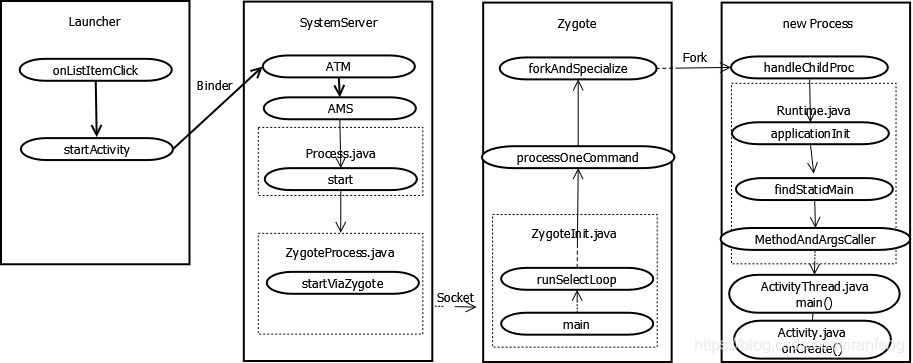
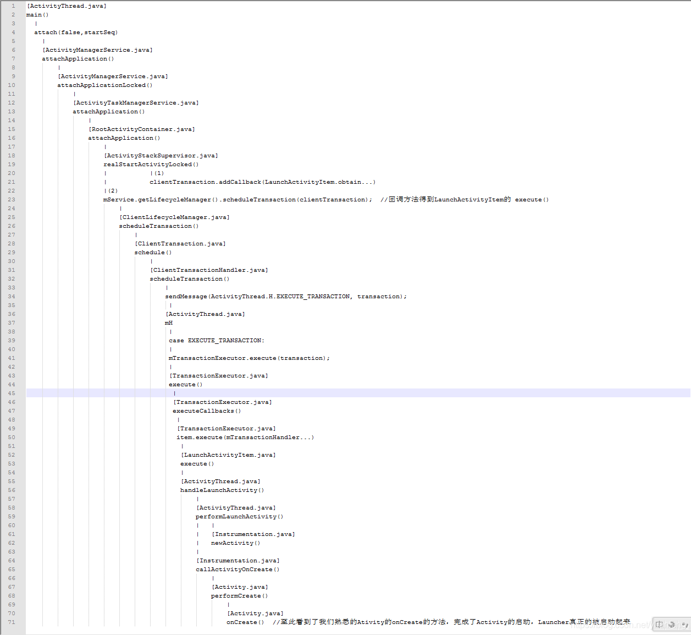

###一、Activity

####1. Activity生命周期

标准生命周期：onCreate()->onStart()->onResume()->onPause()->onStop()->onDestory()

情景一：Activity跳转时生命周期的变化

【A】onPause()->【B】onCreate()->【B】onStart()->【B】onResume()->【A】onStop()->【A】onSaveInstanceState()

######注意：当目标activity为透明时，不会调用onStop()

情景二：按下Home键或者Menu键或者锁屏时时生命周期的变化

onPause()->onStop()->onSaveInstanceState()

情景三：从其他APP或者任务栈切换到APP时

onRestart()->onStart()->onResume()

知识点一：触发onRestart的时机

知识点二：触发onSaveInstanceState的时机

当发生切换APP或者按下home/menu键或者跳转其他activity时触发onSaveInstanceState方法

在onSaveInstanceState方法做耗时操作同样会阻塞主线程导致anr

####2. Activity启动模式

#####Standard

默认启动模式，每次创建新的实例压栈

#####SingleTop

栈顶模式，可以存在多个Activity，但是不允许叠加，比如推送消息页面

#####SingleTask

只存在一个，比如我们的商品搜索页面、订单搜索、会员页面等等

#####SingleInstance

新建栈并且栈中只有他一个，使用的是切换APP的动画

##### TaskAffinity

指定进入哪个任务栈，默认值时包名，所以自定义的不可以是包名

##### IntentFlag

[FLAG_ACTIVITY_EXCLUDE_FROM_RECENTS](https://link.jianshu.com/?t=http://developer.android.com/reference/android/content/Intent.html#FLAG_ACTIVITY_EXCLUDE_FROM_RECENTS)

等同于xml中设置android:excludeFromRecents=”true”，最近任务中不显示

[FLAG_ACTIVITY_LAUNCHED_FROM_HISTORY](https://link.jianshu.com/?t=http://developer.android.com/reference/android/content/Intent.html#FLAG_ACTIVITY_LAUNCHED_FROM_HISTORY)

这个模式启动的Activity不进入任务栈，A->B->C：A->C

####3. Activity启动过程

1. 点击桌面的图标，Launcher调用系统的startActivity进行启动Activity，此时的动作在Launcher进程中
2. 通过Binder向SystemServer进行发送消息，让ATM\AMS 进行Activity的处理，组装message，通过socket发送给SystemServer，此时动作在SystemServer进程中
3. Zygote收到SystemServer发来的消息，进行消息拆分，再调用系统的fork()函数，进行进行孵化操作，此时动作在Zygote进程中
4. 进入ActivityThread的main()，完成最终应用进程的的onCreate操作，该步动作处于新创建的应用进程中

#### 4. Activity/Fragment通信

intent、广播

tips：

1. 当在onSaveInstanceState执行耗时操作时，Activity会正常跳转，但跳转完成后会阻塞UI

###二、Service

#### 1. Service生命周期

Call to startService：onCreate()->onStartCommand()->onDestroy()

Call to bindService：onCreate()->onBind()->onUnbind()->onDestroy()

#####Service启动标识

START_STICKY-告诉系统从低内存中恢复后，如果有足够的可用内存，则创建服务的新副本。在这里，您将丢失之前可能已经计算出的结果。

START_NOT_STICKY-告诉系统不要费心重新启动服务，即使它有足够的内存也是如此。

START_REDELIVER_INTENT-告诉系统崩溃后重新启动服务，并重新交付崩溃时存在的意图。

###三、ContentProvider

本质是对sqlite的封装，ContentProvider一般为存储和获取数据提供统一的接口，可以在不同的应用程序之间共享数据。

contentProvider：内容提供者
contentresolver：内容解析器

###四、Broadcast Receiver

registerReceiver

###五、Application、Fragment、Context等其他

#### 1. Application

Application作用：

1. 处理应用程序生命周期；通过直接继承Application类，我们可以使用Application的生命周期方法来管理应用进程的生命周期，比如在onCreate()方法中初始化全局资源。

2. 监听Activity生命周期；通过registerActivityLifecycleCallbacks()方法可以注册回调接口监听Activity的生命周期调用。

3. 监听所有组件的回调方法；通过registerComponentCallbacks()方法实现，可以回调Android四大组件的公共方法，常用的有onConfigurationChanged()，onLowMemory()等。

4. 通过Application获取应用资源

Applicaton生命周期：

attach

tips：

1. 不要再application构造函数使用context

#### 二、Context

context常用方法：

资源：getAssets()/getResources()/getColor()/getTheme()

文件：getSharedPreferences()/getCacheDir()/getDataDir()/getExternalDir()

组件管理：getPackageManager()/startActivity()/sendBroadcast()/startService()/getSystemService()