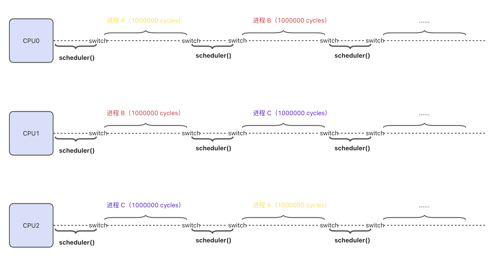

> *how important is it for application developers to truly deeply understand the operating systems they're developing their applications for do they necessarily need to be experts*
> 
> *from [6.S081 Fall 2020 Lecture 1: Introduction and Example] https://www.bilibili.com/video/BV19k4y1C7kA*

学生提问：对于 **应用程序开发人员** 来说，真正深入理解 **操作系统** 有多重要？我们是否需要成为 **操作系统** 方面的专家？


> *you don't have to be an expert but if you spend um a lot of time developing and maintaining and debugging applications you'll eventually end up knowing a lot about the operating system whether you whether you meant to or not it just comes up and you're often forced to understand*

Robert 教授：你不必成为一个 **操作系统** 专家。但是，如果你花费大量时间来开发、维护和调试应用程序，你最终还是会知道大量的 **操作系统** 方面的知识，不管你想不想要掌握这些知识，它们就是出现了，而你，不得不去理解它们。

翻译成白话就是 “**只要你做开发，那操作系统你早晚都得学**”。这也是我学习 **操作系统** 的初衷。

作为最后一篇总结贴，接下来我将一一介绍， MIT 6.S081 Fall 2020 所有实验的难点和我自己的心得，希望能给你一些启发。

# 实验介绍

### Lab1 - Utils

入门实验，一共六道题，三道简单三道中等，其中有一道是算法题，在 LeetCode 上有原题：https://leetcode.cn/problems/count-primes/。

Lab1 的这几个实验都不是很难，还没深入到内核的实现机制，主要是让我们熟悉 **`xv6`** 的开发环境，常用的 **系统调用**，理解 **进程创建** 和 **通信**，**文件系统** 操作等。

总的来说题不难，就是搭环境可能费点事，不想去折腾的话，也可以使用其他同学制作好的 docker 镜像：[《一个玩转国外CSLab的通用环境搭建方案（附我的搭建好的MIT6.S081/MIT6.1810环境）》](https://zhuanlan.zhihu.com/p/449687883)。

主观难度：⭐️⭐️⭐️（*搭环境占两颗星*）

实验笔记：https://zhuanlan.zhihu.com/p/27073703813

### Lab2 - System calls 系统调用

两道中等题目，实验目的是了解什么是 **用户态**、**内核态**，以及调用了 **`syscall`** 以后发生了什么？

实验的逻辑部分的代码量不是很多，重点还是要弄清楚 **syscall 的调用流程**，以及 **系统调用的参数传递**（*熟悉 `RISC-V` 寄存器功能*）。

尤其是为 xv6 工程 **添加新的系统调用** 流程，比较繁琐，经常会遇到漏了某个地方编译不过的情况，大家在做实验的时候，建议全局搜索已有 **`syscall`** 函数，在它后面新增目标函数。

主观难度：⭐️⭐️⭐️（*新增系统调用流程占两颗星*）

实验笔记：https://zhuanlan.zhihu.com/p/28449562710

### Lab3 - Page table 页表

页表实验一共三道题，一道简单题，两道困难题：

- **打印页表（*Print a page table*）**，简单题，按照固定格式打印页表下包含的所有 **列表项**。
- **进程页表（*A kernel page table per process*）**，困难题，实验的目标是，让每个进程在 **内核态** 执行时，使用自己的 **内核页表副本**，而不是共享一个 **全局内核页表**。做这道题，你需要对 **`RISC-V`** 的页表机制、xv6 的 **内存管理**（*分配和释放*），以及 **进程调度** 和 **上下文切换** 的一些实现细节一定的了解。
- **简化 copyin/copyinstr（*Simplify copyin/copyinstr*）**，困难题，这个实验要我们把 **用户空间页表** 映射到上一道题创建的 **用户内核页表** 中，以便 **内核** 可以直接访问 **用户空间**。

lab3 应该是课程最难的实验之一，在本节实验中，我们需要修改 xv6 页表部分的代码来完成一些功能，为了实验能顺利进行，我们必须先要了解：**RISC-V Rv39 的页表设计** 以及  **xv6 是怎么使用它的**？

主观难度：⭐️⭐️⭐️⭐️⭐️

实验笔记：https://zhuanlan.zhihu.com/p/1887529768225859078

### Lab4 - Traps 中断和陷阱

Lab4 一共两道题，一题中等，一题困难，考察的是 **系统调用的实现**（*Lab2已经做过了*）、**用户态和内核态的切换**、**如何保存和回复进程的上下文**、以及 **处理时钟中断** 这几点。

总体来说难度不高，相比于实验，更重要的是 Lec5 和 Lec6 课程中，对 xv6 在 **`RISC-V`** 上的 **Trap 流程** 进行学习。

主观难度：⭐️⭐️

实验笔记：https://zhuanlan.zhihu.com/p/1888668467030388947

### Lab5 - Lazy alloc memory 延迟分配内存

两道中等题目，目标是利用虚拟内存（页表硬件）完成 **Lazy page allocation 延迟分配内存** 的功能。

- 用户进程调用 **`malloc()`** 申请内存时，OS 不会真的为进程分配物理内存并映射到用户进程页表，而是等待真正访问到一块内存再分配。
- 优点
    - 避免用户申请大内存但只使用一小部分的情况发生。
    - 在大量内存复制的场景中节约了时间和内存空间，比如 **`fork()`** 的 **写时复制(copy on write)** ，fork 阶段把父子进程共享的物理页面映射成 **只读**，当父子进程中任意一个进程执行写时，触发页面错误，OS 此时再复制这个错误的页面。
- 缺点，总的时间成本会增加，因为 **页错误（page fault）** 会切换到内核，相较于直接分配增加了额外的开销，我个人认为是一种时间换空间的策略。

和前面几个 lab 不同，lab5 的三道题只是为了完成懒分配这一个功能，每题完成一部分，所以，lab 5 可以理解为只有一个实验。

实验的总体难度不高，其中一半的代码老师已经在视频课介绍过了，可以对着视频抄。

主观难度：⭐️⭐️⭐️

实验笔记：https://zhuanlan.zhihu.com/p/1890104776894694212

### Lab6 - Copy-On-Write 写时复制

lab6 实验目标是完成 **`fork()`** 写时复制（*Copy-on-Write*）的功能，算是上一个懒分配实验的延伸。

未修改的 **`fork()`** 会复制父进程所有的内存到子进程，这个过程耗时且浪费内存，写时复制的核心思想是：

- **`fork`** 阶段，新创建的子进程页表，映射到父进程的物理地址，父子进程页表指向的 物理地址 是 **相同的**。
- 同时，将共享的物理页面映射成 **只读**。
- 只有当父子进程中的 **任意一方** 尝试修改共享的页面时，触发页面错误，OS 才真正为子进程复制该页面。

需要注意的是，实验要求不能在上一节懒加载代码的基础上改，实验前请切换到 cow 分支。

主观难度：⭐️⭐️⭐️

实验笔记：https://zhuanlan.zhihu.com/p/1890812214480450640

### Lab7 - Multithreading 多进程调度

**进程调度**、**内存管理**、**中断处理**，这三点是操作系统最最最最核心的功能，其中，**内存管理的页表** 和 **中断处理** 我们分别在 Lab3、Lab4 中已经介绍过了，本实验我们将会接触到 **进程调度** 的设计和实现。

实验任务是，模仿内核进程切换，写一个用户级线程切换功能（*另外两道题是和并发安全相关的送分题，比较无聊*）。

Lab7 这几道题在最近几个实验里面，难度算是最低的，甚至比 Lab1 还要简单。不过，要想顺利完成 Lab7，我们需要对 xv6 的 “**进程切换机制**” 有个基本的了解。

xv6 进程调度主要依赖两个函数，调度器 **`scheduler()`** 和汇编实现的 **`swtch()`** ：

1. **`scheduler()`：调度器函数，任务是遍历进程表，寻找一个处于 `runnable` 状态的进程，然后调用 `swtch()` 切换到该进程。**
2. **`swtch()`：上下文切换函数，汇编代码 swtch.S 实现，入参是两个 `context` 结构体 `old` 和 `new`，用于交换两个进程的上下文（把当前 CPU 状态写入 `old`，再把 `new` 代表的目标进程的写到 CPU，完成切换）。**



主观难度：⭐️⭐️

实验笔记：https://zhuanlan.zhihu.com/p/1893764028788085772

### Lab8 - Locks 锁优化 | 并发安全

一道中等题，一道困难题，目标是在保证并发安全的前提下，重新设计 **内存分配器** 和 **块缓存** 这两个部分代码，提高系统并发性能。

对于有项目经验的同学来说，实验的难度不算高，重点在于找出 **“哪些操作有并发安全问题”** 需要加锁，实验也没有涉及到新的知识点，直接动手做就行了。

主观难度：⭐️⭐️

实验笔记：https://zhuanlan.zhihu.com/p/1895507803373814529

### Lab9 - File system 文件系统

两道中等题，目标是让 xv6 支持 **大文件** 和实现类似 Linux **软链接** 的功能。

实验目的是让我们了解：**文件系统是怎么使用磁盘的？** 以及 **xv6 的文件系统是如何工作的？**

```c
+----------------+----------------+-------------+-------------+----------------+-------------+
| 引导扇区(block0)|  超级块(block1) |    log区     | inode区     |   bitmap块     |    数据区    |
+----------------+----------------+-------------+-------------+----------------+-------------+
```

主观难度：⭐️⭐️⭐️

实验笔记：https://zhuanlan.zhihu.com/p/1898040100610347926

### Lab10 - Mmap 文件内存映射

lab10 只有一道困难题：实现文件映射到内存的功能，也就是 mmap。

这道题涉及到 **内存管理**、**文件系统**、**trap 中断处理**、**进程调度** 等多个模块，整体难度我觉得仅次于 lab3 的 **页表** 实验。

虽然实验步骤已经在提示部分写的很详细了，但在实现过程中，还是有比较多的细节需要自己去思考、试错，比如： **mmap 的入参合法性检查**（*错了好多次*）、**trap handler 懒分配的 `flags` 处理**、**munmap 的脏页写回和边界处理** 等等。

主观难度：⭐️⭐️⭐️⭐️⭐️

实验笔记：https://zhuanlan.zhihu.com/p/1899934104939659625

### Lab11 - Networking 网络栈

lab11 只有一道困难题，这是课程的最后一个实验，目标是为 xv6 实现 **`E1000`** 网卡驱动的两个核心函数：发送数据包 **`e1000_transmit()`** 和接收数据包 **`e1000_recv()`** 。

实验的难度不算高，实现步骤在提示部分已经给的很全了，按照提示一步步实现即可。

唯一需要注意的是，测试用例中 DNS 测试的地址是 Google 的 8.8.8.8，我们的网络可能无法访问，换成了阿里的 DNS 服务器地址即可通过。

主观难度：⭐️⭐️

实验笔记：https://zhuanlan.zhihu.com/p/1900640635079364808

# 总结

磕磕绊绊近两个月，终于把 MIT 6.S081 Fall 2020 课程啃完了。

不得不说 6.S081 课程设计的非常出色，我个人最感兴趣的 **进程调度**、**内存管理**、**中断处理**、**文件系统**、**网络** 这几个模块都有涉及，并且每个实验都有详细的提示，告诉你要实现什么功能，大概要改哪些文件的哪些函数，但又不会把所有细节都告诉你，留出足够的思考空间。如果你想学习 **操作系统** 的话 6.S081 绝对值得尝试。

最后，推荐几个课程的中文资源：

- 视频课程中译版：https://www.bilibili.com/video/BV19k4y1C7kA/
- 视频课程中译文字版：https://mit-public-courses-cn-translatio.gitbook.io/mit6-s081
- 《xv6 os book》中译版：https://xv6.dgs.zone/
- CS自学指南：https://csdiy.wiki/%E6%93%8D%E4%BD%9C%E7%B3%BB%E7%BB%9F/MIT6.S081/
- Wings：https://blog.wingszeng.top/series/learning-mit-6-s081/
- Miigon：https://blog.miigon.net/categories/mit6-s081/
- 知乎专栏《28天速通MIT 6.S081操作系统》：https://zhuanlan.zhihu.com/p/632281381