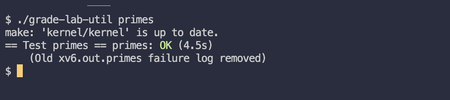

`MIT6.S081` 是麻省理工的操作系统公开课，前身是 `MIT6.82`8，它包含操作系统的知识和前沿 research 内容，2020 年以后，`6.828` 被拆分成两个课程，`6.828` 和 `6.S081`。

新的 `6.S081` 课程去除了原课程中的 research 部分，定位是 **更适合入门的本科课程**，二者的区别之一：

- `6.828` 基于英特尔 **`IA-32`** 开发名为 `JOS` 的操作系统
- `6.S081` 课程则基于 **`RISC-V`** 开发名为 `xv6` 的操作系统

对操作系统感兴趣的同学可以上手 `6.S081`，这样可以避开 `Intel x86` 在发展过程中，为了向下兼容引发的一些历史遗留问题，这部分内容理解起来还是有点头疼的。

`MIT6.S081` 课程目前有三个版本，`2020`、`2021`、`2022`，课程之间区别不大，建议看 `2020` 版，网上资料比较多。

> - 课程地址：https://pdos.csail.mit.edu/6.828/2020/schedule.html
> - 课程录播：https://www.youtube.com/watch?v=L6YqHxYHa7A
> - 《xv6 os book》：https://pdos.csail.mit.edu/6.S081/2020/xv6/book-riscv-rev1.pdf
> - 课后 lab：https://pdos.csail.mit.edu/6.S081/2020/labs
> - 源码仓库：git://g.csail.mit.edu/xv6-labs-2020
> - 中文翻译版
>   - 视频课程：https://www.bilibili.com/video/BV19k4y1C7kA/
>   - 视频课程 - 文字版：https://mit-public-courses-cn-translatio.gitbook.io/mit6-s081
>   - 《xv6 os book》：https://th0ar.gitbooks.io/xv6-chinese/content/index.html

本篇是 Lab1 的课后实验，实验的目的是让你熟悉 `xv6` 操作系统和它的一些系统调用。

在开始实验之前，你需要先看完[《MIT 6.S081 2020 Lec01》](https://www.bilibili.com/video/BV19k4y1C7kA)和[《xv6 第 0章》](https://th0ar.gitbooks.io/xv6-chinese/content/index.html)中的内容，了解 `xv6` 操作系统的基本接口、操作系统应该怎么设计，并熟悉 `进程`、`内存`、`I/O`、`管道`等基础概念。

> - Lab1 地址：https://pdos.csail.mit.edu/6.828/2020/labs/util.html
> - 我的实验记录：https://github.com/yibaoshan/xv6-labs-2020/tree/util

# Boot xv6 (easy)

第一步是搭建 `xv6` 的编译环境，启动系统并运行 `ls` 指令。

网上有很多环境搭建的教程，比如[《MIT6.828 准备 — risc-v 和 xv6 环境搭建》](https://zhayujie.com/mit6828-env.html)，我这里就不多介绍了，如果不想去折腾的话，也可以使用其他同学制作好的 docker 镜像：https://zhuanlan.zhihu.com/p/449687883。

- `make qemu`，构建并运行 xv6 操作系统。
- xv6 没有 `ps` 命令，但你可以使用 `Ctrl-p` 打印每个进程的信息。
- 退出 qemu 请输入: `Ctrl-a` `x`
- `make grade` 启动打分系统，测试程序会自动检查你的作业是否通过。

# sleep (easy)

> Implement the UNIX program sleep for xv6; your sleep should pause for a user-specified number of ticks. A tick is a notion of time defined by the xv6 kernel, namely the time between two interrupts from the timer chip. Your solution should be in the file user/sleep.c.

为 `xv6` 系统写一个 `sleep` 程序，调用系统提供的 `sleep()` 函数，让程序暂停指定数量的时钟 `tick`。

Some hints:

- 查看 `user` 目录下的程序（例如 `user/echo.c` 、 `user/grep.c` 和 `user/rm.c` ），看看他们怎么获取从命令行输入的参数。
- 因为命令行参数的类型是字符串，你需要调用 `atoi()` 将参数转为 `int` 类型。
- 使用系统提供的 `sleep()` 函数完成暂停功能。
- 在程序最后，记得调用 `exit()` 函数退出进程。
- 将 `sleep.c` 文件添加到 `Makefile` 的 `UPROGS` 中，然后使用 `make qemu` 编译。

练手题，非常简单，首先在 `user` 目录下新建 `sleep.c` 文件

```c
#include "kernel/types.h"
#include "user/user.h"

int main(int argc, char *argv[]) {
    // 参数校验，如果输入错误，给用户提示正确用法。
    if (argc != 2) {
        printf("Usage: %s <ticks>\n", argv[0]);
        exit(1);
    }
    // 获取命令行传进来的参数，假如输入： sleep 3
    // argv[0] = sleep，第一个参数是程序名称 sleep。
    // argv[1] = 3，第二个参数是需要暂停多少个 tick
    char *arg = argv[1];
    // string 转 int，如果输入值非阿拉伯数字（比如输入字母或中文）则返回默认值 0
    int ticks = atoi(arg);
    printf("Ready to sleep for %d ticks...\n", ticks);
    // 调用系统提供的函数进行暂停
    sleep(ticks);
    printf("Sleep finished. Goodbye!\n");
    exit(0);
}
```

然后打开根目录下的 `Makefile` 文件，找到 `UPROGS` 块，在最后一行新增 `$U/_sleep\`

```makefile
UPROGS=\
$U/_cat\
$U/_echo\
...
$U/_wc\
$U/_zombie\
$U/_sleep\ # 新增项
```

最后运行 `./grade-lab-util sleep` 命令，来测试代码是否通过。


# pingpong (easy)

> Write a program that uses UNIX system calls to ''ping-pong'' a byte between two processes over a pair of pipes, one for each direction. The parent should send a byte to the child; the child should print "<pid>: received ping", where <pid> is its process ID, write the byte on the pipe to the parent, and exit; the parent should read the byte from the child, print "<pid>: received pong", and exit. Your solution should be in the file user/pingpong.c.

利用 `fork()`、`pipe()`、`read()`、`write()` 等系统函数，写个名为 `ping-pong` 的程序，完成父子进程通信，子进程收到以后打印 `‘<pid>: received ping’` 然后将字节发送给父进程后退出，父进程收到回复打印 `‘<pid>: received pong’`，结束。

实验考察的是 `管道` 和 `进程` 的使用，执行过程如下：

- 父进程先说话，子进程收到消息后打印 `‘<pid>: received ping’` 然后退出自己。
- 父进程接收到子进程消息，打印 `‘<pid>: received pong’` 然后退出进程。

在 `user` 目录下，新建 `pingpong.c` 文件

```c
#include "kernel/types.h"
#include "user/user.h"

int main(int argc, char *argv[]) {

    // 题目无关，测试 fork 后，父进程修改普通变量子进程是否会同步修改
    int i = 100;

    // 创建两个管道描述符，前者用于父进程向子进程通信（读和写），后者用于子进程向父进程通信（读和写）
    // 每个管道描述符长度为 2，其中，0 用于读数据，1 用于写数据。
    int fd_p2c[2], fd_c2p[2];

    // 调用 pipe() 系统函数，创建两个管道
    pipe(fd_p2c);
    pipe(fd_c2p);

    // 调用系统函数 fork() 创建新的进程，父子进程都会接着从本行代码开始向下执行，上面的代码就不用管了。
    if (fork() == 0) {
        // 从这里开始，执行的是子进程代码
        sleep(10);
        // 打印当前 pid、i 的地址和值，以及两个管道地址，fork 会复制父进程的文件描述符表，所以父子进程打印的地址是相同的
        printf("here's child process, pid = %d, i = %d, i addr is %pn, fd_p2c addr is %pn, fd_c2p addr is %pn \n\n", getpid(), i, &i, &fd_p2c, &fd_c2p);

        int port_read = fd_p2c[0];
        int port_write = fd_c2p[1];

        char content_receive[1024] = {0};
        char content_send[1024] = {"daddy!\n"};

        // 读取父进程发送的消息，默认阻塞调用
        read(port_read, content_receive, sizeof(content_receive));
        printf("child received: %s", content_receive);
        printf("%d: received ping\n\n", getpid());

        // 写入消息至管道，回复父进程
        write(port_write, content_send, sizeof(content_send));

        sleep(10);

        exit(0);
    } else {
        // 不为 0 则表示是父进程的代码
        i = 101;
        printf("here's parent process, pid = %d, i = %d, i addr is %pn, fd_p2c addr is %pn, fd_c2p addr is %pn \n", getpid(), i, &i, &fd_p2c, &fd_c2p);

        int port_read = fd_c2p[0];
        int port_write = fd_p2c[1];

        char content_receive[1024] = {0};
        char content_send[1024] = {"call me daddy please \n"};

        // 题目要求父进程先发送消息
        write(port_write, content_send, sizeof(content_send));

        // 发完消息等待子进程回复
        read(port_read, content_receive, sizeof(content_receive));
        printf("parent received: %s", content_receive);
        printf("%d: received pong\n\n", getpid());

        sleep(10);

        exit(0);
    }
}
```

打开根目录下的 `Makefile` 文件，找到 `UPROGS` 块，在最后一行新增 `$U/_pingpong\`

```makefile
UPROGS=\
$U/_cat\
$U/_echo\
...
$U/_wc\
$U/_zombie\
$U/_sleep\
$U/_pingpong\ # 新增项
```

`make qemu` 编译启动，运行 `pingpong` 查看结果


最后运行 `./grade-lab-util pingpong` 命令，来测试代码是否通过。


# primes (moderate)/(hard)

> Write a concurrent version of prime sieve using pipes. This idea is due to Doug McIlroy, inventor of Unix pipes. The picture halfway down this page and the surrounding text explain how to do it. Your solution should be in the file user/primes.c.

使用 `管道` 实现一个并发的 `素数` 筛选版本，这是一道算法题，LeetCode 上有原题：https://leetcode.cn/problems/count-primes/。

和 LeetCode 不同的是，实验要求使用 `管道` 通信来实现。我在这个实验上花了大半天时间，因为涉及到进程链的创建和递归处理，而我的 `VS Code` 还没有配 `Debug 环境`，全程只能靠打日志来梳理思路。

为了帮助后面的同学更好理解 `素数` 筛选过程中的递归逻辑，我用 Java 实现了一个版本，通过递归调用来模拟每个进程的工作方式，或许会对大家有帮助。

```java
    public void sieve(List<Integer> list, int prime) {
        System.out.println(prime);
        List<Integer> ret = list.stream()
                .filter(num -> num % prime != 0) // 收集不能被 prime 整除的数列
                .collect(Collectors.toList());
        if (!ret.isEmpty()) {
            sieve(ret, ret.get(0));             // 这里每一次的递归调用，对应一次 c 语言中的进程创建
        }
    }
```

同时，我还把数据的处理过程打印了出来，`白色字体` 表示每轮要处理的数据，`红色字体` 表示的是每一轮中被删除掉的元素。


好，回到正题，首先我们还是在 `user` 目录下，新建 `primes.c` 文件

```c
#include "kernel/types.h"
#include "user/user.h"

void sieve(int input_fd) {
    int p;

    // 每个进程只负责一个素数，所以读取到的数肯定是质数，参考 Java 版本的第一行打印函数
    if (read(input_fd, &p, sizeof(int)) <= 0) {
        exit(0); // 无数据或者写端已关闭，退出
    }

    printf("prime %d\n", p);

    int fd_pipe[2];
    pipe(fd_pipe); // 创建新管道

    if (fork() == 0) {
        // 子进程：处理下一层筛法
        close(fd_pipe[1]); // 关闭写端
        sieve(fd_pipe[0]); // 递归调用
        close(fd_pipe[0]);
        exit(0);
    } else {
        // 父进程：过滤当前素数的倍数
        close(fd_pipe[0]); // 关闭读端
        int num;
        while (read(input_fd, &num, sizeof(int)) > 0) {
            if (num % p != 0) {
                write(fd_pipe[1], &num, sizeof(int)); // 写入未被过滤的数，等同于 Java 版本的：向 ret 集合中 add 一条数据。
            }
        }
        close(input_fd);    // 关闭输入管道
        close(fd_pipe[1]);   // 关闭输出管道写端
        wait(0);            // 等待子进程结束
        exit(0);
    }
}

int main() {
    int initial_pipe[2];
    pipe(initial_pipe); // 创建初始管道

    if (fork() == 0) {
        // 子进程：开始筛法
        close(initial_pipe[1]); // 关闭写端
        sieve(initial_pipe[0]);
        close(initial_pipe[0]);
        exit(0);
    } else {
        // 主进程：生成初始数列
        close(initial_pipe[0]); // 关闭读端
        // 第一轮，把 2 ~ 35 通过管道通知给子进程
        for (int i = 2; i <= 35; i++) {
            write(initial_pipe[1], &i, sizeof(int));
        }
        close(initial_pipe[1]); // 关闭写端，无用端
        wait(0);               // 等待子进程结束
        exit(0);
    }
}
```

每个 `素数` 对应一个 `进程`，通过 `管道` 连接。初始进程生成数字，每个后续进程过滤掉当前 `素数` 的倍数，并将剩余数传递给下一个进程。

打开根目录下的 `Makefile` 文件，找到 `UPROGS` 块，在最后一行新增 `$U/_primes\`

```makefile
UPROGS=\
$U/_cat\
$U/_echo\
...
$U/_wc\
$U/_zombie\
$U/_sleep\
$U/_pingpong\
$U/_primes\ # 新增项
```

`make qemu` 编译启动，运行 `primes` 查看结果


最后运行 `./grade-lab-util primes` 命令，来测试代码是否通过。



# find (moderate)

> Write a simple version of the UNIX find program: find all the files in a directory tree with a specific name. Your solution should be in the file user/find.c.

编写一个简单 `find` 程序 ：输入 `目录` + `文件名`，查找该目录下所有匹配的文件。

虽然这道题标的难度是 `moderate`，但是实现其实并不难，因为 `xv6` 已经提供了很多功能，所以我们只需要简单地调用系统函数，再注意判定几个边界条件就行了。

涉及到的知识点：`fstat()`、`stat()`、`open()` 等系统函数调用；`dirent`、`stat` 两个结构体包含的信息；`strcmp()`、`strcpy()` 操作字符串函数。

直接上代码

```c
#include "kernel/types.h"
#include "kernel/stat.h" 
#include "user/user.h"   
#include "kernel/fs.h"   
#include "kernel/fcntl.h"

// 递归查找指定目录下所有匹配目标文件名的文件
void find(char *path, const char *target_name) {

    char buf[1024];           // 路径缓冲区
    struct dirent de;        // 目录条目结构体
    struct stat st;          // 文件状态结构体
    int fd;                  // 文件描述符

    // 以只读模式打开目录，并返回文件描述符 fd，失败则直接 return
    if ((fd = open(path, O_RDONLY)) < 0) {
        fprintf(2, "error: cannot open %s\n", path);
        return;
    }

    // 获取文件的状态，stat 结构体包含：类型、索引号、文件的类型（文件、目录、设备）等信息
    if (fstat(fd, &st) < 0) {
        fprintf(2, "error: cannot stat %s\n", path);
        close(fd);
        return;
    }

    // 检查当前路径是否是目录
    if (st.type != T_DIR) {
        fprintf(2, "error: %s is not a directory\n", path);
        close(fd);
        return;
    }

    // 读取目录中的每一个条目
    while (read(fd, &de, sizeof(de)) == sizeof(de)) {
        // 跳过无效条目（inode号为0）
        if (de.inum == 0)
            continue;

        // 跳过 "." 和 ".." 目录（避免无限递归）
        if (strcmp(de.name, ".") == 0 || strcmp(de.name, "..") == 0)
            continue;

        // 拼接完整路径：当前目录路径 + "/" + 文件名
        // 例如：path="a", de.name="b" → "a/b"
        strcpy(buf, path);
        char *p = buf + strlen(buf);
        *p++ = '/';
        strcpy(p, de.name);

        // 获取当前文件的状态
        if (stat(buf, &st) < 0) {
            fprintf(2, "find: cannot stat %s\n", buf);
            continue;
        }

        // 如果是目录，递归处理
        if (st.type == T_DIR) {
            find(buf, target_name);     // 递归查找子目录
        } else if (st.type == T_FILE) { // 如果是文件，检查文件名是否匹配
            if (strcmp(de.name, target_name) == 0) {
                printf("%s\n", buf);    // 打印匹配的完整路径
            }
        }
    }

    close(fd); // 关闭目录文件描述符
}

int main(int argc, char *argv[]) {
    // 参数校验
    if (argc != 3) {
        fprintf(2, "Usage: find <directory> <filename>\n");
        exit(1);
    }

    find(argv[1], argv[2]);
    exit(0);
}
```

把 `$U/_find\` 添加到 `Makefile` 文件中，运行测试 `./grade-lab-util find`


# xargs (moderate)

> Write a simple version of the UNIX xargs program: read lines from the standard input and run a command for each line, supplying the line as arguments to the command. Your solution should be in the file user/xargs.c.

编写一个简单的 `xargs` ：从标准输入读取行，对每一行运行一个命令，将行作为命令的参数。

我之前没用过 `Unix` 的 `xargs` 命令，所以刚开始完全不知道这个实验要做什么，后面是专门查资料了解 `xargs` 是什么以后，才让实验能顺利进行。

以下关于 `xargs` 的介绍来自阮一峰老师的博客：https://www.ruanyifeng.com/blog/2019/08/xargs-tutorial.html

> `Unix` 命令都带有参数，有些命令可以接受 "`标准输入`"（`stdin`）作为参数。
> 
> ```shell
> $ cat /etc/passwd | grep root
> ```
> 
> 上面的代码使用了 `管道命令`（|）。管道命令的作用，是将左侧命令`（cat /etc/passwd）`的标准输出转换为标准输入，提供给右侧命令`（grep root）`作为参数。 
> 
> 因为 `grep` 命令可以接受标准输入作为参数，所以上面的代码等同于下面的代码。
> ```shell
> $ grep root /etc/passwd
> ```
> 
> 但是，大多数命令都不接受标准输入作为参数，只能直接在命令行输入参数，这导致无法用管道命令传递参数。举例来说，`echo` 命令就不接受管道传参。
> 
> ```shell
> $ echo "hello world" | echo
> ```
> 
> 上面的代码不会有输出。因为管道右侧的 `echo` 不接受管道传来的标准输入作为参数。
> 
> `xargs` 的更多功能请查看：https://www.ruanyifeng.com/blog/2019/08/xargs-tutorial.html

简单来说，`xargs` 命令是给其他命令传递参数的一个 `过滤器`，也是 `组合多个命令` 的一个工具。

`xv6` 要求实现的是一个简单版本，只保留最核心的 `逐行参数追加` 功能，所以我们在做实验的时候，只需确保逐行读取输入、能正确分割参数、逐行调用命令即可。

```c
#include "kernel/types.h"
#include "kernel/stat.h"
#include "user/user.h"
#include "kernel/fs.h"

void exec_by_child(char *program, char **args) {
    // fork 出一个子进程去执行
    if (fork() == 0) {
        if (exec(program, args) == -1) {
            printf("\nexec faild, not found the %s!\n\n", program);
        }
        exit(0);
    }
    return;
}

int main(int argc, char *argv[]) {
    char buf[1024];                           // 指令缓冲区
    char *args_buf[128];                      // 参数缓冲区
    char *start_ptr = buf, *last_ptr = buf;   // 参数列表的开始、结束指针
    char **args = args_buf;                   // 当前参数的指针

    if (argc < 2) {
        fprintf(2, "Usage: <command> <params> | xargs <command>  <params>\n");
        exit(1);
    }

    // 读取所有传入的参数
    for (int i = 1; i < argc; i++) {
        *args = argv[i];
        args++;
    }

    char **cur_arg = args;

    // 循环读入参数
    while (read(0, start_ptr, 1) != 0) {

        // 遇到空格或换行符，则将参数结束符置为空，并记录参数的结束位置
        if (*start_ptr == ' ' || *start_ptr == '\n') {
            *start_ptr = '\0';          // 将当前字符替换为字符串结束符
            *(cur_arg++) = last_ptr;    // 将当前参数的起始地址存入参数列表
            last_ptr = start_ptr + 1;   // 更新last_ptr指向下一个字符

            // 如果读取到换行符 则执行子进程
            if (*start_ptr == '\n') {
                *cur_arg = 0;
                exec_by_child(argv[1], args_buf);
                cur_arg = args;
            }
        }
        start_ptr++;
    }

    // 如果还有未处理的参数，同样执行子进程
    if (cur_arg != args) {
        *start_ptr = '\0';
        *(cur_arg++) = last_ptr;
        *cur_arg = 0;
        exec_by_child(argv[1], args_buf);
    }

    while (wait(0) != -1) {
        // wait for child processes
    }
    exit(0);
}
```

把 `$U/_xargs\` 添加到 `Makefile` 文件中，运行测试 `./grade-lab-util xargs`


# 结语

Lab1 的这几个实验都不是很难，还没深入到内核的实现机制，主要是让我们熟悉 `xv6` 的环境，常用的 `系统调用`，理解 `进程创建` 和 `通信`，`文件系统` 操作等。

接下来的 Lab2 会涉及到 `内存管理` 和 `内核态` 的切换，应该会更有意思，那么我们，下次再见。

# 参考资料

- CS自学指南：https://csdiy.wiki/%E6%93%8D%E4%BD%9C%E7%B3%BB%E7%BB%9F/MIT6.S081/
- Miigon：https://blog.miigon.net/categories/mit6-s081/
- Wings：https://blog.wingszeng.top/series/learning-mit-6-s081/
- 知乎专栏《28天速通MIT 6.S081操作系统》：https://zhuanlan.zhihu.com/p/632281381
