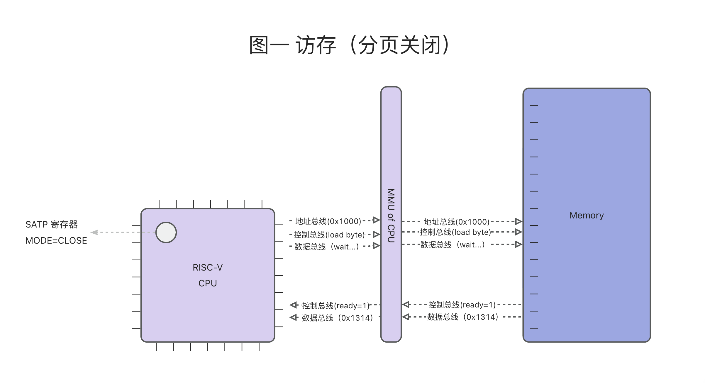
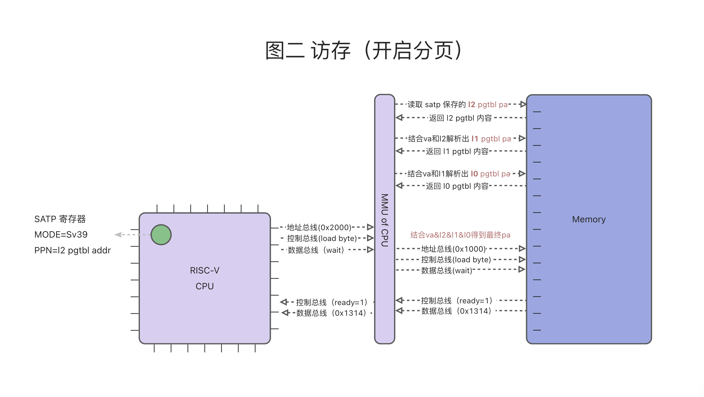
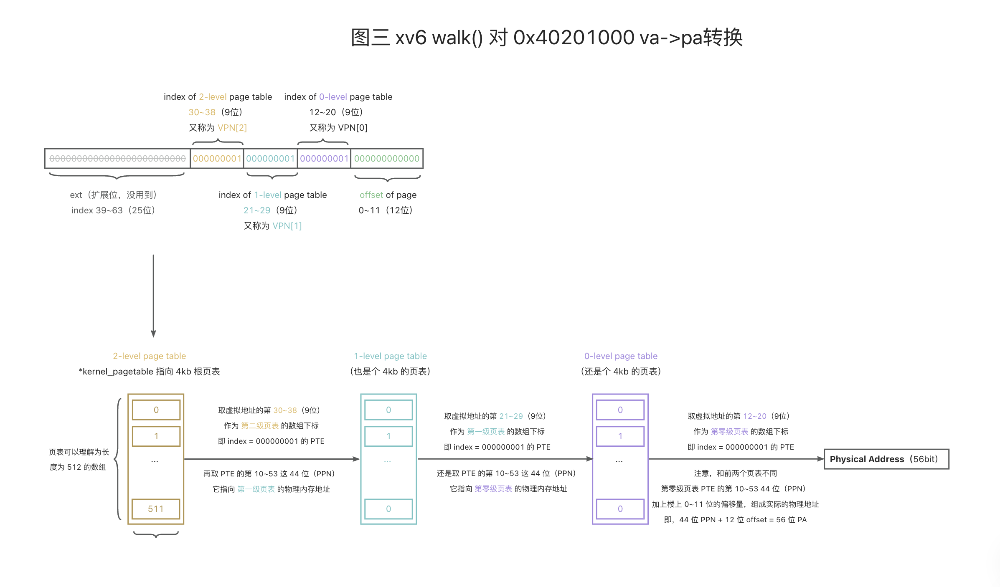
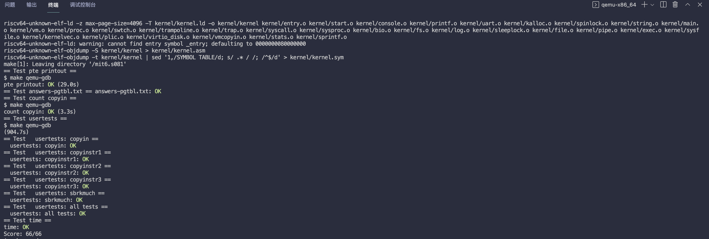

本篇是 MIT6.S081 操作系统课程 Lab3 的实验笔记（_**这可能是本课程最难的实验**_），同时文章也会结合源码，简单介绍 xv6 是怎么基于 RISC-V `页表机制` 实现内存管理的。

> - Lab3 地址：https://pdos.csail.mit.edu/6.828/2020/labs/pgtbl.html
> - 我的实验记录：https://github.com/yibaoshan/xv6-labs-2020/tree/pgtbl

在开始实验之前，你需要：

1. 阅读 [《xv6 book》](https://xv6.dgs.zone/tranlate_books/book-riscv-rev1/c2/s0.html) 第二章：**操作系统架构**
   - 英文原版：https://pdos.csail.mit.edu/6.828/2020/xv6/book-riscv-rev1.pdf
   - 中译版：https://xv6.dgs.zone/tranlate_books/book-riscv-rev1/c2/s0.html
2. 观看 Lecture 3 课程录播视频：**OS Organization and System Calls（操作系统架构和系统调用）**
   - YouTube 原版：https://www.youtube.com/watch?v=o44d---Dk4o
   - 哔哩哔哩中译版：https://www.bilibili.com/video/BV19k4y1C7kA?vd_source=6bce9c6d7d453b39efb8a96f5c8ebb7f&p=2
3. 阅读 [《xv6 book》](https://xv6.dgs.zone/tranlate_books/book-riscv-rev1/c3/s0.html) 第三章：**页表**
   - 英文原版：https://pdos.csail.mit.edu/6.828/2020/xv6/book-riscv-rev1.pdf
   - 中译版：https://xv6.dgs.zone/tranlate_books/book-riscv-rev1/c3/s0.html
4. 观看 Lecture 4 课程录播视频：**Page Tables（页表）**
   - YouTube 原版：https://www.youtube.com/watch?v=f1Hpjty3TT8
   - 哔哩哔哩中译版：https://www.bilibili.com/video/BV19k4y1C7kA?vd_source=6bce9c6d7d453b39efb8a96f5c8ebb7f&p=3
5. 代码方面
   - [kernel/memlayout.h](kernel/memlayout.h) - 定义内存布局
   - [kernel/vm.c](kernel/vm.c) - 包含页表管理的主要代码（绝大多数和页表管理相关的代码都在这儿，建议每个函数都过一遍，做到心中有数）
   - [kernel/kalloc.c](kernel/kalloc.c) - 物理内存分配器
   - [kernel/riscv.h](kernel/riscv.h) - 定义 RISC-V 相关的硬件结构

# 聊聊 Page tables（页表）

`进程调度`、`内存管理`、`中断处理`，这三点是操作系统最基础的核心功能，不管是 `Unix-like` 的 `宏内核` 架构，还是 `微内核` 架构的 OS。而 `页表机制`，是操作系统能够实现 **内存管理** 的基石，它非常重要。

在本节实验中，我们需要修改 xv6 页表部分的代码来完成一些功能，为了实验能顺利进行，我们有必要先来了解：**RISC-V Rv39 的页表设计 ** 以及  **xv6 是怎么使用它的**？

## RISC-V Rv39 的页表机制

分页思想的核心是，**将 `虚拟地址` 空间和 `物理内存` 空间都划分为固定大小的 `页`（通常为4KB），通过一张或多张 `页表` 来记录，`虚拟页` 和 `物理页` 之间的 `映射` 关系**。

RISC-V 支持 32、39、48、57 和 64 多种分页方式，我们这里只讨论 xv6 使用到的 **Rv39**：

- `虚拟地址` Virtual Address（后面简称 `VA`）空间由 39 位组成，单个进程最大可以寻址 512GB 的内存。
- 56 位的 `物理地址` Physical Address（后面简称 `PA`）空间，也就是说，39 位的 `虚拟地址` `va` 最终会被转换为 56 位的 `物理地址` `pa`。
- 三级 `页表` Page Table（后面简称 `pgtbl`）结构，每级 `页表` 包含 512 个 `页表项` Page Table Entry（后面简称 `PTE`），每个 `页表项` 为 64位(8字节)，所以
  - 每张表占用 `4096` 字节，也就是 `4KB` 的内存。
  - 每个进程有 三张表，总共需要 3 * 4 = `12KB` 的内存空间。
- 每页大小为 `4KB`，同时还支持 `2MB` 和 `1GB` 的 `大页模式`，不过 xv6 没有用到大页，可以忽略。

另外，在 `RISC-V Sv39` CPU 的硬件电路中，包含了两种数据结构（或者说是布局，表示 64bit 中每个 bit 位的含义）：**`虚拟地址`**（`va`）和 **`页表项`**（`PTE`）。

#### 虚拟地址（VA）电路设计

64位 `虚拟地址` 的结构如下（`硬件电路`和 `OS` 代码都是按照该规则解析，需要熟记）：

```
 63        39 38        30 29        21 20        12 11         0
+------------+------------+------------+------------+------------+
|    保留位   |   VPN[2]   |   VPN[1]   |   VPN[0]   |   页内偏移  |
+------------+------------+------------+------------+------------+
```

- 第 `63-39` 位：前 25 位暂时没用，忽略不管。
- 第 **`38-30`** 位：共 **9** 位，十进制范围是 0~511（2^9=512），表示它在`顶级`（第二级）页表中的的`索引值`(`VPN[2]`)。
- 第 **`29-21`** 位：在 `一级页表` 中的下标索引(`VPN[1]`)。
- 第 **`20-12`** 位：在 `零级页表` 中的索引(`VPN[0]`)。
- 第 **`11-0`** 位：共 **12** 位，表示 `页内偏移`，2^12=4096，保证能够访问到页内的每一个 `字节`。

图上 `VPN[X]` 中的 `X` 指的，是在第 `X` 级 `页表` 对应的 `下标值`（待会细讲），关于 `三级页表` 的名称排序，xv6-book 书中的顺序是，`顶级页表` 是 `L2`，中间是 `L1`，最后一级则称为 `L0`。

#### 页表项（PTE）电路设计

RISC-V `Sv39` 有 `三级页表`，每张 `页表` 都包含 512 个 `页表项`，接下来我们介绍 `页表项`（`PTE`） 的物理结构（或者说解析规则）。

```
 63        54 53                              10 9    8 7 6 5 4 3 2 1 0
+------------+----------------------------------+------+-+-+-+-+-+-+-+-+
|   保留位    |              44位物理地址          | RSW  |D|A|G|U|X|W|R|V|
+------------+----------------------------------+------+-+-+-+-+-+-+-+-+
```

RISC-V 64位 `页表项` 在不同的 `分页模式` 下有不同的结构，因为 xv6 没有用到 RISC-V `Sv39` 的 `大页模式`，所以，我们这里也只介绍 `Sv39` `4KB` 的 `页表项` 结构（和上面一样需要熟记，因为电路就是这么设计的）

我们按从低位到高位的顺序介绍 `页表项` 的结构：

- V: `Valid` - 表示 `页表项` 是否有效，无效的话说明是空白内存，没数据，跳过。
- R: `Readable` - 可读
- W: `Writable` - 可写
- X: `Executable` - 可执行
- U: `User` - `用户模式` 可访问，一般 `用户进程` 这一位都是 1，`OS` 则置 0 。
- ~~G、A、D、RSW~~ 这几位实验中暂时用不到，可以忽略掉
- 第 **`10-53`** 位，这 **`44`** 位很重要，是 `页表` 或者 `虚拟内存` 的 `物理地址`，我来解释一下：
  - 如果是该 `页表项` 是 `第二级` 或 `第一级` 的 `页表项`，那这 44 位就是 **`下一级页表`** 的物理地址
    - 文章开头我们介绍了 `Rv39` 的 `物理地址` 是 56 位（寄存器都是 64 位，但 `物理地址` 只用了后 56 位，前面用不到的置0）的，那只有 44 位的 `页表` 地址，怎么转为 56 位 `页表` `物理地址` 呢？
    - 首先，将 44 位的 `页表地址`，`右移` 10 位，去掉低位的 `权限位`
    - 然后再 `左移` 12 位，这样就得到 56 位的物理地址。
    - 如果是 `第二级页表`，这个 `物理地址` 指向的是 `第一级页表` 的 `物理地址`，如果是 `第一级页表` 的 `页表项` ，指向的是 `第零级页表`。
  - 如果是最后一级（`第零级`）的 `页表项`，这 44 位就是 `虚拟内存` 对应的 `物理地址` 了
    - 前面我们介绍了 `虚拟地址` 的最后 12 位是 `页内偏移`。
    - 这 44 位加上 12 位的 `偏移量`，组成的 56 位物 `理地址`，就是 `虚拟地址` 最终对应的 `物理地址`。

`虚拟地址`（`va`）和 `页表项`（`PTE`）的数据结构介绍完了， `MMU` 的电路就是按照这样的规则进行解析的，接下来我们画两张图帮助大家理解

#### 图解访存



图一演示了 未开启分页 前，CPU 从内存读一个 `字节` 的过程

- 在 RISC-V 中，`satp` 64位寄存器用来控制 `是否开启分页`，高 4 位是 `mode` 位，值为 0 表示 `关闭分页`，值为 8 表示 `启用 Sv39模式`。
- 图一 `satp` 寄存器为 0，表示 `关闭分页`，此时 MMU 处于`直通`（`pass-through`）模式，即所有的地址都视为 `物理地址`，直接转交给 `内存芯片` 处理。
- `内存芯片` 完成读操作后，将数据写入 `数据总线`，然后通过 `控制总线` 告诉 CPU，我的活干完了。

然后我们来看，**开启分页** 后，CPU 从内存读一个 `字节` 的过程

> **注意⚠️ 我这里忽略了 CPU 的 `cache` 部件（即 CPU 一级二级三级缓存）和 `页表` 的 `cache` 部件（即 TLB），每一次的访存都会去内存找**



MMU 执行访存时，发现 `satp` 寄存器 启用了分页，随之读取寄存器第 **`0-43`** 这 44 位中保存的 `l2 页表` 地址，然后开始访存流程

```
虚拟地址 Virtual Address 的内存布局
 63        39 38        30 29        21 20        12 11         0
+------------+------------+------------+------------+------------+
|    保留位   |   VPN[2]   |   VPN[1]   |   VPN[0]   |   页内偏移  |
+------------+------------+------------+------------+------------+
页表项 Page Table Entry 的内存布局
 63        54 53                              10 9    8 7 6 5 4 3 2 1 0
+------------+----------------------------------+------+-+-+-+-+-+-+-+-+
|   保留位    |              44位物理地址          | RSW  |D|A|G|U|X|W|R|V|
+------------+----------------------------------+------+-+-+-+-+-+-+-+-+
```

1. **第一次访存**，根据 `satp` 保存 `l2 pbtbl addr` 地址，去从内存中读到 `l2 页表`
   - `l2 页表` 是一个 `4kb` 的 `物理页`，里面保存的有 512 个 `页表项`，这么多 `页表项`，应该用哪个呢？
   - 查看 `虚拟地址 va` 的第 **`38-30`** 这 9 位（**`VPN[2]`**）组成的 `下标值`，它就是 `l2 页表` 的索引，我们假设 `下标` 是 1 好了。
2. **第二次访存**，取 `l2 页表` 的第 1 个 `页表项`（一个字节）的第 **`10-53`** 这 44 位，它是个 `物理地址`，指向 `l1 页表`
   - 读到了 `l1 页表` 以后，它同样也是一个 `4kb` 的 `物理页`，保存的也是 512 个 `页表项`。
   - 取 `l1 页表` 512 个哪个 `页表项`，是由 `虚拟地址 va` 的第 **`29-21`** 这 9 位（**`VPN[1]`**）决定的，我们假设 `下标` 值还是 1 好了。
3. **第三次访存**，取 `l1 页表` 的第 1 项指向的 `l0 页表`，它是最后一级页表
   - 读到最后一级页表以后，取 **`VPN[0]`** 页表项，因为这是最后一级页表了，pte 保存的就不是 `下一级页表` 的地址，而是`虚拟地址` 对应的 `物理地址`。
   - `l0` **`VPN[0]`** 中 44 位 `物理地址` + `虚拟地址` 后 12 位偏移 = 56 位 `物理地址`
4. **第四次访存**，真正的访问 `物理地址`，读 or 写。

以上，是开启分页后，`MMU` 和 `内存芯片` 交互的流程，小结一下：

- **启用分页后，CPU 执行的所有的 `访存` 都是 `虚拟地址 va`，`页表` 作为 `MMU` 的数据库，用来辅助完成 `虚拟地址` 到 `物理地址` 的转换。**
- **不考虑 `cache`，RISC-V `Rv39` 启用分页后，对于一个内存操作，总是会进行 `四次` 访存，前三次是为了找到 `三级页表`，最后一次才是访问 `物理地址`。**

## xv6 是怎么使用页表的？

理论学完了，接下来我们一起看看，在 xv6 中，关于页表的 `数据结构` 和一些使用函数。

#### 页表切换

首先我们要知道 `顶级页表` 放在哪？ 它关系到内存读写，MMU 只有依赖 `satp` 寄存器设置的 `页表` 地址，才能完成 `va` 到 `pa` 的转换

在 xv6 中，页表是一个 `pagetable_t` 类型的指针，定义在 riscv.h 中

```c
kernel/riscv.h
typedef uint64 *pagetable_t;  // 512 PTEs
```

内核的顶级页表在 `kernel/proc.c` 中定义，用户页表则在 `proc` 结构体中

```c
kernel/proc.c
extern pagetable_t kernel_pagetable; // kernel page table

kernel/proc.h
struct proc {
  pagetable_t pagetable;       // User page table
};
```

切换进程的时候，需要重新设置 `satp` 寄存器，同步切换 `页表`

```c
void
scheduler(void)
{
  struct proc *p;
  struct cpu *c = mycpu();
  
  c->proc = 0;
  for(;;){
    // ...
    for(p = proc; p < &proc[NPROC]; p++) {
      acquire(&p->lock);
      if(p->state == RUNNABLE) {
        // 切换到新进程
        p->state = RUNNING;
        c->proc = p;
        w_satp(MAKE_SATP(p->pagetable));  // 把新进程的顶级页表设置到 satp 寄存器
        sfence_vma(); // 刷新 TLB
        swtch(&c->context, &p->context);
        // ...
      }
      release(&p->lock);
    }
  }
}
```

#### 页表遍历

上一小节，我们介绍了对于一个 `虚拟地址`，MMU 是怎么样完成 `va->pa` 的转换的，实际开发中，OS 也需要有 `va` 转为 `pa` 的功能

比如，在 `fork` 等需要 `复制内存` 的场景、`mmap` 等需要 `映射内存` 的场景，都要根据进程的 `va` 找到实际的 `pa` 再执行操作。

OS 将 `va->pa` 的过程，就是模拟了硬件 `MMU` 的 `页表` 遍历过程，xv6 对应的是 `walk()` 函数

```c
kernel/vm.c
pte_t *walk(pagetable_t pagetable, uint64 va, int alloc)
{
  // 遍历三级页表
  for(int level = 2; level > 0; level--) {
    // 1. 从虚拟地址中提取VPN索引
    pte_t *pte = &pagetable[PX(level, va)];
    
    // 2. 检查PTE是否有效
    if(*pte & PTE_V) {
      // 有效，获取下一级页表地址
      pagetable = (pagetable_t)PTE2PA(*pte);
    } else {
      // 无效，需要分配新页表
      if(!alloc || (pagetable = (pte_t*)kalloc()) == 0)
        return 0;
      memset(pagetable, 0, PGSIZE);
      *pte = PA2PTE((uint64)pagetable) | PTE_V;
    }
  }
  
  // 3. 返回最后一级页表项的地址
  return &pagetable[PX(0, va)];
}
```

假设 `walk()` 函数的入参是内核的顶级页表 `kernel_pagetable`，虚拟地址为 `0x40201000`（刚好每一个 `VPN[X]` 的 X 值都是1）



图上演示了 `walk()` 执行过程，和 `MMU` 查找 `物理地址` 的的过程是一样的。

理解了 RISC-V `Rv39` 分页的逻辑以后，接下来我们正式开始实验，请将工程切换到 `pgtbl` 分支。

# Print a page table (easy)

Define a function called vmprint(). It should take a pagetable_t argument, and print that pagetable in the format described below. Insert if(p->pid==1) vmprint(p->pagetable) in exec.c just before the return argc, to print the first process's page table. You receive full credit for this assignment if you pass the pte printout test of make grade.

实现一个函数 `vmprint()` ，入参是一个 `页表`，按照格式打印页表下包含的所有 `列表项`。

简单题，考察是否理解 xv6 怎么使用 `RISC-V` 的三级页表结构。在 `defs.h` 中声明 `vmprint()` 函数，让我们能在 `exec.c` 中调用

```c
// vm.c
void            kvminit(void);
...
void            vmprint(pagetable_t); // 新增
```

递归遍历，`页表` 是一个树状结构，我们需要递归地遍历它，在 `vm.c` 文件尾部新增 `vmprint()` 函数：

```c
void
vmprint_recursive(pagetable_t pagetable, int level) {

    // 按照 xv6-book 书上的规则，三级页表名称，从高地址到低地址（从左到右）依次排列为：L2（又称顶级/根页表）、L1、L0
    static int levels[] = {0, 2, 1, 0};

    // 每个 PTE 占用 8 字节，共 512 个 PTE
    for (int i = 0; i < PGSIZE / 8; i++) {
        pte_t pte = pagetable[i];
        // 只处理有效的 PTE
        if (pte & PTE_V) {
            // 打印缩进
            for (int j = 0; j < level; j++)
                printf(" ..");

            // 打印 PTE 的下标值，和其对应的物理地址
            uint64 pa = PTE2PA(pte);
            printf("%d: pte %p pa %p\n", i, pte, pa);

            // 额外打印，证明在 xv6 中，第二级和第一级页表的 PTE 都是指向下一级页表的地址，只有最后一个页表的 PTE 指向的是物理内存地址
            printf("level= %d, is it pgtbl? %s\n", levels[level], ((pte & (PTE_R | PTE_W | PTE_X)) == 0) ? "true" : "false");

            // 如果这个 PTE 指向的是下一级页表，递归打印
            if ((pte & (PTE_R | PTE_W | PTE_X)) == 0) {
                // 这是一个指向下一级页表的 PTE
                vmprint_recursive((pagetable_t) pa, level + 1);
            } // xv6 中无需考虑第二级和第一级页表项指向物理地址的情况
        }
    }
}

void
vmprint(pagetable_t pagetable) {
    printf("page table %p\n", pagetable);
    vmprint_recursive(pagetable, 1);
}
```

代码稍微有点长：

- 从 `顶级页表` 开始，遍历页表中的每一个 `PTE`
- 对有效的 `PTE`，按规则打印 `下标` 和 `物理地址`，并检查它是否指向 `下一级页表`
- 如果是，递归调用打印函数

其中，将 `页表项` 转为 `物理地址`，调用的是 `PTE2PA()` 宏，我们来看一下它的实现：

```c
#define PTE2PA(pte) (((pte) >> 10) << 12)
```

`右移` 10 位后，我们得到了物理页号，再 `左移` 12 位，就将 `物理页号` 转换为完整的 `物理地址`。

回到实验，最后，我们需要在 `exec.c` 中的 `return argc` 语句之前添加调用：

```c
int
exec(char *path, char **argv)
{
  char *s, *last;
  ...
  // 在 return argc; 之前添加
  if(p->pid==1) vmprint(p->pagetable); // 新增
  
  return argc;
}
```

大功告成，`make qemu` 编译运行查看结果

```c
$ make qemu
xv6 kernel is booting

hart 2 starting
hart 1 starting
page table 0x0000000087f6e000
 ..0: pte 0x0000000021fda801 pa 0x0000000087f6a000
level= 2, is it pgtbl? true
 .. ..0: pte 0x0000000021fda401 pa 0x0000000087f69000
level= 1, is it pgtbl? true
 .. .. ..0: pte 0x0000000021fdac1f pa 0x0000000087f6b000
level= 0, is it pgtbl? false
 .. .. ..1: pte 0x0000000021fda00f pa 0x0000000087f68000
level= 0, is it pgtbl? false
 .. .. ..2: pte 0x0000000021fd9c1f pa 0x0000000087f67000
level= 0, is it pgtbl? false
 ..255: pte 0x0000000021fdb401 pa 0x0000000087f6d000
level= 2, is it pgtbl? true
 .. ..511: pte 0x0000000021fdb001 pa 0x0000000087f6c000
level= 1, is it pgtbl? true
 .. .. ..510: pte 0x0000000021fdd807 pa 0x0000000087f76000
level= 0, is it pgtbl? false
 .. .. ..511: pte 0x0000000020001c0b pa 0x0000000080007000
level= 0, is it pgtbl? false
init: starting sh
$ 
```

打印结果符合题目要求。

其中有一些额外打印（`level= x, is it pgtbl? xxx`），这是为了证明，在现阶段 xv6 的实现中，用的是 `4KB` 标准分页模式，`第二级` 和 `第一级` 页表的 `PTE` 都是指向 `下一级页表` 的地址，只有最后一个 `页表` 的 `PTE` 指向的是 `物理内存` 地址。

最后我们来输入 `./grade-lab-pgtbl pte printout` 运行打分系统

```c
$ ./grade-lab-pgtbl pte printout
make: 'kernel/kernel' is up to date.
== Test pte printout == pte printout: OK (3.2s) 
```

测试通过，完整的代码在：https://github.com/yibaoshan/xv6-labs-2020/commit/7e6a94287b53e18e528c05b09cefbd9031bb6fd4

# A kernel page table per process (hard)

Your first job is to modify the kernel so that every process uses its own copy of the kernel page table when executing in the kernel. Modify struct proc to maintain a kernel page table for each process, and modify the scheduler to switch kernel page tables when switching processes. For this step, each per-process kernel page table should be identical to the existing global kernel page table. You pass this part of the lab if usertests runs correctly.

实验背景是，`内核空间` 只有一个 `页表`，即 `vm` 初始化的时候创建的全局变量 `kernel_pagetable`，而 `用户空间` 每个进程都有自己的 `页表`，内核和用户进程的内存地址不通用，这就带来了一个问题：

- 系统调用发生时，传过来的用户指针（例如，传递给 `write()` 的缓冲区指针）时，内核必须先把指针转换为 `物理地址`，才能正常使用。

实验的目标是，让每个进程在 `内核态` 执行时，使用自己的 `内核页表副本`，而不是共享一个 `全局内核页表`。做这道题，你需要对 RISC-V 的页表机制、xv6 的 `内存管理`（分配和释放），以及 `进程调度` 和 `上下文切换` 的一些实现细节一定的了解：

- `内核页表` 的 `初始化` 过程 `vm.c->kvminit()`
- 进程的创建过程 `proc.c->allocproc()` 和回收过程 `proc.c->freeproc()`
- 进程的 `调度` 与 `切换` 过程 `proc.c->scheduler()`

上面几个列出的几个函数有大用，需要熟读。代码实现也分成三部分：

1. 第一步 是 **修改初始化函数**，包括删除为进程预分配的 `栈空间`、修改映射函数以支持用户内核页表
2. 第二步 是 **修改进程的创建和回收过程**，创建进程的时候顺便创建 `用户内核页表 `并完成 `映射`，并为进程申请一页 `内核栈` 空间，回收的时候释放 `栈空间` 和 `用户内核页表`。
3. 第三步 是 **进程的切换过程中**，使用 `用户内核页表`

### 1、爆改初始化函数

第一步主要涉及：

- 删除在 `procinit()` 中，为进程预分配的 `栈空间`：`procinit()` 函数为每个进程都预先分配了 **一页** 的 `栈空间`，页表使用的是全局变量 `kernel_pagetable` ，题目要求每个进程需要有自己的 `内核页表`，所以，预分配 `栈空间` 这一步骤需要删除，改为 **在创建新进程时同步创建`栈空间`**。
- 修改 `映射` 相关函数以支持 `用户内核页表`：在 `vm.c` 内存管理这个关键文件中，虚拟和物理内存映射（`vmmap()`）、虚拟地址转物理地址（`kvmpa()`）和内核映射（`kvminit()`）这几个函数只支持 `内核页表`，需要增加入参，修改为支持 `用户内核页表`。

`proc.c->procinit()` 需要删除的代码如下：

```c
// initialize the proc table at boot time.
void
procinit(void)
{
  struct proc *p;

  initlock(&pid_lock, "nextpid");
  for(p = proc; p < &proc[NPROC]; p++) {
      initlock(&p->lock, "proc");

      // Allocate a page for the process's kernel stack.
      // Map it high in memory, followed by an invalid
      // guard page.
      
      // 下面的代码删除了，改为在创建新进程时同步创建栈空间
      
//      char *pa = kalloc(); // 申请一页的内存
//      if(pa == 0)
//        panic("kalloc");
//      uint64 va = KSTACK((int) (p - proc)); // 使用 KSTACK 宏，为当前进程计算出一个唯一的内核栈虚拟地址
//      kvmmap(va, (uint64)pa, PGSIZE, PTE_R | PTE_W); // 将物理内存映射到刚刚得到内核栈虚拟地址上，并设置可读可写
//      p->kstack = va; // 保存内核栈虚拟地址到进程成员变量

  }
  kvminithart();
}
```

然后是修改 `映射` 相关函数，打开 `defs.h` 文件

```c
// vm.c
void            kvminit(void);
void            kvminithart(void);
uint64          kvmpa(pagetable_t, uint64); // 原有基础上增加了页表入参
...
void            vmprint(pagetable_t);
void            vminit(pagetable_t); // 把原先 kvminit() 初始化内容搬过来，并增加页表作为入参，可以为任一页表映射原内核映射的内容
int             vmmap(pagetable_t, uint64, uint64, uint64, int); // 虚拟和物理内存映射，参考 vmmap() ，入参增加了根页表
```

修改 `vm.c` 文件中的函数实现

```c
/*
 * create a direct-map page table for the kernel.
 */
void
kvminit() {
    kernel_pagetable = (pagetable_t) kalloc();
    // 一堆映射工作改到了 vminit() 中
    vminit(kernel_pagetable);
}

// 新增函数
void vminit(pagetable_t pagetable) {
    memset(pagetable, 0, PGSIZE);

    // uart registers
    vmmap(pagetable, UART0, UART0, PGSIZE, PTE_R | PTE_W);

    // virtio mmio disk interface
    vmmap(pagetable, VIRTIO0, VIRTIO0, PGSIZE, PTE_R | PTE_W);

    // CLINT
    vmmap(pagetable, CLINT, CLINT, 0x10000, PTE_R | PTE_W);

    // PLIC
    vmmap(pagetable, PLIC, PLIC, 0x400000, PTE_R | PTE_W);

    // map kernel text executable and read-only.
    vmmap(pagetable, KERNBASE, KERNBASE, (uint64) etext - KERNBASE, PTE_R | PTE_X);

    // map kernel data and the physical RAM we'll make use of.
    vmmap(pagetable, (uint64) etext, (uint64) etext, PHYSTOP - (uint64) etext, PTE_R | PTE_W);

    // map the trampoline for trap entry/exit to
    // the highest virtual address in the kernel.
    vmmap(pagetable, TRAMPOLINE, (uint64) trampoline, PGSIZE, PTE_R | PTE_X);
}

// 增加入参
uint64
kvmpa(pagetable_t  pagetable, uint64 va) {
    uint64 off = va % PGSIZE;
    pte_t *pte;
    uint64 pa;

    pte = walk(pagetable, va, 0); // 改为使用入参
    if (pte == 0)
        panic("kvmpa");
    ...
}

// 新增函数
int
vmmap(pagetable_t pagetable, uint64 va, uint64 pa, uint64 sz, int perm) {
    if (mappages(pagetable, va, sz, pa, perm) != 0) {
        if(pagetable == kernel_pagetable){
            panic("vmmap");
        }
        return -1;
    }
    return 0;
}
```

`kvmpa()` 增加了入参，所以调用方也需要改，`virtio_disk.c`

```c
...
#include "virtio.h"
#include "proc.h" // 导入

void
virtio_disk_rw(struct buf *b, int write)
{
  uint64 sector = b->blockno * (BSIZE / 512);
  
  ...
  buf0.sector = sector;

  // buf0 is on a kernel stack, which is not direct mapped,
  // thus the call to kvmpa().
  disk.desc[idx[0]].addr = (uint64) kvmpa(myproc()->kpgtbl, (uint64) &buf0); // 使用用户内核页查找物理地址 myproc()->kpgtbl
}
```

### 2、用户内核页表的创建和回收

这一步任务：

- 在 `allocproc()` 中创建进程时
  - 调用新增的 `createukpgtbl()` 同步创建用户内核页表。
  - 为新进程分配一页 `内核栈空间`，并将这页内存 `映射` 到 `用户内核页表`，用于执行内核代码
- 在 `freeproc()` 中，增加释放 `用户内核页表` 和 `栈空间` 的逻辑

打开 `defs.h` 文件

```c
// vm.c
void            kvminit(void);
...
int             vmmap(pagetable_t, uint64, uint64, uint64, int);
pagetable_t     createukpgtbl(); // 新增函数，全称 create user kernel page table，创建用户进程的内核页表
void            freeukpgtbl(pagetable_t); // 新增函数，用来释放用户内核页表
```

`vm.c` 文件底部新增

```c
// 创建一个用户进程的内核页表并完成初始化工作
pagetable_t
createukpgtbl() {
    pagetable_t ukpgtbl = (pagetable_t) kalloc();
    vminit(ukpgtbl);
    return ukpgtbl;
}

// 释放三级页表占用的内存，共 3*4kb
void freeukpgtbl(pagetable_t pagetable) {
    // 只释放页表占用内存，但不释放页表项里面的物理内存（因为是共享的）
    for(int i = 0; i < 512; i++){
        // level-1 page table entry
        pte_t l1pte = pagetable[i];
        if((l1pte & PTE_V) && (l1pte & (PTE_R|PTE_W|PTE_X)) == 0){
            uint64 l1ptepa = PTE2PA(l1pte);
            // 释放最后一级页表
            for(int j = 0; j < 512; j++){
                // level-0 page table entry
                pte_t l0pte = ((pagetable_t)l1ptepa)[j];
                if((l0pte & PTE_V) && (l0pte & (PTE_R|PTE_W|PTE_X)) == 0){
                    kfree((void*)PTE2PA(l0pte)); // 释放 l0 页表
                }
            }
            kfree((void*)l1ptepa); // 释放 l1 页表
        }
    }
    // level-2 page table
    kfree(pagetable); // 释放 l2 顶级页表
}
```

用户内核页表的创建（`createukpgtbl()`）和释放（`freeukpgtbl()`）函数写完了，接下来只需要在进程的创建和释放函数中，调用对应方法完成功能即可。

先打开 `proc.h` ，为进程结构体增加一个 `用户内核页表` 成员变量

```c
// Per-process state
struct proc {
  struct spinlock lock;
  ...
  char name[16];               // Process name (debugging)
  pagetable_t kpgtbl;          // 新增成员变量，全称 kernel page table for user process
};
```

`allocproc()` 和 `freeproc()` 修改如下：

```c
static struct proc*
allocproc(void)
{
  ...
  // An empty user page table.
  p->pagetable = proc_pagetable(p);
  if(p->pagetable == 0){
    freeproc(p);
    release(&p->lock);
    return 0;
  }
  
  // 下面的新增代码，涉及到申请内存的，都可能会遇到失败的情况，所以每一步都需要处理释放
  
  // 为进程分配内核页表，如果创建失败，记得执行释放
  if((p->kpgtbl = createukpgtbl()) == 0){
      freeproc(p);
      release(&p->lock);
      return 0;
  }

  // 申请一页内核栈，简单来说，就是把 procinit() 删除的代码移到这儿
  char *pa = kalloc();
  if(pa == 0) {
      freeproc(p);
      release(&p->lock);
      return 0;
  }
  uint64 va = KSTACK((int)0); // 分配一个唯一的内核栈的虚拟地址
  if(vmmap(p->kpgtbl, va, (uint64)pa, PGSIZE, PTE_R | PTE_W) !=0){ // 映射内核栈到用户内核页表
      kfree((void*)pa);
      freeproc(p);
      release(&p->lock);
      return 0;
  }
  p->kstack = va;   // 记录内核栈的虚拟地址
}  

static void
freeproc(struct proc *p)
{
  if(p->pagetable)
    proc_freepagetable(p->pagetable, p->sz);
  p->pagetable = 0;
  
  void *kstack_pa = (void *)kvmpa(p->kpgtbl, p->kstack); // 找到内核栈的物理地址，释放内存
  kfree(kstack_pa);
  p->kstack = 0;

  // 调用 freeukpgtbl() 释放掉进程的内核页表
  if(p->kpgtbl)
      freeukpgtbl(p->kpgtbl);
  p->kpgtbl = 0;
}
```

### 3、进程切换时使用用户内核页表

最后一步的任务：

- 在 `scheduler()` 函数中，当切换到一个进程时，加载该进程的 `用户内核页表`
- 当切换回调度器时，恢复全局 `内核页表`

代码量很少，依旧是 `proc.c` 文件

```c
void
scheduler(void)
{
   ...
   if(p->state == RUNNABLE) {
      // Switch to chosen process.  It is the process's job
      // to release its lock and then reacquire it
      // before jumping back to us.
      p->state = RUNNING;
      c->proc = p;

      // 切换到进程的内核页表
      w_satp(MAKE_SATP(p->kpgtbl));
      sfence_vma();

      swtch(&c->context, &p->context);

      // 切换回全局内核页表
      w_satp(MAKE_SATP(kernel_pagetable));
      sfence_vma();

      // Process is done running for now.
      // It should have changed its p->state before coming back.
      c->proc = 0;

      found = 1;
    }
}
```

### 测试

`make qemu` 编译运行，输入 `usertests` 运行测试用例查看结果

```c
$ usertests
usertests starting
test execout: OK
test copyin: OK
test copyout: OK
test copyinstr1: OK
test copyinstr2: OK
test copyinstr3: OK
test truncate1: OK
test truncate2: OK
test truncate3: OK
test reparent2: OK
test pgbug: OK
test sbrkbugs: OK
test badarg: OK
test reparent: OK
test twochildren: OK
test forkfork: OK
test forkforkfork: OK
test argptest: OK
test createdelete: OK
test linkunlink: OK
test linktest: OK
test unlinkread: OK
test concreate: OK
test subdir: OK
test fourfiles: OK
test sharedfd: OK
test exectest: OK
test bigargtest: OK
test bigwrite: OK
test bsstest: OK
test sbrkbasic: OK
test sbrkmuch: OK
test kernmem: OK
test sbrkfail: OK
test sbrkarg: OK
test validatetest: OK
test stacktest: OK
test opentest: OK
test writetest: OK
test writebig: OK
test createtest: OK
test openiput: OK
test exitiput: OK
test iput: OK
test mem: OK
test pipe1: OK
test preempt: kill... wait... OK
test exitwait: OK
test rmdot: OK
test fourteen: OK
test bigfile: OK
test dirfile: OK
test iref: OK
test forktest: OK
test bigdir: OK
ALL TESTS PASSED
```

测试通过，完整的代码在：https://github.com/yibaoshan/xv6-labs-2020/commit/f0b13d880ad965d84a15eb8a5c753d3fd4757121

# Simplify copyin/copyinstr (hard)

Replace the body of copyin in kernel/vm.c with a call to copyin_new (defined in kernel/vmcopyin.c); do the same for copyinstr and copyinstr_new. Add mappings for user addresses to each process's kernel page table so that copyin_new and copyinstr_new work. You pass this assignment if usertests runs correctly and all the make grade tests pass.

写两个新函数 `copyin_new()`、`copyinstr_new()` 分别替换 `copyin()` 和 `copyinstr()`，并在 `proc.c` 中为每个进程创建一个 `用户内核页表`，使得 `copyin_new()` 和 `copyinstr_new()` 可以工作。

这个实验要我们把 `用户空间页表` 映射到上一道题创建的 `用户内核页表` 中，以便内核可以直接访问用户空间

依旧分三步走：

1. **函数替换**，把原先 `copyin()`、`copyinstr()` 函数替换为 `copyin_new()`、`copyinstr_new()`。
2. **新增函数 `u2kvmcopy()`**，实现把 用户空间的页表内容复制到 `用户内核页表` 的功能。
3. **同步映射**，最关键的一步，需要在 `创建`、`修改`用户空间页表时，同步 `映射` 到 `用户内核页表` 中。

### 1、函数替换

`copyin_new()`、`copyinstr_new()` 这两个新函数在 `vmcopyin.c` 文件中已经有实现了，我们只需要声明函数和修改原调用这两件事。

打开 `defs.h` 文件，新增两个函数声明

```c
// virtio_disk.c
...
void            virtio_disk_intr(void);

// vmcopyin.c 
int             copyin_new(pagetable_t, char *, uint64, uint64); // 新增两个函数声明
int             copyinstr_new(pagetable_t, char *, uint64, uint64);

// number of elements in fixed-size array
#define NELEM(x) (sizeof(x)/sizeof((x)[0]))
```

`vm.c` 文件中，注释掉原 `copyin()`、`copyinstr()` 代码，改为调用 `copyin_new()`、`copyinstr_new()`

```c
// Copy from user to kernel.
// Copy len bytes to dst from virtual address srcva in a given page table.
// Return 0 on success, -1 on error.
int
copyin(pagetable_t pagetable, char *dst, uint64 srcva, uint64 len) {
//    uint64 n, va0, pa0;
//
//    while (len > 0) {
//        va0 = PGROUNDDOWN(srcva);
//        pa0 = walkaddr(pagetable, va0);
//        if (pa0 == 0)
//            return -1;
//        n = PGSIZE - (srcva - va0);
//        if (n > len)
//            n = len;
//        memmove(dst, (void *) (pa0 + (srcva - va0)), n);
//
//        len -= n;
//        dst += n;
//        srcva = va0 + PGSIZE;
//    }
//    return 0;
    return copyin_new(pagetable, dst, srcva, len);
}

// Copy a null-terminated string from user to kernel.
// Copy bytes to dst from virtual address srcva in a given page table,
// until a '\0', or max.
// Return 0 on success, -1 on error.
int
copyinstr(pagetable_t pagetable, char *dst, uint64 srcva, uint64 max) {
//    uint64 n, va0, pa0;
//    int got_null = 0;
//
//    while (got_null == 0 && max > 0) {
//        va0 = PGROUNDDOWN(srcva);
//        pa0 = walkaddr(pagetable, va0);
//        if (pa0 == 0)
//            return -1;
//        n = PGSIZE - (srcva - va0);
//        if (n > max)
//            n = max;
//
//        char *p = (char *) (pa0 + (srcva - va0));
//        while (n > 0) {
//            if (*p == '\0') {
//                *dst = '\0';
//                got_null = 1;
//                break;
//            } else {
//                *dst = *p;
//            }
//            --n;
//            --max;
//            p++;
//            dst++;
//        }
//
//        srcva = va0 + PGSIZE;
//    }
//    if (got_null) {
//        return 0;
//    } else {
//        return -1;
//    }
    return copyinstr_new(pagetable, dst, srcva, max);
}
```

### 2、实现用户页表拷贝到用户内核页表

第二步，新增 `u2kvmcopy()` 函数，实现把 用户空间的页表内容复制到 `用户内核页表`。

首先还是 `defs.h` 函数声明

```c
// vm.c
void            kvminit(void);
...
void            freeukpgtbl(pagetable_t);
int             u2kvmcopy(pagetable_t, pagetable_t, uint64, uint64); // 新增函数，用于将用户空间的页表内容复制到用户内核页表
```

接着在 `vm.c` 文件实现功能：

1. 函数从 begin 开始，以页为单位（`PGSIZE`）遍历到 end ，为每一页创建映射。
2. 使用 `walk()` 函数去用户页表里面，找虚拟地址 i 对应的页表项（`PTE`），检查该页表项是否存在，以及该页是否被映射。
3. 有了 `pte` 就可以提取 `物理地址 pa` 了，因为映射要用的物理地址。
4. 通过 `& (~PTE_U)` 操作移除了 `PTE_U` 标志位。因为 `PTE_U` 这个标志表示该页可以被 `用户模式` 访问，在 `内核页表` 中不需要这个标志。
5. 有了 `va` 也知道了 `pa`，调用 `mappages()` 把 `pa` 映射到 `kpgtbl`（kernel page table）到 `用户内核页表` 即可，这一步执行完以后，`satp` 设置为 `kpgtbl` 也可以访问用户内存了。

```
int
u2kvmcopy(pagetable_t upgtbl, pagetable_t kpgtbl, uint64 begin, uint64 end)
{
    pte_t *pte;
    uint64 pa, i;
    uint flags;

    for(i = begin; i < end; i += PGSIZE){
        if((pte = walk(upgtbl, i, 0)) == 0)
            panic("uvmmap_copy: pte should exist");
        if((*pte & PTE_V) == 0)
            panic("uvmmap_copy: page not present");
        pa = PTE2PA(*pte);
        // 映射的时候需要去除页表项中的 PTE_U 标志
        flags = PTE_FLAGS(*pte) & (~PTE_U);
        if(mappages(kpgtbl, i, PGSIZE, pa, flags) != 0){
            uvmunmap(kpgtbl, 0, i / PGSIZE, 0);
            return -1;
        }
    }
    return 0;
}
```

### 3、同步映射

最后一步，需要在创建（`fork`、`exec`）、修改（`growproc`）用户空间页表时，调用 `u2kvmcopy()` 把新增或修改的用户列表内容，同步 `映射` 到用户内核页表中。

先来改 `proc.c->fork()`

```c
int
fork(void)
{
  ...
  // Copy user memory from parent to child.
  if(uvmcopy(p->pagetable, np->pagetable, p->sz) < 0){
    freeproc(np);
    release(&np->lock);
    return -1;
  }
  np->sz = p->sz;

  // uvmcopy() 已经父进程的页表和物理内存都复制到新的子进程
  // 这里需要把新的子进程的页表，复制到用户的内核页表
  if (u2kvmcopy(np->pagetable, np->kpgtbl, 0, np->sz) < 0) {
      freeproc(np);
      release(&np->lock);
      return -1;
  }

  np->parent = p;
  ...
}
```

然后是改 `exec.c->exec()`

```c
int
exec(char *path, char **argv)
{
  ...
  // Save program name for debugging.
  for(last=s=path; *s; s++)
    if(*s == '/')
      last = s+1;
  safestrcpy(p->name, last, sizeof(p->name));

  // 先取消旧的映射内容
  uvmunmap(p->kpgtbl, 0, PGROUNDUP(oldsz) / PGSIZE, 0);
  // 将新的用户空间的页表内容拷贝到内核页表中
  if (u2kvmcopy(pagetable, p->kpgtbl, 0, sz) < 0) {
      goto bad;
  }

  // Commit to the user image.
  oldpagetable = p->pagetable;
  p->pagetable = pagetable;
  ...
}
```

接着是 `proc.c->growproc()`，用户空间可用内存扩容或者缩容的时候也要同步，代码都有注释，这里就不解释了。

```c
int
growproc(int n)
{
  uint sz;
  struct proc *p = myproc();

  sz = p->sz;

  // 检查是否会超过 PLIC 的地址
  if(n > 0 && sz + n >= PLIC)
      return -1;

  uint oldsz = sz;

  if(n > 0){
    if((sz = uvmalloc(p->pagetable, sz, sz + n)) == 0) {
      return -1;
    }
    // n>0，申请增加内存，我们这里在等扩容成功以后，把新增加的内存映射到用户内核页表
    u2kvmcopy(p->pagetable, p->kpgtbl, PGROUNDUP(oldsz), sz);
  } else if(n < 0){
    sz = uvmdealloc(p->pagetable, sz, sz + n);
    // 同上，释放内存以后同步映射
    uvmunmap(p->kpgtbl, PGROUNDUP(sz), (PGROUNDUP(oldsz) - PGROUNDUP(sz)) / PGSIZE, 0);
  }
  p->sz = sz;
  return 0;
}
```

最后 `proc.c->userinit()` 这里需要特殊处理一下，因为它是用户空间第一个进程，内核代码初始化完成了以后直接方法跳转过来的，不属于 `fork` 和 `exec`

```c
// Set up first user process.
void
userinit(void)
{
  ...
  // allocate one user page and copy init's instructions
  // and data into it.
  uvminit(p->pagetable, initcode, sizeof(initcode));
  p->sz = PGSIZE;

  // 首个用户空间进程，将用户空间页表映射到内核页表
  if (u2kvmcopy(p->pagetable, p->kpgtbl, 0, PGSIZE) < 0)
    panic("userinit: u2kvmcopy");

  // prepare for the very first "return" from kernel to user.
  p->trapframe->epc = 0;      // user program counter
  p->trapframe->sp = PGSIZE;  // user stack pointer
  ...
}
```

其实到这里开发工作就完成了，但有个小问题，按照实验的要求用户空间不能超过 `PLIC` 这个地址（即 `0 ~ PLIC`。），但在 `0 ~ PLIC` 这个区间内还有个 `CLINT`，实际内存分布是这样的：

```
0->PAGE1->PAGE2...CLINT->PLIC
```

又因为创建进程的时候， `CLINT` 的地址已经映射给用户内核页表（`vm.c->vminit()`）了，所以，对同一个位置 `CLINT`，调用 `u2kvmcopy()` 执行映射时，会报 `remap` 重复映射的错误。

解决方案是，创建用户进程为用户内核页表忽略 `CLINT` 这个地址

```c
void vminit(pagetable_t pagetable) {
    memset(pagetable, 0, PGSIZE);
    ...
    // virtio mmio disk interface
    vmmap(pagetable, VIRTIO0, VIRTIO0, PGSIZE, PTE_R | PTE_W);

    if (pagetable == kernel_pagetable) { // 只有内核页表配享太庙 for fix the remap error
        // CLINT
        vmmap(pagetable, CLINT, CLINT, 0x10000, PTE_R | PTE_W);
    }

    // PLIC
    vmmap(pagetable, PLIC, PLIC, 0x400000, PTE_R | PTE_W);
    ...
}
```

### 测试

`make grade` 运行测试程序查看结果



测试通过，完整代码在：https://github.com/yibaoshan/xv6-labs-2020/commit/b1d927defca5b0d022610a77ecfc5b8d21193e4a

# 参考资料

- CS自学指南：https://csdiy.wiki/%E6%93%8D%E4%BD%9C%E7%B3%BB%E7%BB%9F/MIT6.S081/
- Miigon：https://blog.miigon.net/categories/mit6-s081/
- Wings：https://blog.wingszeng.top/series/learning-mit-6-s081/
- 知乎专栏《28天速通MIT 6.S081操作系统》：https://zhuanlan.zhihu.com/p/632281381