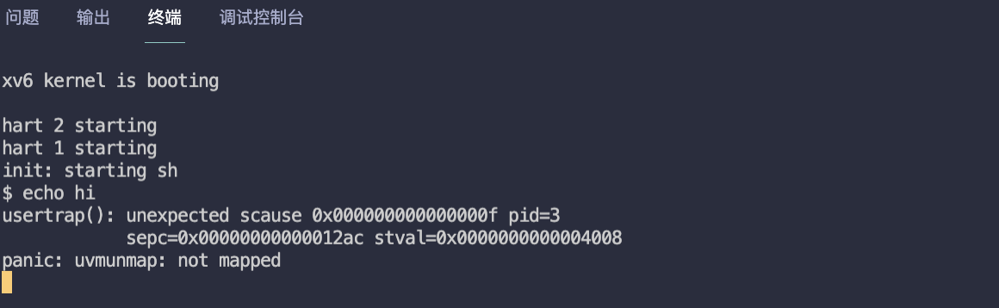
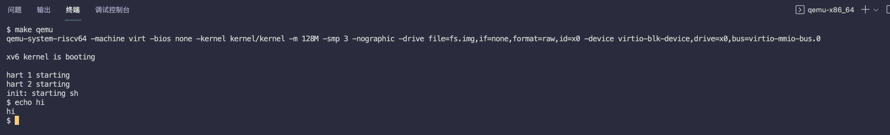
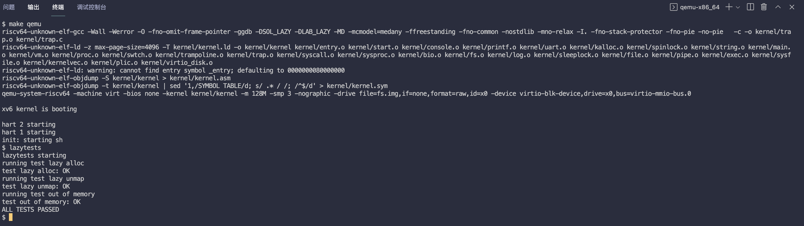
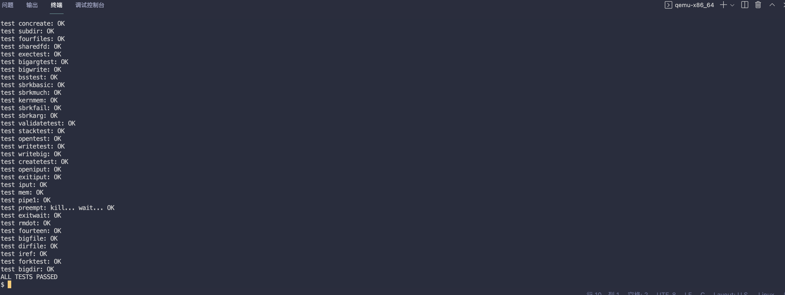

# MIT6.S081 - Lab5 Lazy（延迟分配）

本篇是 MIT6.S081 操作系统课程 Lab5 的实验笔记，目标是利用虚拟内存（页表硬件）完成 **Lazy page allocation 延迟分配内存** 的功能。

- 用户进程调用 **`malloc()`** 申请内存时，OS 不会真的为进程分配物理内存并映射到用户进程页表，而是等待真正访问到一块内存再分配。
- 优点
  - 避免用户申请大内存但只使用一小部分的情况发生。
  - 在大量内存复制的场景中节约了时间和内存空间，比如 **`fork()`** 的 **写时复制(copy on write)**，fork 阶段把父子进程共享的物理页面映射成 **只读**，当父子进程中任意一个进程执行写时，触发页面错误，OS 此时再复制这个错误的页面。
- 缺点，总的时间成本会增加，因为 **页错误（page fault）** 会切换到内核，相较于直接分配增加了额外的开销，我个人认为是一种时间换空间的策略。

和前面几个 lab 不同，lab5 的三道题只是为了完成懒分配这一个功能，每题完成一部分，所以，lab 5 可以理解为只有一个实验。 

实验的总体难度不高，其中一半的代码老师已经在视频课介绍过了。

> - Lab5 地址：https://pdos.csail.mit.edu/6.828/2020/labs/lazy.html
> - 我的实验记录：https://github.com/yibaoshan/xv6-labs-2020/tree/lazy

在开始实验之前，你需要：

1. 观看 Lecture 8 课程录播视频：**Page Faults**
    - YouTube 原版：https://www.youtube.com/watch?v=KSYO-gTZo0A
    - 哔哩哔哩中译版：https://www.bilibili.com/video/BV19k4y1C7kA?vd_source=6bce9c6d7d453b39efb8a96f5c8ebb7f&p=7
2. 阅读 [《xv6 book》](https://xv6.dgs.zone/tranlate_books/book-riscv-rev1/c3/s0.html) 4.6 **页面错误异常**
    - 英文原版：https://pdos.csail.mit.edu/6.828/2020/xv6/book-riscv-rev1.pdf
    - 中译版：https://xv6.dgs.zone/tranlate_books/book-riscv-rev1/c4/s0.html

# Eliminate allocation from sbrk() (easy)

请切换到 lazy 分支

Your first task is to delete page allocation from the sbrk(n) system call implementation, which is the function sys_sbrk() in sysproc.c. The sbrk(n) system call grows the process's memory size by n bytes, and then returns the start of the newly allocated region (i.e., the old size). Your new sbrk(n) should just increment the process's size (myproc()->sz) by n and return the old size. It should not allocate memory -- so you should delete the call to growproc() (but you still need to increase the process's size!).

**修改 `sbrk()` 函数，把立即分配内存改为仅增加用户大小。**

视频里面有介绍代码，不过没有考虑缩容的场景，我这里补一下，sysproc.c

```c
uint64
sys_sbrk(void)
{
  int addr;
  int n;

  if(argint(0, &n) < 0)
    return -1;

  struct proc* p = myproc();

  addr = p->sz;

  // 原代码调用了 growproc 执行扩容 or 缩容
//  if(growproc(n) < 0)
//    return -1;

  if (n > 0){
      (p->sz) += n; // 仅增大 size
  } else {
      uint sz = p->sz;
      p->sz = uvmdealloc(p->pagetable, sz, sz + n);
  }

  return addr;
}
```

启动 xv6，然后在 shell 中输入 `echo hi`，你应该会看到类似以下的内容：



触发异常，`scause` 寄存器值是 `0x000000000000000f`，即 error 15，表示存储指令发生页错误 page fault

- `stval` 寄存器保存的是出错的地址 `0x0000000000004008`。
- `sepc` 寄存器保存的是用户程序的 PC 值 `0x00000000000012ac`。

错误将会在下一题中解决，继续往下看。

# Lazy allocation (moderate)

Modify the code in trap.c to respond to a page fault from user space by mapping a newly-allocated page of physical memory at the faulting address, and then returning back to user space to let the process continue executing. You should add your code just before the printf call that produced the "usertrap(): ..." message. Modify whatever other xv6 kernel code you need to in order to get echo hi to work.

**上一题知道了错误类型（加载页错误还是存储页错误），以及出错的地址，接下来需要为用户进程真正分配物理内存，并映射到用户页表，最后，返回用户空间继续执行。**

课程提示：

1. 你可以通过检查 `r_scause()` 的值是 13 还是 15 来判断是否为页面故障类型。
2. `r_stval()` 返回 RISC-V `stval` 寄存器，该寄存器的值表示出错页面的虚拟地址。
3. 参考 vm.c 中的 `uvmalloc()` 函数实现，主要使用 `kalloc()` 和 `mappages()` 这俩函数。
4. 使用 `PGROUNDDOWN(va)` 将故障的虚拟地址向下舍入到页面边界。
5. `uvmunmap()` 函数会崩溃，修改为在某些页面未映射的时候不崩溃。
6. 如果内核崩溃了，你可以在 kernel/kernel.asm 文件中查看 `sepc` 寄存器的值。
7. 你可以使用之前在页表实验（pgtbl lab）中实现的 `vmprint()` 函数来打印页表的内容。
8. 如果你遇到了 "incomplete type proc" 这个错误，需要按以下顺序添加依赖文件 "spinlock.h"、"proc.h"

按照课程提示一步步修改即可，修改 trap.c 文件，在 trap.c 文件中添加错误检查

```c
void
usertrap(void)
{
  ...
  } else if((which_dev = devintr()) != 0){
    // ok
  } else if (r_scause() == 13 || r_scause() == 15) {
      uint64 va = r_stval();
      if (uvmalloc(p->pagetable, PGROUNDDOWN(va), PGROUNDDOWN(va) + PGSIZE) == 0)
          p->killed = 1;
  } else {
    printf("usertrap(): unexpected scause %p pid=%d\n", r_scause(), p->pid);
    ...
  }
}
```

如果是 **13 加载页错误** 或者 **15 存储页** 错误，调用 `uvmalloc()` 函数分配物理内存，并映射到用户页表。

> _注意，提示要求参考 `uvmalloc()` 函数，使用 `kalloc()` 和 `mappages()` 这两个函数来实现功能，我这里图方便直接调用 `uvmalloc()` 函数了。_

另外，调用 `uvmunmap()` 解除页表映射时，因为前面是 **假分配**，所以这里会存在根据 **虚拟地址找不到实际物理页面** 的情况，需要忽略报错，vm.c

```c
void
uvmunmap(pagetable_t pagetable, uint64 va, uint64 npages, int do_free)
{
  ...
  for(a = va; a < va + npages*PGSIZE; a += PGSIZE){
    if((pte = walk(pagetable, a, 0)) == 0)
//      panic("uvmunmap: walk"); // 忽略
          continue;
    if((*pte & PTE_V) == 0)
//      panic("uvmunmap: not mapped"); // 忽略
        continue;
    if(PTE_FLAGS(*pte) == PTE_V)
      panic("uvmunmap: not a leaf");
    ...
  }
}
```

重新编译，启动 xv6，然后 `echo hi` 应该可以正常工作了



# Lazytests and Usertests (moderate)

We've supplied you with lazytests, an xv6 user program that tests some specific situations that may stress your lazy memory allocator. Modify your kernel code so that all of both lazytests and usertests pass.

**通过 `lazytests` 和 `usertests` 程序。**

目标很明确，通过测试程序，先直接输入 `lazytests`，哪里报错改哪里

### uvmcopy: page not present

报错位置在 `vm.c->uvmcopy()`，查看代码

```c
int
uvmcopy(pagetable_t old, pagetable_t new, uint64 sz)
{
  for(i = 0; i < sz; i += PGSIZE){
    if((pte = walk(old, i, 0)) == 0)
      panic("uvmcopy: pte should exist");
    if((*pte & PTE_V) == 0)
      panic("uvmcopy: page not present"); // here
    pa = PTE2PA(*pte);
}
```

报错原因是，`fork()` 的时候会调用 `uvmcopy()` 复制爸爸的页表，和上一题的 `uvmunmap()` 解除页表映射一样，**有些页是假分配，没有实际地址的**，忽略即可

```c
int
uvmcopy(pagetable_t old, pagetable_t new, uint64 sz)
{
  for(i = 0; i < sz; i += PGSIZE){
    if((pte = walk(old, i, 0)) == 0)
//      panic("uvmcopy: pte should exist");
        continue;
    if((*pte & PTE_V) == 0)
//      panic("uvmcopy: page not present");
        continue;
    pa = PTE2PA(*pte);
}
```

### freewalk: leaf

`vm->freewalk()` 在执行释放页表时，发生错误

```c
void
freewalk(pagetable_t pagetable)
{
    ...
    } else if(pte & PTE_V){
      panic("freewalk: leaf"); // 报错位置
    }
}
```

这说明在释放页表时，还有一些物理页面的映射没有被正确清除。

> _刚开始面对这个错误没什么头绪，去查看 `lazytests` 测试用例才发现的问题_

`sparse_memory_unmap()` 会访问已释放的页，这时候应该触发页面错误杀掉进程 `trap.c->usertrap()`

```c
void
usertrap(void)
{
  ...
  } else if((which_dev = devintr()) != 0){
    // ok
  } else if (r_scause() == 13 || r_scause() == 15) {
      uint64 va = r_stval();
      在原来的基础上，增加了虚拟内存的上下限合法性检查
      if (va >= p->sz || va < p->trapframe->sp || uvmalloc(p->pagetable, PGROUNDDOWN(va), PGROUNDDOWN(va) + PGSIZE) == 0)
          p->killed = 1;
//      if (uvmalloc(p->pagetable, PGROUNDDOWN(va), PGROUNDDOWN(va) + PGSIZE) == 0)
//          p->killed = 1;
  } else {
    printf("usertrap(): unexpected scause %p pid=%d\n", r_scause(), p->pid);
    ...
  }
}
```

### lazytests passed

改完就可以通过 `lazytests` 测试了



### write sbrk failed

执行 `usertests` 遇到错误

```
test sbrkarg: sbrkarg: write sbrk failed
FAILED
```

报错的位置是在 `usertests.c->sbrkarg()` 函数中

```c
// test reads/writes from/to allocated memory
void
sbrkarg(char *s)
{
  ...
  a = sbrk(PGSIZE);
  fd = open("sbrk", O_CREATE|O_WRONLY);
  unlink("sbrk");
  if(fd < 0)  {
    printf("%s: open sbrk failed\n", s); 
    exit(1);
  }
  if ((n = write(fd, a, PGSIZE)) < 0) {
    printf("%s: write sbrk failed\n", s); // 这里抛出了错误
    exit(1);
  }
  ...
}
```

这个测试用例调用了 `write()` 执行写入，此时内核根据用户的页表来找对应的物理地址，但这个时候也可能存在 **假分配的问题，va 没有对应的 pa**，发生报错

整个调用链如下：

```
sys_write()
    ->file.c->filewrite()
        ->fs.c->writei()
            ->proc.c->either_copyin()
                ->vm.c->copyin()
                    ->vm.c->walkaddr()
```

我们需要在 `vm.c->walkaddr()` 中添加错误检查，**如果页表项不存在或者页表项无效但访问地址是有效的，那就尝试为它分配物理内存**

```c
...
#include "spinlock.h"
#include "proc.h" // 需要用到 proc 结构体

uint64
walkaddr(pagetable_t pagetable, uint64 va)
{
  pte_t *pte;
  uint64 pa;
  struct proc *p = myproc(); // 呐，新增的

  if(va >= MAXVA)
    return 0;

  pte = walk(pagetable, va, 0);
  // 如果页表项不存在或者页表项不是有效的，尝试分配物理内存
  if(pte == 0 || (*pte & PTE_V) == 0) {
      if (va >= p->sz || va < p->trapframe->sp || uvmalloc(p->pagetable, PGROUNDDOWN(va), PGROUNDDOWN(va) + PGSIZE) == 0)
          return 0; // 内存地址不合法，或者内存不足分配失败
  }
  ...
}
```

### usertests passed

最后，通过 `usertests` 测试



# 参考资料

- CS自学指南：https://csdiy.wiki/%E6%93%8D%E4%BD%9C%E7%B3%BB%E7%BB%9F/MIT6.S081/
- Wings：https://blog.wingszeng.top/series/learning-mit-6-s081/
- Miigon：https://blog.miigon.net/categories/mit6-s081/
- 知乎专栏《28天速通MIT 6.S081操作系统》：https://zhuanlan.zhihu.com/p/632281381


