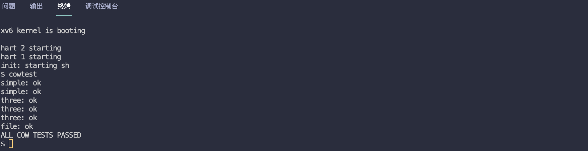

# MIT6.S081 - Lab6 Copy-on-Write（写时复制）

本篇是 MIT6.S081 操作系统课程 Lab6 的实验笔记，目标是完成 `fork()` 写时复制（Copy-on-Write）的功能，算是上一个懒分配实验的延伸。

未修改的 `fork()` 会复制父进程所有的内存到子进程，这个过程耗时且浪费内存，写时复制的核心思想是：

- **fork 阶段，新创建的子进程页表，映射到父进程的物理地址，父子进程页表指向的物理地址是相同的**
- **同时，将共享的物理页面映射成 只读。**
- **只有当父子进程中的某一方尝试修改共享的页面时，触发页面错误，OS 才真正为子进程复制该页面。**

> - Lab6 地址：https://pdos.csail.mit.edu/6.828/2020/labs/cow.html
> - 我的实验记录：https://github.com/yibaoshan/xv6-labs-2020/tree/cow

在开始实验之前，你需要：

1. 观看 Lecture 8 课程录播视频：**Interrupts（中断）**
    - YouTube 原版：https://www.youtube.com/watch?v=zRnGNndcVEA
    - 哔哩哔哩中译版：https://www.bilibili.com/video/BV19k4y1C7kA?vd_source=6bce9c6d7d453b39efb8a96f5c8ebb7f&p=8
2. 阅读 [《xv6 book》](https://xv6.dgs.zone/tranlate_books/book-riscv-rev1/c3/s0.html) 第五章： **中断和设备驱动**
    - 英文原版：https://pdos.csail.mit.edu/6.828/2020/xv6/book-riscv-rev1.pdf
    - 中译版：https://xv6.dgs.zone/tranlate_books/book-riscv-rev1/c5/s0.html

# Implement copy-on write(hard)

Your task is to implement copy-on-write fork in the xv6 kernel. You are done if your modified kernel executes both the cowtest and usertests programs successfully.

**实现 copy-on-write fork 功能，并通过 cowtest 和 usertests 测试程序。**

实验要求不能在上一节懒加载代码的基础上改，请切换到 cow 分支。

实现思路视频中讲得比较清楚：

1. **延迟复制/释放，把一个物理页的复制（`kalloc()` then `memmove()`）和释放（`kfree()`）操作，改为记录这个物理页面被多少个进程引用**
   - 创建新的物理页，引用数 +1
   - 复制一个物理页面，该物理页的引用数 +1
   - 进程释放一个物理页面，引用计数 -1，只有最后一个进程解除引用时，才可以真正的释放物理内存。
   - 执行写时复制，物理页的引用数也需要 -1
2. **写时复制，本实验的核心功能，当一个进程尝试向一个共享页写入的时候，执行创建新物理页并复制。**
   - 为 PTE 新增标识，用来标记这个物理页是写时复制的共享页面。
   - 触发页面错误，OS 才真正为子进程复制该页面。

### 1、延迟复制/释放

首先我们需要新增引用记数，用来记录每个物理页面被多少个进程引用，内存的申请释放都在 kalloc.c 文件

```c
...
struct {
  struct spinlock lock;
  struct run *freelist;
} kmem;

// 物理地址转 index
#define PA2IDX(p) (((uint64)(p)) / PGSIZE)

struct {
  struct spinlock lock; // 保证并发安全
  int ref_arr[PHYSTOP / PGSIZE]; // 每个物理页面的引用次数
} page_ref; // 模仿 kmem 新建页面引用结构
...
```

新建 `page_ref` 结构体，里面有个数组用来存储物理页面的引用次数，还有个 `lock` 自旋锁，用来保证多 CPU 的并发安全。

```c
void
kinit()
{
  initlock(&kmem.lock, "kmem");
  initlock(&page_ref.lock, "pageref"); // 初始化 page_ref.lock
  freerange(end, (void*)PHYSTOP);
}
```

初始化 page_ref.lock

```c
void *
kalloc(void)
{
  ...
  if(r){
    memset((char*)r, 5, PGSIZE); // fill with junk
    // 如果是新分配的有效物理页，引用计数为 1
    page_ref.ref_arr[PA2IDX(r)] = 1;
  }
  return (void*)r;
}
```

如果是新分配的有效物理页，引用计数需要为 1。

`kfree()` 释放函数也需要修改，释放一个物理页面，引用计数 -1，只有最后一个进程解除引用，没有进程映射到该物理页了，才真正释放页面

```c
void
kfree(void *pa)
{
  struct run *r;

  if(((uint64)pa % PGSIZE) != 0 || (char*)pa < end || (uint64)pa >= PHYSTOP)
    panic("kfree");

  acquire(&page_ref.lock);

  // 只有页面的引用计数为 0，没有进程映射到该物理页了，才真正释放页面
  if(--page_ref.ref_arr[PA2IDX(pa)] <= 0) {

    // Fill with junk to catch dangling refs.
    memset(pa, 1, PGSIZE);

    r = (struct run*)pa;

    acquire(&kmem.lock);
    r->next = kmem.freelist;
    kmem.freelist = r;
    release(&kmem.lock);
  }

  release(&page_ref.lock);
}
```

同时，还需要给外部提供增加引用次数和复制物理页的函数

```c

// 如果有必要，克隆一页物理页
void *ktry_pgclone(void *pa) {

    acquire(&page_ref.lock);

    // 这个物理页本来就只有一个地方引用，直接返回
    if(page_ref.ref_arr[PA2IDX(pa)] <= 1) {
        release(&page_ref.lock);
        return pa;
    }

    // 申请一页物理页
    uint64 newpa = (uint64)kalloc();

    if(newpa == 0) {
        release(&page_ref.lock);
        return 0;
    }

    // 复制老物理页内容到新页
    memmove((void*)newpa, (void*)pa, PGSIZE);

    // 老物理页引用减一
    page_ref.ref_arr[PA2IDX(pa)]--;

    release(&page_ref.lock);
    return (void*)newpa;
}

// 增加物理页面的引用次数
void kparef_inc(void *pa) {
    acquire(&page_ref.lock);
    page_ref.ref_arr[PA2IDX(pa)]++;
    release(&page_ref.lock);
}
```

把原先的 vm.c 里面的 copy 工作，改为对这个物理页的引用次数 +1

```c
int
uvmcopy(pagetable_t old, pagetable_t new, uint64 sz)
{
  pte_t *pte;
  uint64 pa, i;
  uint flags;
//  char *mem; // 不需要新的内存空间的

  for(i = 0; i < sz; i += PGSIZE){
    if((pte = walk(old, i, 0)) == 0)
      panic("uvmcopy: pte should exist");
    if((*pte & PTE_V) == 0)
      panic("uvmcopy: page not present");
    pa = PTE2PA(*pte);

    // 如果页面是可写权限，那把它标记为 COW 并移除写权限
    if (*pte & PTE_W) {
        *pte = (*pte & ~PTE_W) | PTE_COW;
    }

    flags = PTE_FLAGS(*pte);

    // 这里取消申请内存并复制的操作
//    if((mem = kalloc()) == 0)
//      goto err;
//    memmove(mem, (char*)pa, PGSIZE);

    // 将爸爸的物理地址映射到新的页表
    if(mappages(new, i, PGSIZE, (uint64)pa, flags) != 0){
      goto err;
    }
    // 将物理页的引用次数增加 1
      kparef_inc((void*)pa);
  }
  return 0;

 err:
  uvmunmap(new, 0, i / PGSIZE, 1);
  return -1;
}
```

### 2、写时复制

内存复制延迟到写操作，那就需要一种方来标记，哪些页面是写时复制的共享页面，我们这里用的是 PTE 的保留位来实现

```
kernel/riscv.h
...
#define PTE_U (1L << 4) // 1 -> user can access
#define PTE_COW (1L << 8)  // 第8位保留位用于标记 COW 页面
```

提供个方法，针对 cow 页面，执行创建新物理页并复制。

```c
kernel/vm.c
// 处理 COW 页错误
int cow_handler(pagetable_t pagetable, uint64 va)
{
    pte_t *pte;

    // 拿到 va 对应的页表项
    if((pte = walk(pagetable, va, 0)) == 0)
        panic("uvmcowcopy: walk");

    uint64 pa = PTE2PA(*pte);
    uint64 newpa;
    // 转为 pa 丢到 kalloc 里面处理，因为涉及到物理页的记数操作
    if((newpa = (uint64)ktry_pgclone((void*)pa)) != 0){
        // 重新修改为可写，并删除 cow 标识
        uint64 flags = (PTE_FLAGS(*pte) | PTE_W) & ~PTE_COW;
        // 解除原来的映射，注意最后一个参数要传0，不释放物理页
        uvmunmap(pagetable, PGROUNDDOWN(va), 1, 0);
        // 映射到新的物理页
        if(mappages(pagetable, va, 1, newpa, flags) == -1) {
            panic("uvmcowcopy: mappages");
        }
        return 0;
    }
    return -1;
}
```

然后，如果发现是 cow 页面，就调用 `cow_handler()` 来处理。

```c
kernel/vm.c
#include "spinlock.h"
#include "proc.h"
int
copyout(pagetable_t pagetable, uint64 dstva, char *src, uint64 len)
{
  uint64 n, va0, pa0;
  pte_t *pte;
  struct proc *p = myproc();

  while(len > 0){
    va0 = PGROUNDDOWN(dstva);

    // 如果是 cow 页，执行复制
    if(va0 < p->sz && (pte = walk(pagetable, va0, 0))!=0 && *pte & PTE_V&& *pte & PTE_COW)
        cow_handler(pagetable,va0);
    pa0 = walkaddr(pagetable, va0);
    ...
}
```

```
kernel/trap.c
void
usertrap(void) {
    ...
    if (r_scause() == 8) {
        // system call
        ...
    } else if ((which_dev = devintr()) != 0) {
        // ok
    } else if (r_scause() == 13 || r_scause() == 15) { // 和上一节实验一样，响应页错误
        pte_t *pte;
        uint64 va = r_stval();
        // 检查地址是否合法
        if (va >= p->sz)
            exit(-1);
        pte = walk(p->pagetable, va, 0);
        // 检查 pte 是否有效且是个 cow 页，不满足条件直接干掉进程
        if (pte == 0 || (*pte & PTE_V) == 0 || (*pte & PTE_COW) == 0)
            exit(-1);
        // 如果是 cow 页面，尝试为它完成写时复制
        if (cow_handler(p->pagetable, va) == -1) {
            exit(-1);
        }
    } else {
        printf("usertrap(): unexpected scause %p pid=%d\n", r_scause(), p->pid);
        printf("            sepc=%p stval=%p\n", r_sepc(), r_stval());
        p->killed = 1;
    }
    ...
}
```

最后来执行测试用例 cowtest



测试通过，完整代码在：https://github.com/yibaoshan/xv6-labs-2020/commit/63b00eaae1c503792142d0e770fc99faaec6a182

# 参考资料

- CS自学指南：https://csdiy.wiki/%E6%93%8D%E4%BD%9C%E7%B3%BB%E7%BB%9F/MIT6.S081/
- Wings：https://blog.wingszeng.top/series/learning-mit-6-s081/
- Miigon：https://blog.miigon.net/categories/mit6-s081/
- 知乎专栏《28天速通MIT 6.S081操作系统》：https://zhuanlan.zhihu.com/p/632281381


