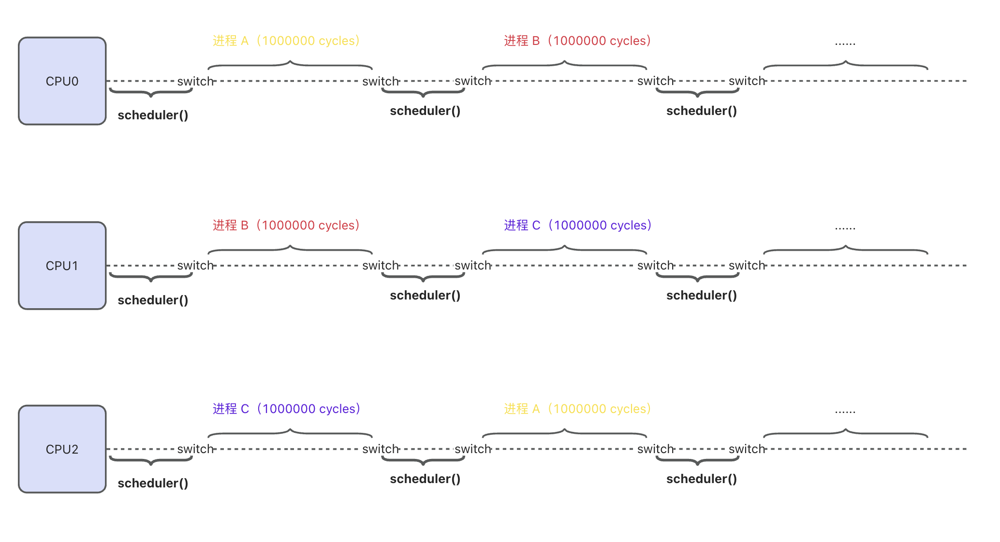
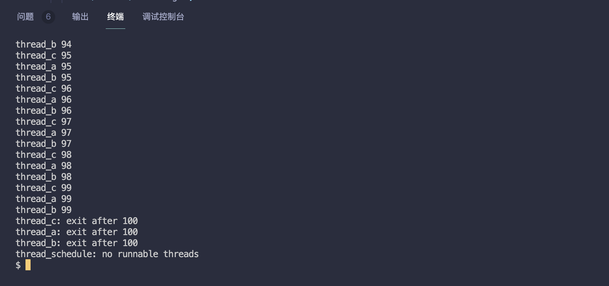
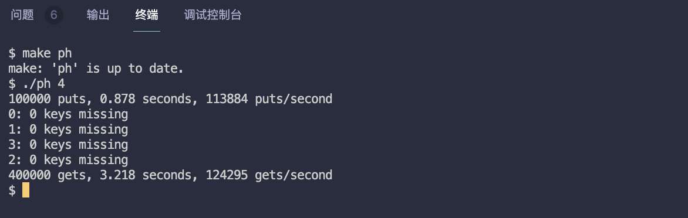
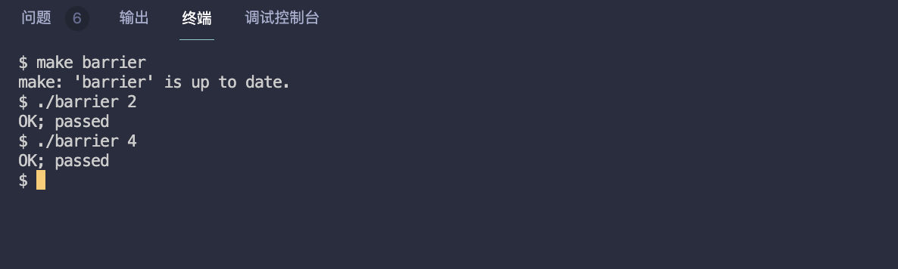

# MIT6.S081 - Lab7 Multithreading（进程调度）

本篇是 MIT6.S081 操作系统课程 Lab7 的实验笔记，任务是模仿内核进程切换，写一个用户级线程切换功能。同时，我也会结合源码，介绍 xv6 是如何完成进程切换的。

> - Lab7 地址：https://pdos.csail.mit.edu/6.828/2020/labs/thread.html
> - 我的实验记录：https://github.com/yibaoshan/xv6-labs-2020/tree/thread

在开始实验之前，你需要：

1. 观看 Lecture 10 课程录播视频：**Multiprocessors and Locks（多处理器和锁）**
    - YouTube 原版：https://www.youtube.com/watch?v=NGXu3vN7yAk
    - 哔哩哔哩中译版：https://www.bilibili.com/video/BV19k4y1C7kA?vd_source=6bce9c6d7d453b39efb8a96f5c8ebb7f&p=9
    - 中译文字版：https://mit-public-courses-cn-translatio.gitbook.io/mit6-s081/lec10-multiprocessors-and-locking
2. 阅读 [《xv6 book》](https://xv6.dgs.zone/tranlate_books/book-riscv-rev1/c3/s0.html) 第六章： **Lock**
    - 英文原版：https://pdos.csail.mit.edu/6.828/2020/xv6/book-riscv-rev1.pdf
    - 中译版：https://xv6.dgs.zone/tranlate_books/book-riscv-rev1/c6/s0.html
3. 观看 Lecture 11 课程录播视频：**Thread Switching（线程切换）**
    - YouTube 原版：https://www.youtube.com/watch?v=vsgrTHY5tkg
    - 哔哩哔哩中译版：https://www.bilibili.com/video/BV19k4y1C7kA?vd_source=6bce9c6d7d453b39efb8a96f5c8ebb7f&p=10
    - 中译文字版：https://mit-public-courses-cn-translatio.gitbook.io/mit6-s081/lec11-thread-switching-robert
4. 阅读 [《xv6 book》](https://xv6.dgs.zone/tranlate_books/book-riscv-rev1/c3/s0.html) 第七章： **Scheduling（调度）**
    - 英文原版：https://pdos.csail.mit.edu/6.828/2020/xv6/book-riscv-rev1.pdf
    - 中译版：https://xv6.dgs.zone/tranlate_books/book-riscv-rev1/c7/s0.html

# xv6 如何是完成进程切换的？

Lab7 是最近几个实验里面，难度最低的，甚至比 Lab1 还要简单。不过，要想顺利完成 Lab7，我们需要对 xv6 的 “**进程切换机制**” 有个基本的了解。

xv6 进程切换主要依赖两个函数，调度器 `scheduler()` 和汇编实现的 `swtch()`：

1. **`scheduler()`：调度器函数，功能是遍历进程表，寻找一个处于 `runnable` 状态的进程，然后调用 `swtch()` 切换到该进程。**
2. **`swtch()`：上下文切换函数，汇编代码 swtch.S 实现，入参是两个 `context` 结构体 `old` 和 `new`，用于交换两个进程的上下文（把当前 CPU 状态写入 `old`，再把 `new` 代表的目标进程的写到 CPU，完成切换）。**

### 1、swtch()

`switch()` 的工作内容非常简单，切换入参的两个上下文，然后返回到新上下文 `ra` 寄存器 指向的地址继续执行。

```asm
# 上下文切换
#
#   void swtch(struct context *old, struct context *new);
# 
# 1. 保存当前寄存器到 old 中
# 2. 从 new 中加载寄存器
# 3. 返回到new的ra寄存器指向的地址

.globl swtch
swtch:
        # 保存当前 CPU 的上下文到 old (a0 参数)
        sd ra, 0(a0)    # 保存 ra 寄存器指向的函数返回地址 return address
        sd sp, 8(a0)    # 保存栈顶位置
        sd s0-s11...    # 保存被调用者保存的寄存器

        # 加载新上下文 new (a1 参数)到 CPU
        ld ra, 0(a1)    # 加载新的返回地址
        ld sp, 8(a1)    # 加载新的栈指针
        ld s0-s11...    # 加载新的寄存器值

        ret             # 返回到新上下文的 ra 指定的地址（ra 已经设置过了）
```

`switch()` 运行在 **内核态**，此时，用户进程的状态在切换到 **内核态** 的时候已经保存到 **`trapframe`** 里了，所以，这里的汇编程序只需要 **保存/恢复** 函数调用相关的寄存器即可。

### 2、scheduler()

板子上电后，每个 CPU 都会运行从 `enter.S` -> `start.c` -> `main.c` -> `scheduler()` 的流程。

```c
kernel/main.c
// start() jumps here in supervisor mode on all CPUs.
void
main()
{
  if(cpuid() == 0){
    ... // 一系列的初始化工作
    __sync_synchronize();
    started = 1;
  } else {
    while(started == 0) // 其他 CPU 等待 0 号位完成初始化再执行
      ;
    __sync_synchronize();
    kvminithart();    // turn on paging 开启分页
    trapinithart();   // install kernel trap vector 注册 trap 
    ...
  }

  scheduler(); // 进入自己的调度器        
}
```

- 对于 **0 号 CPU**，负责初始化 **内存**、**进程**、**文件管理** 以及 **启动第一个用户程序** 等工作，**全局初始化** 执行完以后，进入 **`scheduler()`**。
- 对于其他 CPU，在等待 0 号位完成 **全局初始化** 后，再进行开启自己的 **分页**（_每个 CPU 的寄存器都是独立的_）、**注册中断** 等工作，最终也进入 **`scheduler()`**。

在 xv6 中，结构体 `cpu` 保存了当前 CPU 的上下文 `context`，以及当前 CPU 正在运行的进程 `proc`。

```c
// Per-CPU state.
struct cpu {
  struct proc *proc;          // The process running on this cpu, or null.
  struct context context;     // swtch() here to enter scheduler().
};
```

接下来重点来了，`scheduler()` 函数的核心逻辑是：

1. 遍历进程表，寻找一个处于 `runnable` 状态的进程，然后调用 `swtch()` 切换到该进程。
2. 如果没有需要执行的进程，执行 `wfi` 指令，让 CPU 进入 **低功耗** 等待状态，直到有 **中断** 发生。

```c
void
scheduler(void)
{
  struct proc *p;
  struct cpu *c = mycpu();
  c->proc = 0;
  for(;;){
    // 允许中断，这样 I/O 中断才能唤醒等待的进程
    intr_on();
    // 遍历进程表，选取一个处于 runnable 状态的进程
    for(p = proc; p < &proc[NPROC]; p++){
      // 确保每一个进程只有一个 CPU 在修改状态
      acquire(&p->lock);
      // 逮到了！（杨迪四川话版）
      if(p->state == RUNNABLE){
        p->state = RUNNING;
        c->proc = p;
        // 保存当前调度器（cpu->context）的状态，恢复 p->context（保存了进程 p 上次离开时的内核上下文）
        swtch(&c->context, &p->context);
        // 当进程 p 再次切回到 CPU 后，继续执行此处，即 ra 寄存器返回的地址
        c->proc = 0;
      }
      release(&p->lock);
    }
    if(nproc <= 2) {   // only init and sh exist
      intr_on();
      asm volatile("wfi");
    }
  }
}
```

如果有需要调度的进程，调用 `swtch()` 函数，入参 **`old` = `c->context`**，**`new` = `p->context`**

我们在上一小节介绍了 `switch` 汇编程序的功能：

1. **当前 CPU 的状态，会被保存到 `c->context` 中**
   - 其中，`ra` 寄存器的值保存的是 `swtch()` 返回后的下一条指令地址，即 **`c->proc = 0`**。 
   - 当进程 p 返回的时候， `ra` 会被恢复为调度器调用 `swtch()` 时的值，即从 **`c->proc = 0`** 处继续向下执行。
2. **`p->context` 会被加载到 CPU，然后返回到 `ra` 寄存器指向的地址继续执行**
   - `p->context` `ra` 保存的是进程上次执行的位置，如果是新进程，`ra` 指向的是 `forkret()` 函数（_`forkret` 负责完成进程创建后的收尾工作这里不向下展开_）
   - `switch` 汇编程序 执行最后一行 `ret` 的那一刻，进程完成了切换。

xv6 在创建新进程时，会为该进程创建一个 **上下文 `context`**，这一步用来保证：**如果一个新创建的进程首次被调度器选中，`p->context` 不会为空。**

```c
static struct proc*
allocproc(void)
{
  ...
  // Set up new context to start executing at forkret,
  // which returns to user space.
  memset(&p->context, 0, sizeof(p->context));
  p->context.ra = (uint64)forkret;
  p->context.sp = p->kstack + PGSIZE;
  ...
}
```

开机首次从 **内核 `schedule()`** 切换到 **用户进程** 的过程大概就是这样，小结一下：

```
首次切换：
scheduler() 运行
    ↓
swtch(&c->context, &p->context)
    ↓ 保存 scheduler() 的上下文到 c->context
    ↓ 加载进程的上下文（从 p->context 中获取）
    ↓ usertrapret() -> trampoline.S:
      1. 切换到用户页表
      2. 从 trapframe 恢复所有用户寄存器
      3. 返回用户态继续执行
```

**内核代码** 切换到 **用户进程** 已经讲完了，接下来我们一起来看看，**OS 是如何从用户进程切换回 `scheduler()` 内核代码的**。

### 3、触发调度

在 xv6 中，有 **三个** 主要入口会调用 `swtch()` 切换回 `scheduler()`：

1. **`yield()` ：主动让出 CPU**

```c
void yield(void) {
  struct proc *p = myproc();
  acquire(&p->lock);
  p->state = RUNNABLE;
  sched();  // 调用 swtch 切换到 scheduler
  release(&p->lock);
}
```

2. **`exit()` ：进程退出**

```c
void exit(int status) {
  // ... 清理进程资源 ...
  p->state = ZOMBIE;
  release(&original_parent->lock);
  sched();  // 切换到 scheduler，永不返回
  panic("zombie exit");
}
```

3. **`sleep()` ：进程休眠**

```c
void sleep(void *chan, struct spinlock *lk) {
  // ... 设置休眠条件 ...
  p->chan = chan;
  p->state = SLEEPING;
  sched();  // 切换到 scheduler
  // ... 唤醒后的清理工作 ...
}
```

这 **三个** 场景都会通过调用 `sched` 函数，最终使用 `swtch（）` 切换到 **内核调度器**。它们代表了进程调度的三种典型情况：**主动让出 CPU（`yield`）**、**进程终止（`exit`）**、**进程等待某个事件发生（`sleep`）**

我们这一小节要讨论的是 **OS 怎么切换回调度器 的**，所以只关注 **用户进程时间片** 用完了，触发 **定时器中断** 的情况：

```c
void
usertrap(void)
{
  // ... 
  if(which_dev == 2) {  // 时钟中断
    yield();
  }
}

void
kerneltrap(void)
{
  // ...
  if(which_dev == 2 && myproc() != 0 && myproc()->state == RUNNING) {
    yield();
  }
}
```

如果 which_dev == 2，说明是 **时钟中断**，触发了 `yield()`。

定时器的时长是在 **CPU0** 执行初始化工作的时候设置的：

```c
kernel/start.c
// 为每个 CPU 的时钟中断间隔为 1000,000 个 CPU 周期
timerinit() {
    ... 
    int interval = 1000000; // cycles; about 1/10th second in qemu.
    *(uint64*)CLINT_MTIMECMP(id) = *(uint64*)CLINT_MTIME + interval;
    ...
}
```

每个进程允许执行 **1000,000** 个 CPU 周期，到期触发 **时钟中断**，然后调用 `yield()`，`yield()` 又调用了 `sched()` 函数让出 CPU。

```c
void
sched(void)
{
  ...
  struct proc *p = myproc();
  swtch(&p->context, &mycpu()->context);
  ...
}
```

`sched()` 函数很简单，转头调用 `swtch()` 执行切换，入参 **`old` = `p->context`**，**`new` = `mycpu->context`**

1. **把当前 CPU 状态保存到正在运行进程的 context 。**
2. **取出上次 `mycpu->context` 保存的上下文，恢复到 CPU**
3. **switch 汇编执行最后一行 `ret` 的那一刻，切换回 `scheduler()` 继续运行（`c->proc = 0`）。**

```c
void
scheduler(void)
{
  ...
  for(;;){
    ...
    for(p = proc; p < &proc[NPROC]; p++){
        ...
        swtch(&c->context, &p->context);
        c->proc = 0; // here!!! 我胡汉三又回来了！
    }
  }
}
```

切回 **调度器** 后，`scheduler()` 继续查找 **下一个** 需要调度的进程，进程的时间片用完了，触发 **定时器中断**，调用 `yield()` 切换回 **内核调度器** `scheduler()`，周而复始，，，

到这里，**xv6 是如何完成进程切换** 就全部讲完了，我们来画张图总结一下 CPU 的工作流程：



接下来开始做实验

# Uthread: switching between threads(moderate)

In this exercise you will design the context switch mechanism for a user-level threading system, and then implement it. To get you started, your xv6 has two files user/uthread.c and user/uthread_switch.S, and a rule in the Makefile to build a uthread program. uthread.c contains most of a user-level threading package, and code for three simple test threads. The threading package is missing some of the code to create a thread and to switch between threads.

**实现一个用户级线程系统中线程间的上下文切换机制，也就是让多个线程能在一个用户程序内 “切换执行”，并提供了 `user/uthread.c` 和 `user/uthread_switch.S`，你在里面填充代码即可。**

简单题，抄 xv6 进程调度的代码就可以，打开 **user/uthread.c**

```c
#define STACK_SIZE  8192
#define MAX_THREAD  4

// 线程上下文结构体
struct context {
  uint64 ra;
  uint64 sp;
  uint64 s0;
  uint64 s1;
  uint64 s2;
  uint64 s3;
  uint64 s4;
  uint64 s5;
  uint64 s6;
  uint64 s7;
  uint64 s8;
  uint64 s9;
  uint64 s10;
  uint64 s11;
};

struct thread {
  char       stack[STACK_SIZE]; /* the thread's stack */
  int        state;             /* FREE, RUNNING, RUNNABLE */
  struct     context context;  // 线程上下文
};
struct thread all_thread[MAX_THREAD];
...

void 
thread_init(void)
{
  // main() is thread 0, which will make the first invocation to
  // thread_schedule().  it needs a stack so that the first thread_switch() can
  // save thread 0's state.  thread_schedule() won't run the main thread ever
  // again, because its state is set to RUNNING, and thread_schedule() selects
  // a RUNNABLE thread.
  current_thread = &all_thread[0];
  current_thread->state = RUNNING;
}

void 
thread_schedule(void)
{
  ...
  if (current_thread != next_thread) {         /* switch threads?  */
    next_thread->state = RUNNING;
    t = current_thread;
    current_thread = next_thread;
    /* YOUR CODE HERE
     * Invoke thread_switch to switch from t to next_thread:
     * thread_switch(??, ??);
     */
     // 调用 thread_switch 进行上下文切换
    thread_switch((uint64)&t->context, (uint64)&next_thread->context);
  } else
    next_thread = 0;
}

void 
thread_create(void (*func)())
{
  ...
  t->state = RUNNABLE;
  // YOUR CODE HERE
  // 设置新线程的上下文
  memset(&t->context, 0, sizeof(t->context));
  t->context.ra = (uint64)func;  // 返回地址设为线程函数
  t->context.sp = (uint64)t->stack + STACK_SIZE;  // 栈指针指向栈顶
}
```

**user/uthread_switch.S** 里面就更简单了，直接拷贝 kernel 里面的 **switch.S** 文件

```asm
	.text

	/*
         * save the old thread's registers,
         * restore the new thread's registers.
         */

	.globl thread_switch
thread_switch:
	/* YOUR CODE HERE */
	# a0 保存当前线程上下文的地址
    # a1 保存下一个线程上下文的地址
    
    # 保存当前线程的寄存器
    sd ra, 0(a0)
    sd sp, 8(a0)
    sd s0, 16(a0)
    sd s1, 24(a0)
    sd s2, 32(a0)
    sd s3, 40(a0)
    sd s4, 48(a0)
    sd s5, 56(a0)
    sd s6, 64(a0)
    sd s7, 72(a0)
    sd s8, 80(a0)
    sd s9, 88(a0)
    sd s10, 96(a0)
    sd s11, 104(a0)

    # 恢复下一个线程的寄存器
    ld ra, 0(a1)
    ld sp, 8(a1)
    ld s0, 16(a1)
    ld s1, 24(a1)
    ld s2, 32(a1)
    ld s3, 40(a1)
    ld s4, 48(a1)
    ld s5, 56(a1)
    ld s6, 64(a1)
    ld s7, 72(a1)
    ld s8, 80(a1)
    ld s9, 88(a1)
    ld s10, 96(a1)
    ld s11, 104(a1)
	ret    /* return to ra */
```

`make qemu` 编译，执行 `uthread` 查看结果



测试通过，完整代码在：https://github.com/yibaoshan/xv6-labs-2020/commit/978d71fd02928313549058f5b354180fcab200d5

# Using threads (moderate)

In this assignment you will explore parallel programming with threads and locks using a hash table. You should do this assignment on a real Linux or MacOS computer (not xv6, not qemu) that has multiple cores. Most recent laptops have multicore processors.

**给哈希表加锁，保证并发安全**

送分题，打开 ph.c 文件

```c
...
int keys[NKEYS];
int nthread = 1;

// 为每个 bucket 创建一个锁
pthread_mutex_t locks[NBUCKET];
...

static 
void put(int key, int value)
{
  ...
  if(e){
    // update the existing key.
    e->value = value;
  } else {
    // the new is new.
    pthread_mutex_lock(&locks[i]); // 加锁
    insert(key, value, &table[i], table[i]);
    pthread_mutex_unlock(&locks[i]); // 解锁
  }
}

int
main(int argc, char *argv[])
{
  ...
  if (argc < 2) {
    fprintf(stderr, "Usage: %s nthreads\n", argv[0]);
    exit(-1);
  }
  // 初始化所有锁
  for(int i = 0; i < NBUCKET; i++) {
      pthread_mutex_init(&locks[i], NULL);
  }
  nthread = atoi(argv[1]);
  ...
}
```

`make ph` 编译单个 ph 文件，再执行 `./ph 4` 查看结果



测试通过，完整代码在：https://github.com/yibaoshan/xv6-labs-2020/commit/91ab33bdcd4379ae1f1931fdc577846aa870cc9a

# Barrier(moderate) 

In this assignment you'll implement a barrier: a point in an application at which all participating threads must wait until all other participating threads reach that point too. You'll use pthread condition variables, which are a sequence coordination technique similar to xv6's sleep and wakeup.

**实现一个 “屏障”（`barrier`）：所有的线程都需要在 barrier 这个同步点等待，直到所有线程都到达这个点之后才可以继续向下执行。**

又是送分题，打开 notxv6/barrier.c 文件

```c
notxv6/barrier.c
static void 
barrier()
{
  // YOUR CODE HERE
  //
  // Block until all threads have called barrier() and
  // then increment bstate.round.
  //
  pthread_mutex_lock(&bstate.barrier_mutex);
  
  bstate.nthread++;
  
  if (bstate.nthread >= nthread) {
    bstate.round++;
    bstate.nthread = 0;
    // 唤醒所有正在等待的线程
    pthread_cond_broadcast(&bstate.barrier_cond);
  } else {
    // 等待其他线程
    pthread_cond_wait(&bstate.barrier_cond, &bstate.barrier_mutex);
  }
  
  pthread_mutex_unlock(&bstate.barrier_mutex);
  
}
```

`make barrier` 编译单个文件，再执行 `./barrier 4` 查看结果



测试通过，完整代码在：https://github.com/yibaoshan/xv6-labs-2020/commit/890a2ee8cba5c98dfbd73df32bd80cd11ed974c4

# 参考资料

- CS自学指南：https://csdiy.wiki/%E6%93%8D%E4%BD%9C%E7%B3%BB%E7%BB%9F/MIT6.S081/
- Wings：https://blog.wingszeng.top/series/learning-mit-6-s081/
- Miigon：https://blog.miigon.net/categories/mit6-s081/
- 知乎专栏《28天速通MIT 6.S081操作系统》：https://zhuanlan.zhihu.com/p/632281381
