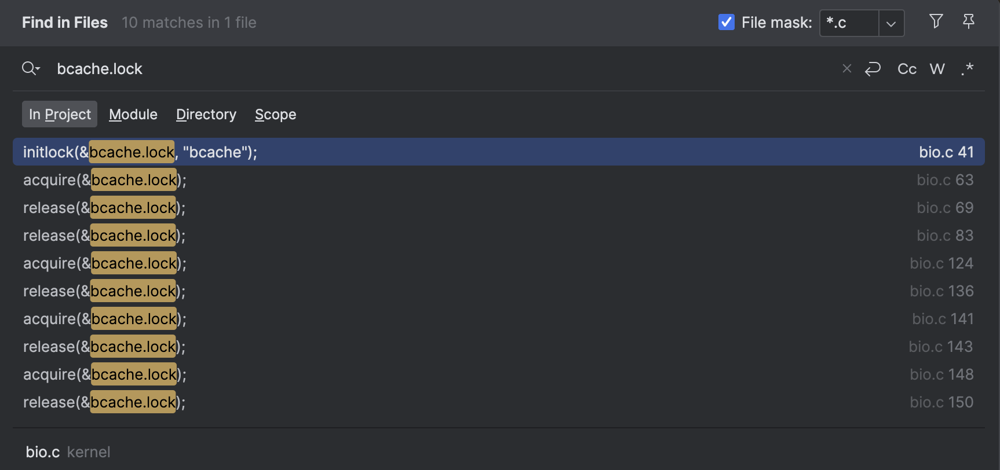
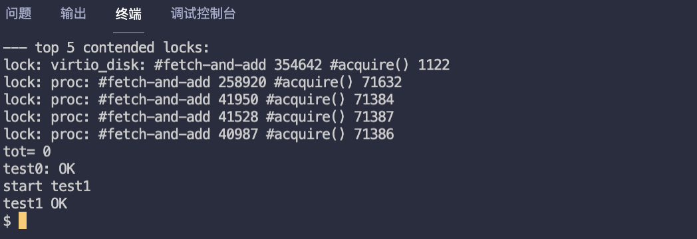

# MIT6.S081 - Lab8 Locks（锁优化 | 并发安全）

本篇是 MIT6.S081 2020 操作系统课程 Lab8 的实验笔记，目标是在保证并发安全的前提下，重新设计 **内存分配器** 和 **块缓存** 这两个部分代码，提高系统并发性能。

对于有项目经验的同学来说，实验的难度不算高，重点在于找出 **“哪些操作有并发安全问题”** 需要加锁，实验也没有涉及到新的知识点，直接动手做就行了。

> - Lab8 地址：https://pdos.csail.mit.edu/6.828/2020/labs/lock.html
> - 我的实验记录：https://github.com/yibaoshan/xv6-labs-2020/tree/lock

在开始实验之前，你需要（_上一节看过就不用看了_）：

1. 观看 Lecture 10 课程录播视频：**Multiprocessors and Locks（多处理器和锁）**
    - YouTube 原版：https://www.youtube.com/watch?v=NGXu3vN7yAk
    - 哔哩哔哩中译版：https://www.bilibili.com/video/BV19k4y1C7kA?vd_source=6bce9c6d7d453b39efb8a96f5c8ebb7f&p=9
    - 中译文字版：https://mit-public-courses-cn-translatio.gitbook.io/mit6-s081/lec10-multiprocessors-and-locking
2. 阅读 [《xv6 book》](https://xv6.dgs.zone/tranlate_books/book-riscv-rev1/c3/s0.html) 第六章： **Lock**
    - 英文原版：https://pdos.csail.mit.edu/6.828/2020/xv6/book-riscv-rev1.pdf
    - 中译版：https://xv6.dgs.zone/tranlate_books/book-riscv-rev1/c6/s0.html

# Memory allocator (moderate)

The program user/kalloctest stresses xv6's memory allocator: three processes grow and shrink their address spaces, resulting in many calls to kalloc and kfree. kalloc and kfree obtain kmem.lock. kalloctest prints (as "#fetch-and-add") the number of loop iterations in acquire due to attempts to acquire a lock that another core already holds, for the kmem lock and a few other locks. The number of loop iterations in acquire is a rough measure of lock contention. The output of kalloctest looks similar to this before you complete the lab:

```
$ kalloctest
start test1
test1 results:
--- lock kmem/bcache stats
lock: kmem: #fetch-and-add 83375 #acquire() 433015
lock: bcache: #fetch-and-add 0 #acquire() 1260
--- top 5 contended locks:
lock: kmem: #fetch-and-add 83375 #acquire() 433015
lock: proc: #fetch-and-add 23737 #acquire() 130718
lock: virtio_disk: #fetch-and-add 11159 #acquire() 114
lock: proc: #fetch-and-add 5937 #acquire() 130786
lock: proc: #fetch-and-add 4080 #acquire() 130786
tot= 83375
test1 FAIL
```

**重新设计 内存分配器 这部分的代码，测试程序 user/kalloctest 会使用 3 个进程，分别执行 申请 和 释放 内存的操作，从而测试 内存分配器的 并发安全。**

### 实验思路

原先操作内存用到的是 kmem 结构体，里面维护一个 **自旋锁** 和一个 **空闲内存链表**

```c
kernel/kalloc.c
struct {
  struct spinlock lock; // 内存分配锁
  struct run *freelist; // 维护空闲内存的链表
} kmem; 
```

**申请/释放** 内存实际是对 `freelist` 链表的读写操作，大家都在一口锅里面吃饭，所以，为了并发安全，多 CPU 操作链表时需要加锁。

```c
void
kfree(void *pa)
{
  struct run *r = (struct run*)pa;
  acquire(&kmem.lock); // 加锁
  r->next = kmem.freelist; // 释放页 next 指针指向链表
  kmem.freelist = r; // 释放的空页重新加到链表的头部
  release(&kmem.lock); // 解锁
}

void *
kalloc(void)
{
  struct run *r;
  acquire(&kmem.lock); // 加锁
  r = kmem.freelist; // 从链表头取一个空闲页
  if(r)
    kmem.freelist = r->next; // 从链表头移除这个空闲页
  release(&kmem.lock);
  return (void*)r;
}
```

同一时间只能有一个 CPU 操作内存，效率太低，实验要求对这块代码进行优化：

1. **让每个 CPU 维护一个属于自己的 空闲内存列表，申请 和 释放 都只操作自己的 空闲内存列表 ，从而提高并发性能。**
   - 系统默认由 CPU0 执行初始化内存，因此，刚启动时 可用内存 全部在 CPU0 的链表上。其他 CPU 执行到 `kalloc()` 时，会按顺序从其他 CPU 的 空闲内存列表 中拉取（_刚开始往往会会从 CPU0 的链表中取，因为只有它有空闲_）。
2. **如果自个儿的 空闲内存列表 空了，没有可用内存了，去其他 CPU 的空闲内存列表中去 “抢”。**
   - 操作自己的链表也需要加锁，因为其他 CPU 没内存了可能会过来抢我们的。

### 代码实现

第一步，把 kmem 结构体改为数组形式，让每个 CPU 维护自己的 空闲内存列表

```c
kernel/kalloc.c
struct {
    struct spinlock lock;
    struct run *freelist;
} kmem[NPROC]; // 每个 CPU 都拥有自个儿的可用内存链表
```

原先初始化锁的地方改为：

```c
void
kinit() {
//  initlock(&kmem.lock, "kmem");
    for (int i = 0; i < NPROC; i++)
        initlock(&kmem[i].lock, "kmem"); // 初始化每个 CPU 的锁
    freerange(end, (void *) PHYSTOP);
}
```

然后是 申请 和 释放 内存操作，按照代码顺序，先改 **释放 `kfree()`**

```c
void
kfree(void *pa) {
    struct run *r;
    int id = cpuid();

    if (((uint64) pa % PGSIZE) != 0 || (char *) pa < end || (uint64) pa >= PHYSTOP)
        panic("kfree");

    // Fill with junk to catch dangling refs.
    memset(pa, 1, PGSIZE);

    r = (struct run *) pa;

   // 原来的逻辑，加锁，然后把空闲页加到链表的头部，释放锁，搞定
//  acquire(&kmem.lock);
//  r->next = kmem.freelist;
//  kmem.freelist = r;
//  release(&kmem.lock);

    // 改为，把空闲页加入到正在执行的 CPU 的链表中
    acquire(&kmem[id].lock);
    r->next = kmem[id].freelist;
    kmem[id].freelist = r;
//    printf("cpu %d free 1 page\n", id);
    release(&kmem[id].lock);
}
```

把已经释放的空闲页，随机加入某个 CPU 的链表中（_取决于哪个 CPU 执行的释放_）

接着是 **申请内存 `kalloc()`**

```c
void *
kalloc(void) {
    struct run *r = 0;

    // 原来的逻辑，加锁，然后从链表头取一个空闲页，释放锁
//  acquire(&kmem.lock);
//  r = kmem.freelist;
//  if(r)
//    kmem.freelist = r->next;
//  release(&kmem.lock);

    // 改为，优先从当前 CPU（curid）中获取一个空闲页，如果失败，从当前 CPU 右手边开始遍历，直到找到一页或者都没有可用内存
    for (int i = 0, curid = cpuid(); i < NPROC && !r; i++, curid++) {
        if (curid == NPROC)
            curid = 0; // 环形遍历
        acquire(&kmem[curid].lock);
        r = kmem[curid].freelist;
        if (r) {
            kmem[curid].freelist = r->next;
//            printf("cpu %d steal 1 page from cpu %d\n", cpuid(), curid);
        }
        release(&kmem[curid].lock);
    }

    if (r)
        memset((char *) r, 5, PGSIZE); // fill with junk
    return (void *) r;
}
```

1. **优先尝试从 `curid`（当前 CPU）中获取一个空闲页。**
2. **如果成功，把该页从链表头移除，不满足循环条件，退出循环。**
3. **如果失败，从当前 CPU 右手边继续向下遍历，直到找到一页空闲内存，或者全部 CPU 都没有可用内存，退出循环。**

代码写完了，`make qemu` 编译，执行 `kalloctest` 查看结果


测试通过，完整代码在：https://github.com/yibaoshan/xv6-labs-2020/commit/bef38c1a26bfa3a668ccadcc3afa8bdc876c0917

# Buffer cache (hard)

If multiple processes use the file system intensively, they will likely contend for bcache.lock, which protects the disk block cache in kernel/bio.c. bcachetest creates several processes that repeatedly read different files in order to generate contention on bcache.lock; its output looks like this (before you complete this lab):

```
$ bcachetest
start test0
test0 results:
--- lock kmem/bcache stats
lock: kmem: #fetch-and-add 0 #acquire() 33035
lock: bcache: #fetch-and-add 16142 #acquire() 65978
--- top 5 contended locks:
lock: virtio_disk: #fetch-and-add 162870 #acquire() 1188
lock: proc: #fetch-and-add 51936 #acquire() 73732
lock: bcache: #fetch-and-add 16142 #acquire() 65978
lock: uart: #fetch-and-add 7505 #acquire() 117
lock: proc: #fetch-and-add 6937 #acquire() 73420
tot= 16142
test0: FAIL
start test1
test1 OK
```

You will likely see different output, but the number of acquire loop iterations for the bcache lock will be high. If you look at the code in kernel/bio.c, you'll see that bcache.lock protects the list of cached block buffers, the reference count (b->refcnt) in each block buffer, and the identities of the cached blocks (b->dev and b->blockno).

```
$ bcachetest
start test0
test0 results:
--- lock kmem/bcache stats
lock: kmem: #fetch-and-add 0 #acquire() 32954
lock: kmem: #fetch-and-add 0 #acquire() 75
lock: kmem: #fetch-and-add 0 #acquire() 73
lock: bcache: #fetch-and-add 0 #acquire() 85
lock: bcache.bucket: #fetch-and-add 0 #acquire() 4159
lock: bcache.bucket: #fetch-and-add 0 #acquire() 2118
lock: bcache.bucket: #fetch-and-add 0 #acquire() 4274
lock: bcache.bucket: #fetch-and-add 0 #acquire() 4326
lock: bcache.bucket: #fetch-and-add 0 #acquire() 6334
lock: bcache.bucket: #fetch-and-add 0 #acquire() 6321
lock: bcache.bucket: #fetch-and-add 0 #acquire() 6704
lock: bcache.bucket: #fetch-and-add 0 #acquire() 6696
lock: bcache.bucket: #fetch-and-add 0 #acquire() 7757
lock: bcache.bucket: #fetch-and-add 0 #acquire() 6199
lock: bcache.bucket: #fetch-and-add 0 #acquire() 4136
lock: bcache.bucket: #fetch-and-add 0 #acquire() 4136
lock: bcache.bucket: #fetch-and-add 0 #acquire() 2123
--- top 5 contended locks:
lock: virtio_disk: #fetch-and-add 158235 #acquire() 1193
lock: proc: #fetch-and-add 117563 #acquire() 3708493
lock: proc: #fetch-and-add 65921 #acquire() 3710254
lock: proc: #fetch-and-add 44090 #acquire() 3708607
lock: proc: #fetch-and-add 43252 #acquire() 3708521
tot= 128
test0: OK
start test1
test1 OK
$ usertests
  ...
ALL TESTS PASSED
$
```

Please give all of your locks names that start with "bcache". That is, you should call initlock for each of your locks, and pass a name that starts with "bcache".

本实验涉及到一个新的模块：**Buffer cache**（_**磁盘 I/O 缓存**_）

代码实现在 kernel/bio.c 文件中，Buffer cache 是为了减少磁盘的 I/O 操作，提高性能：

1. **读文件的时候，先检查读的部分是否已经在缓存中，如果是则直接返回，如果不在缓存中，则分配一个新的缓冲区，从磁盘读取数据。**
2. **写的时候，也是先修改缓冲区中的数据（如果有的话），然后等待某个时机调用 `bwrite()` 函数将缓冲区的内容真正写到磁盘。**

xv6 现存的 **读**（`bget`）、**释放**（`brelse`）、**加减引用**（`bpin`、`bunpin`）缓冲块的操作，用的都是同一把锁 **bcache.lock**



**如果有多个 I/O 密集型程序在执行，竞争同一把锁将会成为 OS 的性能瓶颈**，实验要求我们对这部分代码进行优化。

### 实验思路

xv6 用 **数组 + 链表** 的方式来维护缓冲区，结构如下：

```c
struct buf {
  int valid;   // has data been read from disk?
  int disk;    // does disk "own" buf?
  uint dev;
  uint blockno;
  struct sleeplock lock;
  uint refcnt;
  struct buf *prev; // LRU cache list
  struct buf *next;
  uchar data[BSIZE]; // BSIZE=1024
};

struct {
  struct spinlock lock;
  struct buf buf[NBUF]; // NBUF=30，长度为 30 的 buf 数组

  // Linked list of all buffers, through prev/next.
  // Sorted by how recently the buffer was used.
  // head.next is most recent, head.prev is least.
  struct buf head; // 双向链表实现的 LRU，head.next 表示最近使用的，head.prev 是最久未使用的
} bcache;
```

`buf` 结构体里面的 `data` 字段存储的是磁盘块的内容，大小是 1024 个字节，也就是 1KB。

`bcache` 结构体中的 `buf[]` 数组长度是 30，也就是说 xv6 最多可以缓存 30 * 1KB = 30KB 的数据，当需要缓存第 31 个块时，需要通过 LRU 算法淘汰一个最近最少使用的块。

这种 **数组 + 链表** 的设计在 OS 中很常见，Linux 的 `page cache` 也是类似这种设计，好处是：

1. **预分配的数组空间，可以避免动态内存分配的开销。**
2. **数组是连续存储，能提高缓存命中率。**

```
[数组视角]
buf[0] buf[1] buf[2] ... buf[NBUF-1]
  ↓     ↓      ↓          ↓
[实际内存中的固定位置]

[链表视角]
head ↔ 最近使用 ↔ 次近使用 ↔ ... ↔ 最久未使用
       buf[5]    buf[2]          buf[7]
```

扯远了，回到实验，，，

本小节的目标很明确，把 bcache.lock 这把大锁 拆分 成多个小锁，降低锁竞争，我们要面临的问题：

1. **小锁怎么拆？按什么颗粒度来拆？**
2. **原有的全局 LRU 怎么维护？**
   a. 如果还是放全局，操作链表的时候肯定要加锁，那就又回退到一把锁了。
   b. 如果跟小锁结构走，那通信怎么解决？怎么才能知道哪块 buffer 是最少使用的？

#### 小锁怎么拆？

我们可以参照上一小节的 kalloc 的实现，为每一个 buffer 分配一个锁（_xv6 一共才 30 个 buffer，代价也不是很高_）。

不过，实验 tips 中建议我们使用哈希桶来实现，所以这部分我们就按照实验要求来，使用 hash bucket 。

#### 原有的全局 LRU 怎么维护？

我的方案是废除原链表实现的 LRU 方案，改为使用时间戳 LRU，为 buffer 结构体增加一个时间戳字段

- **每读一次 buffer，更新 时间戳**
- **时间戳 值越大，说明是最近使用**
- **在查找可用 buffer 时，如果所有的 buffer 都在使用，根据时间戳，复用最久未使用的 buffer**

思路讲完了，接下来上代码。

### 代码实现

首先，为 `buf` 结构体增加一个 时间戳 字段，用来记录 buffer 的使用情况

```c
kernel/buf.h
struct buf {
  ...
  uint refcnt;
  // 废弃掉原链表节点
//  struct buf *prev; // LRU cache list 
//  struct buf *next;
  uchar data[BSIZE];
  uint timestamp;    // 新增时间戳字段
};
```

然后把原来的 `bcache` 结构体改为数组，长度为质数 13

```c
kernel/bio.c
#define NBUCKET 13  // 哈希桶数量，一般用质数
#define NBUFFER CEIL(NBUF, NBUCKET)  // 每个桶的 buf 数量， NBUF 默认为 30，这里向上取整后结果应该是 3，即每个桶里面有 3 个 buf

#define CEIL(num, divisor) (((num) + (divisor) - 1) / (divisor)) // 向上取整的宏

struct {
  struct spinlock lock;
  struct buf buf[NBUFFER];
//  struct buf head; 废弃
} bcache[NBUCKET]; // 哈希桶数组，长度为 13

static uint global_timestamp;  // 全局时间戳计数器
```

按照实验要求，`NBUCKET` 的长度为质数 13，`NBUFFER` 表示每个桶里面有多少个 buffer，它调用了自定义宏 `CEIL`，30/13 向上取整，得出每个桶里面有 3 个 buffer。

第二步是初始化锁

```c
void
binit(void)
{
  for (int i = 0; i < NBUCKET; i++) {
      initlock(&bcache[i].lock, "bcache");
      for (int j = 0; j < NBUFFER; j++) {
          bcache[i].buf[j].timestamp = 0; // 初始化时间戳为 0
          initsleeplock(&bcache[i].buf[j].lock, "buffer");
      }
  }
}
```

第三步是对使用 bcache.lock 的地方做修改，bio.c 里面有四个函数用到了 bcache.lock，分别是 `bget()`、`brelse()`、`bpin()`、`bunpin()`

其中，`bget()` 有点复杂，我们放到后面讲，先把 `brelse()`、`bpin()`、`bunpin()` 这 3 个函数改完：

```c
void
brelse(struct buf *b)
{
  if(!holdingsleep(&b->lock))
    panic("brelse");

  int bucket_id = hash(b->blockno);
  acquire(&bcache[bucket_id].lock);
  b->refcnt--;
  release(&bcache[bucket_id].lock);
  releasesleep(&b->lock);
}

void
bpin(struct buf *b) {
  int bucket_id = hash(b->blockno);
  acquire(&bcache[bucket_id].lock);
  b->refcnt++;
  release(&bcache[bucket_id].lock);
}

void
bunpin(struct buf *b) {
  int bucket_id = hash(b->blockno);
  acquire(&bcache[bucket_id].lock);
  b->refcnt--;
  release(&bcache[bucket_id].lock);
}
```

这三个函数步骤都一样，**先根据 `b->blockno` 计算出哈希桶的索引，然后加锁，修改 `refcnt`，再释放锁。**

最后是改动最大的 `bget()` 函数：

```c
static struct buf*
bget(uint dev, uint blockno)
{
  struct buf *b;
  uint bucket_id = hash(blockno);

  // 优先在当前哈希桶中，查找已缓存的块
  acquire(&bcache[bucket_id].lock);
  for(int i = 0; i < NBUFFER; i++) {
    b = &bcache[bucket_id].buf[i];
    if(b->dev == dev && b->blockno == blockno) {
      b->refcnt++;
      // 增加引用的同时，更新时间戳
      update_timestamp(b);
      release(&bcache[bucket_id].lock);
      acquiresleep(&b->lock);
      return b;
    }
  }
  release(&bcache[bucket_id].lock);

  uint min_timestamp = 0xffffffff;
  struct buf *least_used_buf = 0;

  // 没有找到缓存块，和上一小节的 kalloc 一样，环形遍历所有桶，查找其他桶中未使用的空闲块
  // 遍历所有桶的过程中，记录最少使用并且最久未使用的块
  // 如果没有空闲块，那么就直接使用 最少使用并且最久未使用的块
  for(int i = 0, cur_bucket = bucket_id; i < NBUCKET; i++, cur_bucket++) {
    if(cur_bucket == NBUCKET)
      cur_bucket = 0;  // 环形遍历

    acquire(&bcache[cur_bucket].lock);
    for(int j = 0; j < NBUFFER; j++) {
      b = &bcache[cur_bucket].buf[j];
      if(b->refcnt == 0) {  // 找到未使用的块
        b->dev = dev;
        b->blockno = blockno;
        b->valid = 0;
        b->refcnt = 1;
        update_timestamp(b);

        release(&bcache[cur_bucket].lock);
        acquiresleep(&b->lock);
        return b;
      }

      //更新 最久未使用的 buffer
      if(b->timestamp < min_timestamp) {
        min_timestamp = b->timestamp;
        least_used_buf = b;
      }
    }
    release(&bcache[cur_bucket].lock);
  }

  // 其他桶里面也没有空闲块，那就只能使用 最久未使用的 buffer
  if(least_used_buf) {
    acquire(&bcache[bucket_id].lock);
    // 一大堆赋值和初始化操作
    least_used_buf->dev = dev;
    least_used_buf->blockno = blockno;
    least_used_buf->valid = 0;
    least_used_buf->refcnt = 1;
    update_timestamp(least_used_buf);
    release(&bcache[bucket_id].lock);
    acquiresleep(&least_used_buf->lock);
    return least_used_buf;
  }

  panic("bget: no buffers");
}
```

`bget()` 函数逻辑几乎全部推翻重写，它一共干了三件事：

1. **在当前哈希桶中，查找已缓存的块，如果命中，就直接返回该块，并更新时间戳。**
2. **没有命中缓存块，则尝试分配一个空闲 buffer**
   - 环形遍历所有桶，包括自身，查找桶中是否有未使用的 buffer。
   - 有空闲 buffer，增加引用并更新时间戳并返回该 buffer。
   - 遍历过程中，记录并更新 最久未使用的块，
3. **所有哈希桶中，都找不到空闲 buffer，那么，复用记录的最久未使用的 buffer。**

补充剩余的工具函数

```c
kernel/defs.h
// bio.c
...
void            bunpin(struct buf*);
uint            hash(uint);
void            update_timestamp(struct buf*);
```

```c
kernel/bio.c
uint
hash(uint blockno)
{
    return blockno % NBUCKET;
}

void
update_timestamp(struct buf *b)
{
    // 这里 global_timestamp 会有溢出问题，暂不考虑优化
    b->timestamp = __sync_fetch_and_add(&global_timestamp, 1);
//    printf("time %d\n",b->timestamp);
}
```

代码写完了，`make qemu` 编译，执行 `bcachetest` 查看结果



测试通过，完整代码在：https://github.com/yibaoshan/xv6-labs-2020/commit/12ea059da0cc8853c365b491190a01bd56d78550

# 参考资料

- CS自学指南：https://csdiy.wiki/%E6%93%8D%E4%BD%9C%E7%B3%BB%E7%BB%9F/MIT6.S081/
- Wings：https://blog.wingszeng.top/series/learning-mit-6-s081/
- Miigon：https://blog.miigon.net/categories/mit6-s081/
- 知乎专栏《28天速通MIT 6.S081操作系统》：https://zhuanlan.zhihu.com/p/632281381
