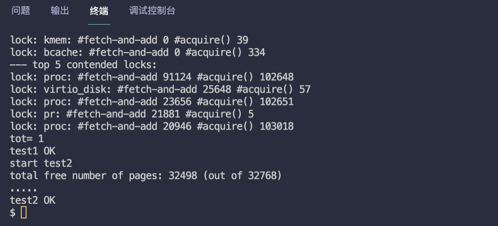

# MIT6.S081 - Lab7 Locks（锁优化 | 并发安全）

本篇是 MIT6.S081 2020 操作系统课程 Lab8 的实验笔记，目标是在保证并发安全的前提下，重新设计 内存分配器 和 块缓存 这两个部分代码，来提高系统并发性能。

对于有项目经验的同学来说，实验的难度不算高，重点在于找出 哪个操作有并发安全问题 需要加锁，实验也没有涉及到新的知识点，直接动手做就行了。

> - Lab8 地址：https://pdos.csail.mit.edu/6.828/2020/labs/lock.html
> - 我的实验记录：https://github.com/yibaoshan/xv6-labs-2020/tree/lock

在开始实验之前，你需要（_上一节看过就不用看了_）：

1. 观看 Lecture 10 课程录播视频：**Multiprocessors and Locks（多处理器和锁）**
    - YouTube 原版：https://www.youtube.com/watch?v=NGXu3vN7yAk
    - 哔哩哔哩中译版：https://www.bilibili.com/video/BV19k4y1C7kA?vd_source=6bce9c6d7d453b39efb8a96f5c8ebb7f&p=9
    - 中译文字版：https://mit-public-courses-cn-translatio.gitbook.io/mit6-s081/lec10-multiprocessors-and-locking
2. 阅读 [《xv6 book》](https://xv6.dgs.zone/tranlate_books/book-riscv-rev1/c3/s0.html) 第六章： **Lock**
    - 英文原版：https://pdos.csail.mit.edu/6.828/2020/xv6/book-riscv-rev1.pdf
    - 中译版：https://xv6.dgs.zone/tranlate_books/book-riscv-rev1/c6/s0.html

# Memory allocator (moderate)

The program user/kalloctest stresses xv6's memory allocator: three processes grow and shrink their address spaces, resulting in many calls to kalloc and kfree. kalloc and kfree obtain kmem.lock. kalloctest prints (as "#fetch-and-add") the number of loop iterations in acquire due to attempts to acquire a lock that another core already holds, for the kmem lock and a few other locks. The number of loop iterations in acquire is a rough measure of lock contention. The output of kalloctest looks similar to this before you complete the lab:

```
$ kalloctest
start test1
test1 results:
--- lock kmem/bcache stats
lock: kmem: #fetch-and-add 83375 #acquire() 433015
lock: bcache: #fetch-and-add 0 #acquire() 1260
--- top 5 contended locks:
lock: kmem: #fetch-and-add 83375 #acquire() 433015
lock: proc: #fetch-and-add 23737 #acquire() 130718
lock: virtio_disk: #fetch-and-add 11159 #acquire() 114
lock: proc: #fetch-and-add 5937 #acquire() 130786
lock: proc: #fetch-and-add 4080 #acquire() 130786
tot= 83375
test1 FAIL
```

**重新设计 内存分配器 这部分的代码，测试程序 user/kalloctest 会使用 3 个进程，分别执行 申请 和 释放 内存的操作，从而测试内存分配器的并发安全。**

### 实验思路

原先操作内存用到的是 kmem 结构体，里面维护一个自旋锁和一个空闲内存链表

```c
kernel/kalloc.c
struct {
  struct spinlock lock; // 内存分配锁
  struct run *freelist; // 维护空闲内存的链表
} kmem; 
```

申请/释放 内存实际是对 freelist 链表的读写操作，大家都在一口锅里面吃饭，所以，为了并发安全，多 CPU 操作链表时需要加锁。

```c
void
kfree(void *pa)
{
  struct run *r = (struct run*)pa;
  acquire(&kmem.lock); // 加锁
  r->next = kmem.freelist; // 释放页 next 指针指向链表
  kmem.freelist = r; // 释放的空页重新加到链表的头部
  release(&kmem.lock); // 解锁
}

void *
kalloc(void)
{
  struct run *r;
  acquire(&kmem.lock); // 加锁
  r = kmem.freelist; // 从链表头取一个空闲页
  if(r)
    kmem.freelist = r->next; // 从链表头移除这个空闲页
  release(&kmem.lock);
  return (void*)r;
}
```

同一时间只能有一个 CPU 操作内存，效率太低，所以实验要求对这块代码进行优化：

1. 让每个 CPU 维护一个属于自己的 空闲内存列表，申请和释放都只操作自己的 空闲内存列表 ，从而提高并发性能。
   - 系统启动后，默认由 CPU0 执行初始化内存，因此，刚启动时 可用内存 全部在 CPU0 的链表上。其他 CPU 执行到 kalloc() 时，会按顺序从其他 CPU 的 空闲内存列表 中拉取（刚开始往往会会从 CPU0 的链表中取，因为只有它有空闲）。
2. 如果自个儿的 空闲内存列表 空了，没有可用内存了，去其他 CPU 的空闲内存列表中去 “抢”。
   - 操作自己的链表也需要加锁，因为其他 CPU 没内存了可能会过来抢我们的。

### 代码实现

第一步，把 kmem 结构体改为数组形式，让每个 CPU 维护自己的 空闲内存列表

```c
kernel/kalloc.c
struct {
    struct spinlock lock;
    struct run *freelist;
} kmem[NPROC]; // 每个 CPU 都拥有自个儿的可用内存链表
```

原先初始化锁的地方改为：

```c
void
kinit() {
//  initlock(&kmem.lock, "kmem");
    for (int i = 0; i < NPROC; i++)
        initlock(&kmem[i].lock, "kmem"); // 初始化每个 CPU 的锁
    freerange(end, (void *) PHYSTOP);
}
```

然后是 申请 和 释放 内存操作，按照代码顺序，先改释放 kfree()

```c
void
kfree(void *pa) {
    struct run *r;
    int id = cpuid();

    if (((uint64) pa % PGSIZE) != 0 || (char *) pa < end || (uint64) pa >= PHYSTOP)
        panic("kfree");

    // Fill with junk to catch dangling refs.
    memset(pa, 1, PGSIZE);

    r = (struct run *) pa;

   // 原来的逻辑，加锁，然后把空闲页加到链表的头部，释放锁，搞定
//  acquire(&kmem.lock);
//  r->next = kmem.freelist;
//  kmem.freelist = r;
//  release(&kmem.lock);

    // 改为，把空闲页加入到正在执行的 CPU 的链表中
    acquire(&kmem[id].lock);
    r->next = kmem[id].freelist;
    kmem[id].freelist = r;
//    printf("cpu %d free 1 page\n", id);
    release(&kmem[id].lock);
}
```

把已经释放的空闲页，随机加入某个 CPU 的链表中（取决于哪个 CPU 执行的释放）

接着是 申请内存 kalloc()

```c
void *
kalloc(void) {
    struct run *r = 0;

    // 原来的代码，加锁，然后从链表头取一个空闲页，释放锁
//  acquire(&kmem.lock);
//  r = kmem.freelist;
//  if(r)
//    kmem.freelist = r->next;
//  release(&kmem.lock);

    // 改为，优先从当前 CPU（curid）中获取一个空闲页，如果失败，从当前 CPU 右手边开始遍历，直到找到一页或者都没有可用内存
    for (int i = 0, curid = cpuid(); i < NPROC && !r; i++, curid++) {
        if (curid == NPROC)
            curid = 0; // 环形遍历
        acquire(&kmem[curid].lock);
        r = kmem[curid].freelist;
        if (r) {
            kmem[curid].freelist = r->next;
//            printf("cpu %d steal 1 page from cpu %d\n", cpuid(), curid);
        }
        release(&kmem[curid].lock);
    }

    if (r)
        memset((char *) r, 5, PGSIZE); // fill with junk
    return (void *) r;
}
```

1. 优先尝试从 curid（当前 CPU）中获取一个空闲页。
2. 如果成功，把该页从链表头移除，不满足循环条件，退出循环。
3. 如果失败，从当前 CPU 右边继续向下遍历，直到找到一页空闲内存，或者全部 CPU 都没有可用内存，退出循环。

代码写完了，`make qemu` 编译，执行 `kalloctest` 查看结果



测试通过，完整代码在：https://github.com/yibaoshan/xv6-labs-2020/commit/bef38c1a26bfa3a668ccadcc3afa8bdc876c0917

# Buffer cache (hard)

If multiple processes use the file system intensively, they will likely contend for bcache.lock, which protects the disk block cache in kernel/bio.c. bcachetest creates several processes that repeatedly read different files in order to generate contention on bcache.lock; its output looks like this (before you complete this lab):

```
$ bcachetest
start test0
test0 results:
--- lock kmem/bcache stats
lock: kmem: #fetch-and-add 0 #acquire() 33035
lock: bcache: #fetch-and-add 16142 #acquire() 65978
--- top 5 contended locks:
lock: virtio_disk: #fetch-and-add 162870 #acquire() 1188
lock: proc: #fetch-and-add 51936 #acquire() 73732
lock: bcache: #fetch-and-add 16142 #acquire() 65978
lock: uart: #fetch-and-add 7505 #acquire() 117
lock: proc: #fetch-and-add 6937 #acquire() 73420
tot= 16142
test0: FAIL
start test1
test1 OK
```

You will likely see different output, but the number of acquire loop iterations for the bcache lock will be high. If you look at the code in kernel/bio.c, you'll see that bcache.lock protects the list of cached block buffers, the reference count (b->refcnt) in each block buffer, and the identities of the cached blocks (b->dev and b->blockno).

```
$ bcachetest
start test0
test0 results:
--- lock kmem/bcache stats
lock: kmem: #fetch-and-add 0 #acquire() 32954
lock: kmem: #fetch-and-add 0 #acquire() 75
lock: kmem: #fetch-and-add 0 #acquire() 73
lock: bcache: #fetch-and-add 0 #acquire() 85
lock: bcache.bucket: #fetch-and-add 0 #acquire() 4159
lock: bcache.bucket: #fetch-and-add 0 #acquire() 2118
lock: bcache.bucket: #fetch-and-add 0 #acquire() 4274
lock: bcache.bucket: #fetch-and-add 0 #acquire() 4326
lock: bcache.bucket: #fetch-and-add 0 #acquire() 6334
lock: bcache.bucket: #fetch-and-add 0 #acquire() 6321
lock: bcache.bucket: #fetch-and-add 0 #acquire() 6704
lock: bcache.bucket: #fetch-and-add 0 #acquire() 6696
lock: bcache.bucket: #fetch-and-add 0 #acquire() 7757
lock: bcache.bucket: #fetch-and-add 0 #acquire() 6199
lock: bcache.bucket: #fetch-and-add 0 #acquire() 4136
lock: bcache.bucket: #fetch-and-add 0 #acquire() 4136
lock: bcache.bucket: #fetch-and-add 0 #acquire() 2123
--- top 5 contended locks:
lock: virtio_disk: #fetch-and-add 158235 #acquire() 1193
lock: proc: #fetch-and-add 117563 #acquire() 3708493
lock: proc: #fetch-and-add 65921 #acquire() 3710254
lock: proc: #fetch-and-add 44090 #acquire() 3708607
lock: proc: #fetch-and-add 43252 #acquire() 3708521
tot= 128
test0: OK
start test1
test1 OK
$ usertests
  ...
ALL TESTS PASSED
$
```

Please give all of your locks names that start with "bcache". That is, you should call initlock for each of your locks, and pass a name that starts with "bcache".

### 实验思路

本实验涉及到一个新的模块：Buffer cache（磁盘 I/O 缓存），代码实现在 kernel/bio.c 文件中，Buffer cache 是为了减少磁盘的 I/O 操作，提高性能

1. 读文件的时候，先检查读的部分是否已经在缓存中，如果是则直接返回，如果不在缓存中，则分配一个新的缓冲区，从磁盘读取数据。
2. 写的时候，也是先修改缓冲区中的数据（如果有的话），然后等待某个时机调用 bwrite() 函数将缓冲区的内容真正写到磁盘。

现存的读（bget）、释放（brelse）加减引用（bpin、bunpin）缓冲块的函数，用的都是同一把锁 bcache.lock


如果有多个 I/O 密集型程序在执行，竞争同一把锁将会成为 OS 的性能瓶颈，实验要求我们对这部分代码进行优化。

把大锁 bcache.lock 拆分成多个小锁，每个小锁对应一个 bucket，bucket 中包含多个缓冲块，这样每个 bucket 就相当于一个锁，减少锁冲突。

因为是新模块，实验前建议大家先把 bio.c 代码过一遍，只有 150 行，很快就看完了。

# 参考资料

- CS自学指南：https://csdiy.wiki/%E6%93%8D%E4%BD%9C%E7%B3%BB%E7%BB%9F/MIT6.S081/
- Wings：https://blog.wingszeng.top/series/learning-mit-6-s081/
- Miigon：https://blog.miigon.net/categories/mit6-s081/
- 知乎专栏《28天速通MIT 6.S081操作系统》：https://zhuanlan.zhihu.com/p/632281381
