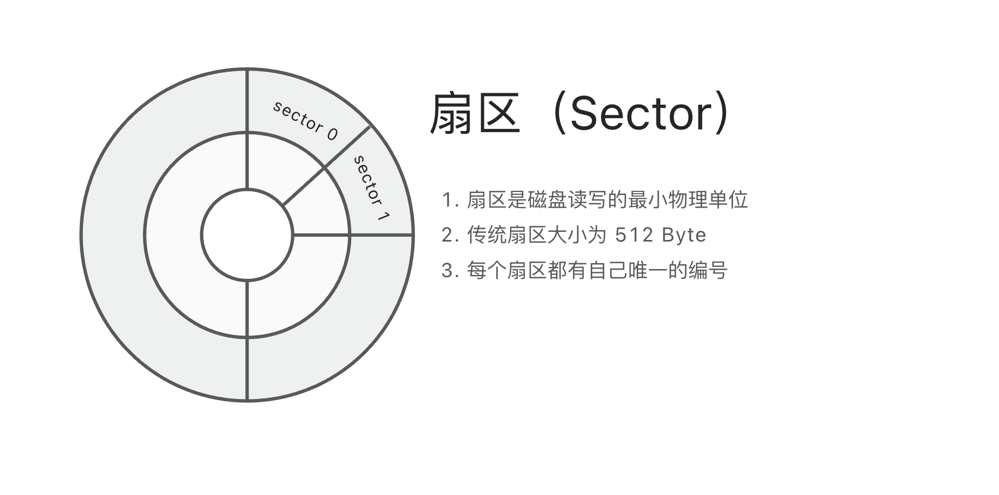
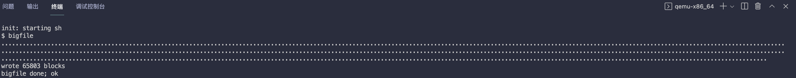
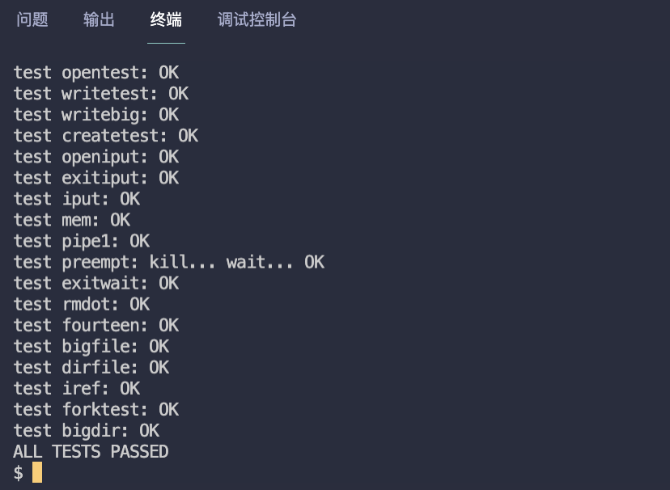
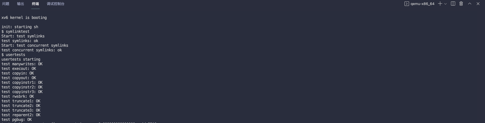
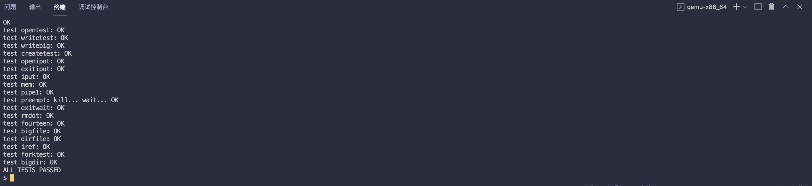

# MIT6.S081 - Lab9 File Systems（文件系统）

本篇是 MIT6.S081 2020 操作系统课程 Lab9 的实验笔记，目标是让 xv6 支持 **大文件** 和实现类似 **Linux 软链接** 的功能，同时，我也会结合源码来介绍 xv6 文件系统的设计与实现。

> - Lab9 地址：https://pdos.csail.mit.edu/6.828/2020/labs/fs.html
> - 我的实验记录：https://github.com/yibaoshan/xv6-labs-2020/tree/fs

在开始实验之前，你需要：

1. 观看 Lecture 14 课程录播视频：**File Systems（文件系统）**
    - YouTube 原版：https://www.youtube.com/watch?v=ADzLv1nRtR8
    - 哔哩哔哩中译版：https://www.bilibili.com/video/BV19k4y1C7kA?vd_source=6bce9c6d7d453b39efb8a96f5c8ebb7f&p=13
    - 中译文字版：https://mit-public-courses-cn-translatio.gitbook.io/mit6-s081/lec14-file-systems-frans
2. 观看 Lecture 15 课程录播视频：**Crash recovery（崩溃恢复）**
    - YouTube 原版：https://www.youtube.com/watch?v=7Hk2dIorDkk
    - 哔哩哔哩中译版：https://www.bilibili.com/video/BV19k4y1C7kA?vd_source=6bce9c6d7d453b39efb8a96f5c8ebb7f&p=14
    - 中译文字版：https://mit-public-courses-cn-translatio.gitbook.io/mit6-s081/lec15-crash-recovery-frans
3. 阅读 [《xv6 book》](https://xv6.dgs.zone/tranlate_books/book-riscv-rev1/c3/s0.html) 第八章： **File Systems（文件系统）**
    - 英文原版：https://pdos.csail.mit.edu/6.828/2020/xv6/book-riscv-rev1.pdf
    - 中译版：https://xv6.dgs.zone/tranlate_books/book-riscv-rev1/c8/s0.html
4. 阅读 xv6 源码：
    - https://github.com/mit-pdos/xv6-riscv/blob/riscv/kernel/bio.c
    - https://github.com/mit-pdos/xv6-riscv/blob/riscv/kernel/fs.c
    - https://github.com/mit-pdos/xv6-riscv/blob/riscv/kernel/sysfile.c
    - https://github.com/mit-pdos/xv6-riscv/blob/riscv/kernel/file.c
    - https://github.com/mit-pdos/xv6-riscv/blob/riscv/kernel/log.c

# 聊聊 xv6 的文件系统

xv6 的文件系统和早期 Linux v0.11 在设计思想及实现上比较相似，比如他们都使用 **inode** 作为文件系统的核心数据结构、都支持目录层次结构、采用数据块缓存机制等。

块缓存我们在上一篇文章 [《Lab8 Locks（锁优化 | 并发安全）》](https://yibs.space/post/mit6s081-lab8-locks/) 中已经接触过了，它的功能是为了减少磁盘的 I/O 操作，提高系统性能。

本小节我们重点讨论 xv6 文件系统的核心：**inode**

### 1、文件系统是怎么使用磁盘的

正文开始前，我们先来了解磁盘的存储结构



*图片来源：自己画的*

如图所示，受早期 IBM PC 的影响，**扇区（Sector）** 成为了磁盘上最小的操作单位（*事实上的工业标准并一直延续至今*），扇区大小是 512 byte，大多数硬盘驱动都支持该标准，包括 Linux 和本篇的 xv6。

每个扇区都有自己的唯一 ID，操作系统要读写某个扇区时，首先确定柱面（*多个盘面的同一磁道构成的圆柱被称作柱面*），再确定盘面，最后确定扇区（*我们这里只关注扇区，所以柱面、盘面、磁头名词解释不再展开*）。

[**Buffer Cache**](https://yibs.space/post/mit6s081-lab8-locks/) 实验中我们知道， xv6 使用了 **块（Block）** 对扇区 Sector 进行了抽象封装，文件系统中的所有接口都是基于 **块（Block）**操作，应用程序是无法直接和磁盘的扇区交互的：

- **一个 `block` 可能对应多个 `sector`**
- **在 `512 byte / sector` 的磁盘上，一个 `block` 就等于两个连续的 `sector`，因为 xv6 中一个 `block` 大小是 1kb**
    - block 0 对应 sector 0,1
    - block 1 对应 sector 2,3
    - block 2 对应 sector 4,5
    - 以此类推...block 号 n 对应的扇区号是 2n 和 2n+1
- **当文件系统要读写一个块时，磁盘驱动程序需要进行两次扇区操作**
    - 先读取第一个扇区（512 byte）
    - 再读取第二个扇区（512 byte）
    - 组合成一个完整的块（1024 byte）

把 sector 封装为 block，站在 OS 的角度来说，磁盘就可以看为一个 **“巨大的 block 数组”** ，假设磁盘大小为 1MB，那么这个 **block 数组** 的范围就是 0 ~ 1023。

在 xv6 中，数组的结构分布如下：

```c
+----------------+----------------+-------------+-------------+----------------+-------------+
| 引导扇区(block0)|  超级块(block1) |    log区     | inode区     |   bitmap块     |    数据区    |
+----------------+----------------+-------------+-------------+----------------+-------------+
```

1. **block 0** 是 **引导扇区**，里面存储的代码负责 加载内核并启动系统，和本文关系不大，可以忽略。
2. **block 1** 是 **超级块（superblock）**，这 1kb 里面存储着磁盘的 **使用情况**，系统启动后读取这一个块就能知道当前的磁盘信息，比如磁盘中总共有多少块，哪些块被使用了等
   ```c
   struct superblock {
     uint magic;        // 用于标识文件系统类型的魔数，编译 fs.img 时写入固定值（0x10203040），系统启动后读取这个值，判定 是否是 xv6 文件系统
     uint size;         // 文件系统的总块数，xv6 硬编码写死为 200000，正常情况会从 BIOS/UEFI 接口中读
     uint nblocks;      // 可用于存储数据的块数（不包括引导块、超级块、inode块、位图块等系统块）
     uint ninodes;      // inode 节点数量，目前 NINODES 为 200，也就是说 xv6 最多能创建 200 个文件/目录
     uint nlog;         // 日志区的块数量，当前 LOGSIZE 固定为 30
     uint logstart;     // 日志区起始块号，由于日志区、inode区的大小是固定的，所以下面几个值都可以通过计算得到，把它们看做常量好了
     uint inodestart;   // inode 区起始块号，可看做常量
     uint bmapstart;    // 位图区起始块号，可看做常量
   };
   ```
3. 跟在 **superblock** 后面的是 **日志区（log area）**，大小由 `LOGSIZE` 常量决定，它主要负责文件操作的 **原子性** 和 **一致性**，系统挂了也可以通过磁盘上的日志区可以恢复磁盘状态（*比较重要的知识点，但和本文关系不大，可以忽略*）。
4. 日志区后面是 **inode 区**，它是本小节要关注的重点，可以说，**xv6 的整个文件系统都是围绕 inode 构建的，理解 inode 的工作机制，就能理解 xv6 文件系统的基本原理。**
    ```c
    kernel/fs.h
    struct dinode {
      short type;           // 文件类型，0=未使用，1=普通文件，2=目录，3=设备
      short major;          // 主设备号，标识设备类型，文件类型为设备时有效
      short minor;          // 次设备号，标识具体设备，同样文件类型为设备时有效
      short nlink;          // 硬链接数，表示该 inode 被多少个人用了
                            // 如果当前 inode 是文件，表示指向该文件的硬链接数量
                            // 如果当前 inode 是目录，每创建一个子目录，父目录的 nlink 加 1，初始值为 2（代表 "." 和 ".."），因为子目录的 ".." 指向父目录
      uint size;           // 表示文件包含的字节数，或者所有目录项（dirent结构体）占用的总字节数
      uint addrs[NDIRECT+1];   // 数据块地址数组：
                              // 前12个是直接块地址
                              // 最后一个是间接块地址
    };
    ```
5. 再然后是 **bitmap 块**，占用一个 block，用来标记磁盘中哪些块已经被 **使用（bit=1）**，哪些块是 **空闲（bit=0）**的，最大可管理 1024 * 8 = 8192个块（*实验无关，可忽略*）。
6. 分区的最后一块是 **数据区（data area）**，它用来存储 **文件的数据** 或者是 **目录的内容（dirent 数组）**

**数据区（data area）** 存储两种类型的内容：

- 普通文件的数据
- 目录的内容（dirent 数组）

如果存储的是 “**文件**”，假设有个 “**杭州彭于晏名单.txt**” 的文件，内容是："**yibaoshan**"

该文件在磁盘中会被分两份保存，一份是实际的 **数据块** 保存在 **数据区**，另一份是 **inode**，保存在磁盘的 **inodes 区**，inode 结构是：

```c
type = T_FILE
size = 9          // 9个字母，实际占用 9 个字节
addrs[0] = 100    // 指向数据块 100
addrs[1-11] = 0   // 未使用
```

数据区 index = 100 的 **数据块** 的内容为：

```c
[yibaoshan]     // 实际的数据，一个 block 最大的大小是 1024 byte
```

如果存储的是 “**目录**”，我们假设有一个目录 “**/home**”，它在磁盘中也会被分为两份保存，其中 inode 结构为：

```c
type = T_DIR      // 注意类型，这里是目录
size = 64         // 单个目录项占用 16 个自己，4 * 16 
addrs[0] = 200    // 指向数据块 200
```

数据区 index = 200 数据块里面的内容是 **dirent 数组**

目录和文件存的内容不太一样，文件块里面就是文件的内容，无特定格式，目录都是以 **`struct dirent`** 结构体的格式保存的，`inum` 作为目录的唯一 ID，`name` 是目录的名称，这样就可以区分同名目录，比如 “`.`” “`..`” 谁是谁了。

```c
struct dirent[4] = {
{inum: 23, name: "."    }, // 指向自己，每个目录都默认配 "."、".." 这俩目录，如果是根目录，"."、".." 这俩都会指向自己
{inum: 1,  name: ".."   }, // 指向爸爸
{inum: 45, name: "user1"},
{inum: 46, name: "user2"}
}
```

小结一下，xv6 把磁盘分为：**~~引导扇区~~**、**超级块**、**~~log 区~~**、**inode 区**、**~~bitmap 块~~**、**数据区**，共 6 个区

**超级块** 用来统计磁盘使用情况，**inode 区** 用来描述系统内有多少个文件和目录，**数据区** 则用来存储文件内容或者目录结构，其他几个区和实验关系不大忽略不管。

### 2、xv6 文件系统是如何工作的？

ummmmm，不想写了，自己看源码吧

- **mkfs/mkfs.c**，xv6 的文件系统镜像创建工具，用于 初始化文件系统、创建文件系统镜像文件（`fs.img`）、初始化 **超级块**、**inode区**、**bitmap块** 等等
- **kernel/fs.h**，文件系统的关键数据结构都在这儿，包含 `superblock`、`dinode`、`dirent` 等
- **kernel/fs.c**，filesystem，文件系统的核心功能实现，主要是 **inode 操作**、**块分配** 等
- **kernel/sysfile.c**，提供给用户的文件相关的系统调用，常见的如 `open()`、`read()`、`write()`、`link()` 等等。
- **kernel/file.h、file.c**，封装文件操作相关结构体和函数，文件系统的中间层，主要是提供给操作系统内核使用的
   ```c
   用户程序 
      ↓
   系统调用（sysfile.c）
      ↓
   文件抽象层（file.c）
      ↓
   具体实现（fs.c, pipe.c, console.c等）
   ```
- **kernel/log.c**，日志的实现，保证文件操作不会丢失
- **kernel/virtio_disk.c**，磁盘驱动，封装块级别的读写 api

# Large files (moderate)

In this assignment you'll increase the maximum size of an xv6 file. Currently xv6 files are limited to 268 blocks, or 268*BSIZE bytes (BSIZE is 1024 in xv6). This limit comes from the fact that an xv6 inode contains 12 "direct" block numbers and one "singly-indirect" block number, which refers to a block that holds up to 256 more block numbers, for a total of 12+256=268 blocks.

干活干活，开始做实验了。

**Large files 目标是扩大 xv6 文件系统的单个文件最大容量：通过添加 二级间接块（doubly-indirect block）来实现，把当前的 268 个块的限制扩展到 65803 个块。**

简单题，实现思路是把 inode 结构从 **`12 个直接块` + `1 个一级间接块`**，改为 **`11 个直接块` + `1 个一级间接块` + `1 个二级间接块`**

首先来修改 fs.h 的 `dinode` 结构：

```c
#define NDIRECT 11 // 改为 11
#define NINDIRECT (BSIZE / sizeof(uint))
#define NDINDIRECT (NINDIRECT * NINDIRECT) // 新增二级间接块容量
#define MAXFILE (NDIRECT + NINDIRECT + NDINDIRECT) // 新增最大文件容量限制

// On-disk inode structure
struct dinode {
  short type;           // File type
  short major;          // Major device number (T_DEVICE only)
  short minor;          // Minor device number (T_DEVICE only)
  short nlink;          // Number of links to inode in file system
  uint size;            // Size of file (bytes)
  uint addrs[NDIRECT + 2];   // 改为 11个直接块 + 1个间接块 + 1个二级间接块
};
```

同时，file.c 的 `inode` 结构也要同步修改：

```c
kernel/file.h
struct inode {
  uint dev;           // 设备号：inode所在的设备
  uint inum;          // inode编号：在inode表中的索引
  int ref;           // 引用计数：有多少进程在使用这个inode
  struct sleeplock lock; // 睡眠锁：保护inode的内容
  int valid;         // 有效标志：inode是否从磁盘加载

  // 以下字段从dinode复制而来
  short type;        // 文件类型
  short major, minor;// 设备号
  short nlink;       // 硬链接数
  uint size;        // 文件大小
  uint addrs[NDIRECT+2]; // 改动点！！
};
```

最后来修改 fs.c 文件系统中映射 inode 的 `bmap()` 函数和释放 `itrunc()` 函数，让它们支持二级间接块（*参考一级的映射和释放逻辑*）

```c
static uint
bmap(struct inode *ip, uint bn)
{
  uint addr, *a;        // addr 存储物理块号，a 用于访问缓冲区

  // 处理直接块，如果块不存在，创建一个新的并返回
  if(bn < NDIRECT){
    if((addr = ip->addrs[bn]) == 0)
      ip->addrs[bn] = addr = balloc(ip->dev);
    return addr;
  }
  
  // 原一级间接块逻辑
  if(bn < NINDIRECT){
    // Load indirect block, allocating if necessary.
    ...
  }

  bn -= NINDIRECT;

  // 二级间接块，参考一级间接块处理的逻辑
  if(bn < NDINDIRECT){
    if((addr = ip->addrs[NDIRECT + 1]) == 0)
      ip->addrs[NDIRECT + 1] = addr = balloc(ip->dev); // 二级间接块未分配，分配新块
    bp = bread(ip->dev, addr);
    a = (uint*)bp->data;
    uint index = bn / NINDIRECT;
    if((addr = a[index]) == 0){ // 再次 check 一级间接块，确保一级间接块存在，不存在则分配
      a[index] = addr = balloc(ip->dev);
      log_write(bp);
    }
    brelse(bp);

    bp = bread(ip->dev, addr);
    a = (uint*)bp->data;
    index = bn % NINDIRECT;
    if((addr = a[index]) == 0){  // 确保数据块存在，不存在也要分配
      a[index] = addr = balloc(ip->dev); 
      log_write(bp);
    }
    brelse(bp);
    return addr;
  }

  panic("bmap: out of range");
}

void
itrunc(struct inode *ip)
{
  // 释放一级间接块(12-267)逻辑
  if(ip->addrs[NDIRECT]){
   ...
  }

  if(ip->addrs[NDIRECT+1]){ // 如果二级间接块存在
    bp = bread(ip->dev, ip->addrs[NDIRECT+1]);
    a = (uint*)bp->data;
    // 遍历所有一级间接块
    for(i = 0; i < NINDIRECT; i++){
      if(a[i]){
        struct buf *bp2 = bread(ip->dev, a[i]);
        uint *a2 = (uint*)bp2->data;
        for(j = 0; j < NINDIRECT; j++){
          if(a2[j]) // 如果数据块存在，执行释放
            bfree(ip->dev, a2[j]);
        }
        brelse(bp2);
        bfree(ip->dev, a[i]);
      }
    }
    brelse(bp);
    // 这里不要忘了释放二级间接块本身
    bfree(ip->dev, ip->addrs[NDIRECT+1]);
    ip->addrs[NDIRECT+1] = 0;
  }

  ip->size = 0;
  iupdate(ip);
}
```

代码写完了，`make qemu` 编译，先执行 `bigfile`：



再执行 `usertests`



测试通过，完整代码在：https://github.com/yibaoshan/xv6-labs-2020/commit/4ca511e47b87010315fe5d5bdf61ef60f6bafdb2

# Symbolic links (moderate)

In this exercise you will add symbolic links to xv6. Symbolic links (or soft links) refer to a linked file by pathname; when a symbolic link is opened, the kernel follows the link to the referred file. Symbolic links resembles hard links, but hard links are restricted to pointing to file on the same disk, while symbolic links can cross disk devices. Although xv6 doesn't support multiple devices, implementing this system call is a good exercise to understand how pathname lookup works.

**实现一个 `symlink` 系统调用，模仿类似 Linux 软链接的功能，关于硬链接和软链接介绍可以查看：https://gnu-linux.readthedocs.io/zh/latest/Chapter03/00_link.html**

核心逻辑比较简单，需要对 **`sysfile.c->sys_open()`** 系统调用函数进行改造：

```c
uint64
sys_open(void)
{
  ...
  if(omode & O_CREATE){
    ip = create(path, T_FILE, 0, 0);
    if(ip == 0){
      end_op();
      return -1;
    }
  } else {
    if((ip = namei(path)) == 0){
      end_op();
      return -1;
    }
    ilock(ip);
    
    // 新增部分，处理符号链接
    int depth = 0; // 解析深度上限
    char target[MAXPATH];
    // 尝试解析符号链接（最多解析10层）
    while(depth < 10 && ip->type == T_SYMLINK && !(omode & O_NOFOLLOW)) {
      // 读取链接目标路径
      if(readi(ip, 0, (uint64)target, 0, MAXPATH) <= 0) {
        iunlockput(ip);
        end_op();
        return -1;
      }
      iunlockput(ip);
      
      if((ip = namei(target)) == 0) { // 查找目标文件
        end_op();
        return -1;
      }
      ilock(ip);
      depth++;
    }

    if(depth >= 10) {
      iunlockput(ip);
      end_op();
      return -1;
    }

    if(ip->type == T_DIR && omode != O_RDONLY){
      iunlockput(ip);
      end_op();
      return -1;
    }
  }

  ...
  return fd;
}
```

然后是增加系统调用和常亮补充：

```c
kernel/fcntl.h
...
#define O_TRUNC   0x400
#define O_NOFOLLOW 0x800  // 不跟随符号链接

kernel/stat.h
...
#define T_DEVICE  3   // Device
#define T_SYMLINK 4   // 符号链接标识

kernel/syscall.h
...
#define SYS_close  21
#define SYS_symlink  22

kernel/syscall.c
...
extern uint64 sys_uptime(void);
extern uint64 sys_symlink(void);

static uint64 (*syscalls[])(void) = {
...
[SYS_close]   sys_close,
[SYS_symlink]   sys_symlink,
};

user/user.h
// system calls
...
int uptime(void);
int symlink(const char*, const char*);

user/usys.pl
...
entry("uptime");
entry("symlink");

/Makefile
UPROGS=\
    ...
	$U/_zombie\
	$U/_symlinktest\
```

搞定，`make qemu` 编译，执行 `symlinktest`：



再执行 `usertests`



测试通过，完整代码在：https://github.com/yibaoshan/xv6-labs-2020/commit/beedcaedff00cc0c6aeca7726dbc0f6b8de5d324

# 参考资料

- CS自学指南：https://csdiy.wiki/%E6%93%8D%E4%BD%9C%E7%B3%BB%E7%BB%9F/MIT6.S081/
- Wings：https://blog.wingszeng.top/series/learning-mit-6-s081/
- Miigon：https://blog.miigon.net/categories/mit6-s081/
- 知乎专栏《28天速通MIT 6.S081操作系统》：https://zhuanlan.zhihu.com/p/632281381
