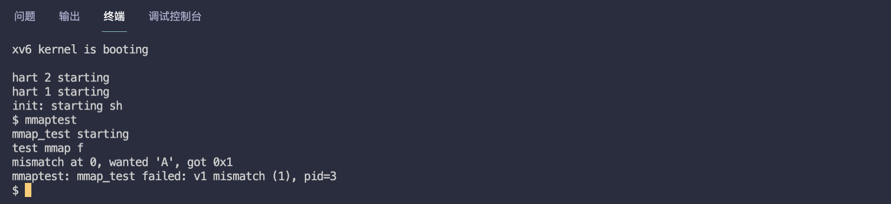
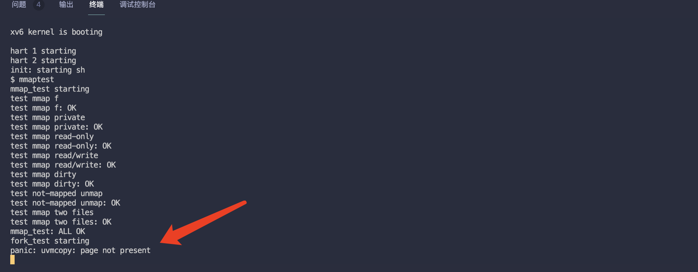
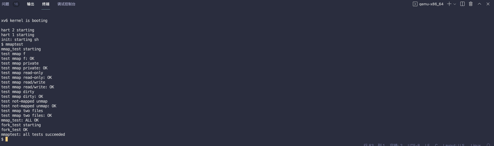
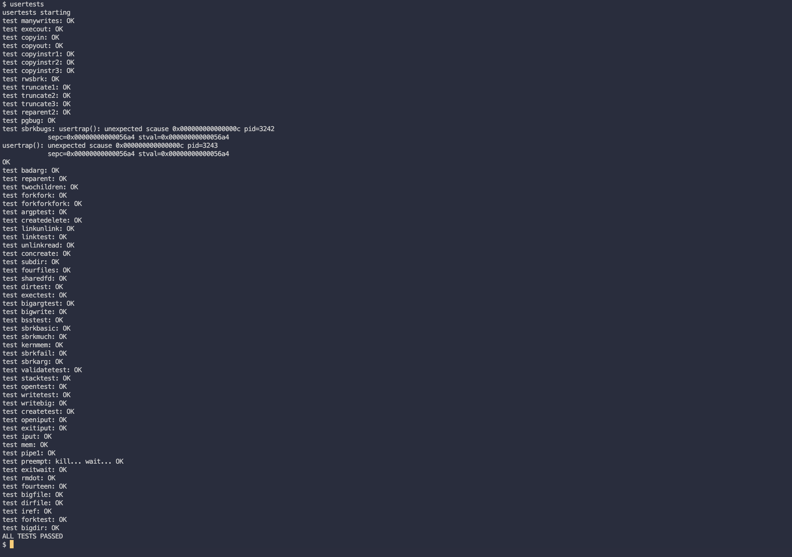

# MIT6.S081 - Lab10 mmap（文件&内存映射）

本篇是 MIT6.S081 2020 操作系统课程 Lab10 的实验笔记，目标只有一个：**实现文件映射到内存的功能，也就是 `mmap`**。

作为一名 Android 开发者，我可太熟悉 **mmap** 这个词儿了。Android 的 **跨进程通信 Binder 驱动**、**图形内存分配和管理**、**腾讯 MMKV 键值对库** 都离不开 mmap 技术的支持，所以，我对 什么是 mmap、它的使用场景和使用方式 以及 大概的实现原理 多多少少都了解一些。

> - Lab10 地址：https://pdos.csail.mit.edu/6.828/2020/labs/mmap.html
> - 我的实验记录：https://github.com/yibaoshan/xv6-labs-2020/tree/mmap

今天的实验要我们自己来实现 **简化版的 mmap** ，虽然只有 Linux mmap 的部分功能（*仅支持把文件映射到内存*），但足够让我们理解 mmap 的核心原理了。（*能借着学习 xv6 的机会一窥 mmap 全貌，说实话我还是挺开心的*）

在开始实验之前，你需要：

1. 观看 Lecture 17 课程录播视频：**Virtual memory for applications（虚拟内存）**
    - YouTube 原版：https://www.youtube.com/watch?v=YNQghIvk0jc
    - 哔哩哔哩中译版：https://www.bilibili.com/video/BV19k4y1C7kA?vd_source=6bce9c6d7d453b39efb8a96f5c8ebb7f&p=16
    - 中译文字版：https://mit-public-courses-cn-translatio.gitbook.io/mit6-s081/lec17-virtual-memory-for-applications-frans
2. 阅读论文：**Virtual memory Primitives for User Programs**
   - mit 存档：https://pdos.csail.mit.edu/6.828/2020/readings/appel-li.pdf

# 聊聊 mmap

实验开始前，我们先来聊聊 什么是 mmap？ 它的出现是为了解决什么问题？我们为什么需要它？

根据维基资料：https://en.wikipedia.org/wiki/Mmap，mmap 的原始设计来自 `TOPS-20` 操作系统，最早是为了解决 **虚拟内存管理效率问题**

- **传统的文件 I/O 需要在 用户空间 和 内核空间 之间多次拷贝数据。**
- **大文件处理时，内存的开销比较大。**

举个例子🌰

```c
void file_io(const char* filename) {
    // 获取文件 fd
    int fd = open(filename, O_RDWR);
    if (fd < 0) return;

    // 分配位于用户空间的 buffer 缓冲区
    // ps：如果是大文件，为了提高效率，这里就需要申请比较大的缓冲区
    char* buffer = (char*)malloc(BUFFER_SIZE);
    
    // 从文件读数据到 buffer 缓冲区
    // 1. 内核先将数据从磁盘读入内核缓冲区
    // 2. 然后再将数据从内核缓冲区拷贝到用户空间缓冲区
    read(fd, buffer, BUFFER_SIZE);
    
    // 修改数据
    buffer[100] = 'A';
    
    // 把修改的内容写回文件
    // 1. 数据从用户空间缓冲区拷贝到内核缓冲区
    // 2. 然后再从内核缓冲区写入磁盘
    write(fd, buffer, BUFFER_SIZE);
    
    free(buffer);
    close(fd);
}
```

楼上是用 传统的文件 I/O 方式 读写文件代码：

- **读取时，数据会先从 `磁盘`->`内核缓冲区`->`用户缓冲区`**
- **写回时，数据从 `用户缓冲区`->`内核缓冲区`->`磁盘`**

如果遇到频繁读写的场景，每次读写都要在 内核空间 和 用户空间 之间拷贝数据，浪费 CPU 资源。

如果改为 mmap 实现：

```c
void mmap_file_io(const char* filename) {
    int fd = open(filename, O_RDWR);
    if (fd < 0) return;
    
    // 将文件映射到进程的地址空间
    char* addr = mmap(NULL, BUFFER_SIZE, PROT_READ | PROT_WRITE, MAP_SHARED, fd, 0);
    
    // 直接修改内存，不需要额外的拷贝
    addr[100] = 'A';
    
    // 系统会自动将修改同步到文件
    munmap(addr, BUFFER_SIZE);
    close(fd);
}
```

**我们只需要将 文件 映射到进程的 地址空间，读写内存 就可以 直接修改文件内容，不需要再进行 额外的 拷贝操作了，这将会大大减少 内存拷贝 的次数，提高系统的整体效率。**

# mmap (hard)

The mmap and munmap system calls allow UNIX programs to exert detailed control over their address spaces. They can be used to share memory among processes, to map files into process address spaces, and as part of user-level page fault schemes such as the garbage-collection algorithms discussed in lecture. In this lab you'll add mmap and munmap to xv6, focusing on memory-mapped files.

前一小节通过小 demo 简单介绍 mmap 的使用，本章节我们将根据实验要求，实现 xv6 中的 mmap 功能。

### 增加系统调用

Start by adding _mmaptest to UPROGS, and mmap and munmap system calls, in order to get user/mmaptest.c to compile. For now, just return errors from mmap and munmap. We defined PROT_READ etc for you in kernel/fcntl.h. Run mmaptest, which will fail at the first mmap call.

**为 xv6 实现 mmap 功能，实现思路参考（*提示部分*）：https://pdos.csail.mit.edu/6.828/2020/labs/mmap.html**

首先，我们按照实验提示，先为 xv6 工程添加 `mmap()` 和 `munmap()` 两个系统调用

```c
kernel/syscall.h
...
#define SYS_close  21
#define SYS_mmap   22
#define SYS_munmap 23

kernel/syscall.c
...
extern uint64 sys_uptime(void);
extern uint64 sys_mmap(void);
extern uint64 sys_munmap(void);

kernel/sysfile.c
...
uint64
sys_mmap(void) // 新增两个系统调用空函数，暂时不用实现
{
    return 0;
}

uint64
sys_munmap(void)
{
    return 0;
}

user/user.h
...
void *memcpy(void *, const void *, uint);
void *mmap(void *addr, int length, int prot, int flags, int fd, int offset);
int munmap(void *addr, int length);

user/user.pl
...
entry("uptime");
entry("mmap");
entry("munmap");
```

`mmap()` 和 `munmap()` 新增完成以后，运行 `make qemu` 可以正常编译，但是运行 `mmaptest` 测试程序会报错：



### 创建 VMA

Keep track of what mmap has mapped for each process. Define a structure corresponding to the VMA (virtual memory area) described in Lecture 15, recording the address, length, permissions, file, etc. for a virtual memory range created by mmap. Since the xv6 kernel doesn't have a memory allocator in the kernel, it's OK to declare a fixed-size array of VMAs and allocate from that array as needed. A size of 16 should be sufficient.

**定义 [Lec 16](https://www.bilibili.com/video/BV19k4y1C7kA?vd_source=6bce9c6d7d453b39efb8a96f5c8ebb7f&p=15) 提到的 `VMA` 结构体，用来记录 mmap 创建的虚拟内存区域，包括 地址、长度、权限、文件等，然后为进程创建长度 16 的 `vma` 数组**

```c
kernel/proc.h
...
enum procstate { UNUSED, SLEEPING, RUNNABLE, RUNNING, ZOMBIE };

#define NVMA 16  // 每个进程的最大 VMA 数量

struct vma {
  uint64 addr;       // 开始映射的地址（va）
  uint64 length;     // 映射的长度
  int prot;          // 保护标志 (PROT_READ, PROT_WRITE)
  int flags;         // MAP_SHARED 或 MAP_PRIVATE
  struct file *file; // 映射的文件
  uint64 offset;     // 文件偏移量
};

// Per-process state
struct proc {
  ...
  struct vma vmas[NVMA];       // 进程的内存映射区域
};
```

### 实现 mmap

Implement mmap: find an unused region in the process's address space in which to map the file, and add a VMA to the process's table of mapped regions. The VMA should contain a pointer to a struct file for the file being mapped; mmap should increase the file's reference count so that the structure doesn't disappear when the file is closed (hint: see filedup). Run mmaptest: the first mmap should succeed, but the first access to the mmap-ed memory will cause a page fault and kill mmaptest.

按以下步骤实现 `mmap()` 函数：

1. **在当前进程的 `vmas` 数组中，查找一个空闲未使用的 `vma` 对象。**
2. **把本次 `mmap()` 调用的参数，记录到刚刚申请的 `vma` 对象中。**
3. **调用 `filedup()` 为入参的 `file` 增加一次引用次数，防止其他地方调用 `fileclose()` 函数时，因为没人引用文件，导致该文件被关闭了。**

> *注意，这一步不需要真的申请内存，和 懒加载 实验一样，申请内存延迟到在 缺页异常 里面处理*

`sys_mmap()` 函数实现如下：

```c
kernel/sysfile.c

uint64
sys_mmap(void)
{
    // 调用 mmap 函数传进来的参数
    uint64 addr;
    int len, prot, flags, fd, offset;
    struct file* file;
    
    // 创建一个空的 vma
    struct vma* vma = 0;

    // 获取 mmap 系统调用的入参，并检查是否合法
    if(argaddr(0, &addr)<0 || argint(1, &len)<0
       || argint(2, &prot)<0 || argint(3, &flags)<0
       || argfd(4, &fd, &file)<0 || argint(5, &offset)<0)
        return -1;

    // 一些参数合法性校验
    if(len <= 0)
      return -1;        
    if((prot & (PROT_READ|PROT_WRITE|PROT_EXEC)) == 0) // only PROT_READ, PROT_WRITE, PROT_EXEC
        return -1;
    if((prot & PROT_WRITE) && !file->writable && flags==MAP_SHARED) // MAP_SHARED 时，文件必须可写
        return -1;
    if((prot & PROT_READ) && !file->readable) // 同理，MAP_PRIVATE 时，文件必须可读，否则返回错误
        return -1;

    struct proc* p = myproc();
    len = PGROUNDUP(len);

    // 如果进程的虚拟内存空间已经超出了最大值，返回错误
    if(p->sz+len > MAXVA)
        return -1;

    if(offset<0 || offset%PGSIZE)
        return -1;

    // 在当前进程 vma 数组里面，查找一个空闲的 vma 区域    
    for(int i=0; i<NVMA; i++) {
        if(p->vmas[i].addr)
            continue;
        vma = &p->vmas[i];
        break;
    }

    // vma 全部被占用，没有空闲，返回🔙
    if(!vma)
        return -1;

    if(addr == 0)
        vma->addr = p->sz; // 用户未指定地址，则使用进程当前大小作为起始地址
    else
        vma->addr = addr; // 用户指定了地址

    // 一些赋值操作
    vma->length = len;
    vma->prot = prot;
    vma->flags = flags;
    vma->offset = offset;
    vma->file = file;
    p->sz += len;
    
    // 文件引用 +1
    filedup(file);

    return vma->addr;
}
```

### 实现 munmap

Implement munmap: find the VMA for the address range and unmap the specified pages (hint: use uvmunmap). If munmap removes all pages of a previous mmap, it should decrement the reference count of the corresponding struct file. If an unmapped page has been modified and the file is mapped MAP_SHARED, write the page back to the file. Look at filewrite for inspiration.

按下面的步骤实现 `munmap()` 函数：

1. **在当前进程中，查找要解除映射的 `vma` 对象。**
2. **如果找到了，调用 `uvmunmap()` 函数，解除映射。**
3. **调用 `fileclose()` 函数，释放文件对象。**
4. **如果是 共享映射（`MAP_SHARED`）且 页面被修改过，要把内容写回文件（参考 `filewrite()` 的实现）。**

```c
uint64
sys_munmap(void)
{
    uint64 addr;
    int len;
    struct vma* vma = 0;
    struct proc* p = myproc();

    if(argaddr(0, &addr)<0 || argint(1, &len)<0)
        return -1;

    // 参数检查
    if(len <= 0 || addr + len > p->sz)
        return -1;

    addr = PGROUNDDOWN(addr);
    len = PGROUNDUP(len);

    // 查找 addr 对应的 VMA
    for(int i=0; i<NVMA; i++) {
        if(p->vmas[i].addr && addr>=p->vmas[i].addr
           && addr+len<=p->vmas[i].addr+p->vmas[i].length) {
            vma = &p->vmas[i];
            break;
        }
    }

    // addr 不合法，返回
    if(!vma || addr != vma->addr)
        return -1;

    // 如果是共享映射，需要在接触映射的时候写回文件！
    if(vma->flags & MAP_SHARED)
        filewrite(vma->file, addr, len);

    // 解除页表映射
    uvmunmap(p->pagetable, addr, len/PGSIZE, 1);

    // 更新 VMA 信息
    if(len == vma->length) {
        // 完全解除映射，则释放 VMA
        fileclose(vma->file);
        memset(vma, 0, sizeof(*vma));
    } else {
        // 部分解除映射，更新地址和长度
        vma->addr += len;
        vma->length -= len;
    }

    // 解除映射的是进程地址空间的末尾，调整当前进程大小
    if(addr + len == p->sz)
        p->sz -= len;

    return 0;
}
```

### trap handler 懒分配

Add code to cause a page-fault in a mmap-ed region to allocate a page of physical memory, read 4096 bytes of the relevant file into that page, and map it into the user address space. Read the file with readi, which takes an offset argument at which to read in the file (but you will have to lock/unlock the inode passed to readi). Don't forget to set the permissions correctly on the page. Run mmaptest; it should get to the first munmap.

处理 缺页异常，当程序首次访问 映射的区域 时，会触发 缺页异常：

1. **这时候才会真正的为 `va` 分配内存 `mem`。**
2. **把要映射的文件内容按 offset 读出一页，写到刚申请的内存中。**
3. **为 `mem` 和 `va` 创建映射关系。**

```c
kernel/trap.c
...
#include "spinlock.h"
#include "sleeplock.h"
#include "fs.h"
#include "file.h"
#include "proc.h"
#include "fcntl.h"
#include "defs.h"

void
usertrap(void)
{
  ...
  if(r_scause() == 8){
    ...
  } else if((which_dev = devintr()) != 0){
    // ok
  } else if(r_scause()==13 || r_scause()==15) { // 处理缺页异常，这里是程序首次访问映射的区域出错了，需要为该 va 分配物理内存
    // 读取需要处理错误的 va，参考页表实验
    uint64 va = r_stval();                    
    struct vma* vma = 0;                      
    char* mem = 0;                           
    int success = 0;                       
    
    // 对齐 va
    va = PGROUNDDOWN(va);
    
    // 验证地址合法性（必须在用户栈顶和进程大小之间）
    if(va < p->sz && va > p->trapframe->sp) {
        // 尝试查找当前 va 在是哪个 vma 中
        for(int i=0; i<NVMA; i++) {
            if(va>=p->vmas[i].addr && va<p->vmas[i].addr+p->vmas[i].length) {
                vma = &p->vmas[i];
                break;
            }
        }
        
        // 找到 va 对应的 vma
        if(vma) {
            // 尝试为 va 分配物理内存
            mem = kalloc();
            if(mem) { // 分配成功
                memset(mem, 0, PGSIZE);  // 清零新分配的内存
                
                // 把要映射的文件的数据读出来，然后写入刚申请的内存中 mem
                uint offset = va - vma->addr + vma->offset;  // 计算文件偏移量，确定要读取的位置
                ilock(vma->file->ip);
                int bytes_read = readi(vma->file->ip, 0, (uint64)mem, offset, PGSIZE);
                iunlock(vma->file->ip);
                
                if(bytes_read >= 0) {
                    // 更新页表项 pte 的权限
                    int flags = PTE_U;  // 基本权限，用户可访问
                    // 根据 prot 字段设置 pte 的权限
                    if(vma->prot & PROT_READ)
                        flags |= PTE_R;  // 可读
                    if(vma->prot & PROT_WRITE)
                        flags |= PTE_W;  // 可写
                    if(vma->prot & PROT_EXEC)
                        flags |= PTE_X;  // 可执行
                    
                    // 如果是共享映射，确保内存的修改可以被写回到文件中
                    if(vma->flags & MAP_SHARED)
                        flags |= PTE_R;
                    
                    // 为 va 建立页表映射
                    if(mappages(p->pagetable, va, PGSIZE, (uint64)mem, flags) == 0) {
                        success = 1;  // 查找 vma、分配内存、建立页表映射这几步全部都成功了
                    }
                }
            }
        }
    }
    
    // 没成功的话，如果已经分配过内存，释放掉
    if(!success) {
        if(mem)
            kfree(mem);  // 释放已分配的内存
        p->killed = 1;   // 终止进程
    }
  } else {
    ...
  }
...
}
```

### 修改 exit 

Modify exit to unmap the process's mapped regions as if munmap had been called. Run mmaptest; mmap_test should pass, but probably not fork_test.

**修改 `exit()` 函数，在进程退出时，要像调用 `munmap()` 一样清理掉进程的所有映射区域**

```c
kernel/proc.c
void
exit(int status)
{
  ...
  // Close all open files.
  for(int fd = 0; fd < NOFILE; fd++){
    if(p->ofile[fd])
    ...
  }

  // 清理所有的 VMA
  for(int i = 0; i < 16; i++) {
    if(p->vmas[i].length > 0) { // 同样只处理被使用的 vma
      // 解除映射
      uvmunmap(p->pagetable, p->vmas[i].addr, p->vmas[i].length/PGSIZE, 1);
      if(p->vmas[i].file) // 如果有映射的文件，需要关闭
        fileclose(p->vmas[i].file);
      p->vmas[i].length = 0; // 清空 length，表示未使用
    }
  }

  begin_op();
  ...
}
```

如果进程退出，遍历 `vmas` 数组，释放已经使用的 `vma`，并调用 `fileclose()` 关闭映射的文件。

### 修改 fork

Modify fork to ensure that the child has the same mapped regions as the parent. Don't forget to increment the reference count for a VMA's struct file. In the page fault handler of the child, it is OK to allocate a new physical page instead of sharing a page with the parent. The latter would be cooler, but it would require more implementation work. Run mmaptest; it should pass both mmap_test and fork_test.

让 `fork()` 也支持内存映射功能：

1. **修改 `fork`，把 爸爸进程 的映射区域 同样复制给 儿子进程**
2. **复制 `vma` 时，记得调用 `filedup()` 增加文件的 引用计数**

```c
int
fork(void)
{
  ...
  np->state = RUNNABLE;

  // 复制父进程的VMA
  for(int i = 0; i < 16; i++) { // length>0 表示该 VMA 正在使用
    if(p->vmas[i].length > 0) {
      // 复制爸爸的 vma
      memmove(&np->vmas[i], &p->vmas[i], sizeof(struct vma));
      if(p->vmas[i].file) // 调用 mmap 传进来的 fd ，要映射的文件
        filedup(p->vmas[i].file); // 文件引用次数加一，因为现在子进程也在使用这个文件
    }
  }

  release(&np->lock);

  return pid;
}
```

### 异常处理 uvmunmap: not mapped

mmap 的核心代码已经写完了，但是，当我们执行` mmaptest` 时，会遇到 "**panic: uvmunmap: not mapped**" 错误。

这个错误是 **解除内存映射 `uvmunmap()`** 函数抛出来的，因为 mmap 使用了 **懒加载（*lazy allocation*）**策略：

1. **`sys_mmap()` 函数中，`vma` 只记录了入参，没有实际分配物理内存。**
2. **`usertrap()` 中，首次访问这些页面时，才通过 缺页中断 分配物理内存。**

所以在 `uvmunmap()` 时，可能存在一些页面从未被访问过，那它们的 页表项 就是无效的（*`PTE_V = 0`*），在本实验里面这种情况是正常的，不应该触发 panic，注释掉抛错代码即可。

```c
void
uvmunmap(pagetable_t pagetable, uint64 va, uint64 npages, int do_free)
{
  ...
  for(a = va; a < va + npages*PGSIZE; a += PGSIZE){
    if((pte = walk(pagetable, a, 0)) == 0)
      panic("uvmunmap: walk");
    if((*pte & PTE_V) == 0)
      continue; // 和懒加载实验一样，可能存在申请了内存但没使用，页表项可能是无效的
      // panic("uvmunmap: not mapped");
    ...
  }
}
```

### 异常处理: page not present

继续执行 `mmaptest` 测试程序，发现虽然 `mmap_test` 测试用例可以正常通过，但 `fork_test` 会出现 "**panic: uvmcopy: page not present**" 错误。



这是因为在 `fork()` 过程中， `uvmcopy()` 函数尝试 复制 爸爸进程 的所有页面到 儿子进程 时，因为 `mmap()` 的 懒加载 机制，有些 已映射的页面 可能还没有 实际分配物理内存。

解决方案是，注释掉 `uvmcopy()` 函数抛出的 panic 错误即可

```c
int
uvmcopy(pagetable_t old, pagetable_t new, uint64 sz)
{
  ...
  for(i = 0; i < sz; i += PGSIZE){
    if((pte = walk(old, i, 0)) == 0)
      panic("uvmcopy: pte should exist");
    if((*pte & PTE_V) == 0)
      continue; // 复制的时候也可能存在申请了内存但没使用的情况，忽略异常
//       panic("uvmcopy: page not present");
    pa = PTE2PA(*pte);
    ...
    }
  }
  return 0;

 err:
  uvmunmap(new, 0, i / PGSIZE, 1);
  return -1;
}
```

最后一次运行 `mmaptest` 测试程序



mmap_test 和 fork_test 都可以正常通过。

再执行 `usertests`



测试通过，完整代码在：https://github.com/yibaoshan/xv6-labs-2020/commits/mmap

# 参考资料

- CS自学指南：https://csdiy.wiki/%E6%93%8D%E4%BD%9C%E7%B3%BB%E7%BB%9F/MIT6.S081/
- 「实验记录」MIT 6.S081 Lab10 mmap：https://zhuanlan.zhihu.com/p/610226018