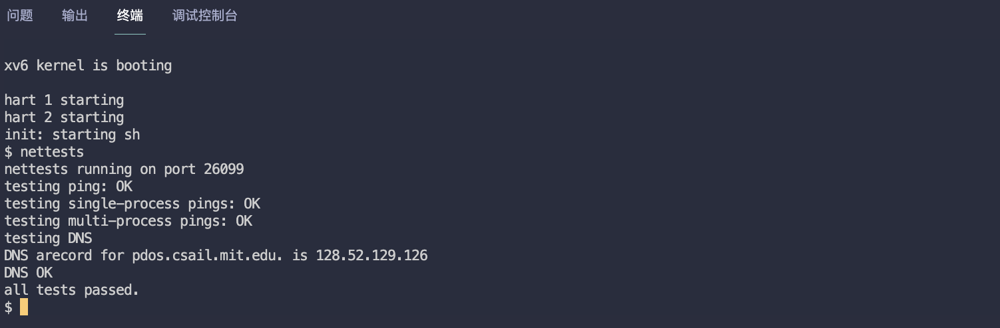

# MIT6.S081 - Lab11 networking（网络栈）

本篇是 MIT6.S081 2020 操作系统课程 Lab11 的实验笔记，这是课程的最后一个实验了，目标是为 xv6 实现 E1000 网卡驱动的两个核心函数：**发送数据包 `e1000_transmit()` 和接收数据包 `e1000_recv()`。**

> - Lab11 地址：https://pdos.csail.mit.edu/6.828/2020/labs/net.html
> - 我的实验记录：https://github.com/yibaoshan/xv6-labs-2020/tree/net

在开始实验之前，你需要：

1. 观看 Lecture 21 课程录播视频：**Networking（网络栈）**
    - YouTube 原版：https://www.youtube.com/watch?v=Fcjychg4Tvk
    - 哔哩哔哩中译版：https://www.bilibili.com/video/BV19k4y1C7kA?vd_source=6bce9c6d7d453b39efb8a96f5c8ebb7f&p=20
    - 中译文字版：https://mit-public-courses-cn-translatio.gitbook.io/mit6-s081/lec21-networking-robert

# 聊聊网络模型

本小节是 Lec 21 Networking 的课程笔记。

```c
应用程序 → 协议栈 → 驱动程序 → 网卡硬件 → 物理网络
```

### 1、物理层 网卡硬件

位于物理层的网卡工作内容是：

- 主要由网卡硬件（内部电路）处理
- 包括前导码、SFD 的添加和识别
- 信号的编码和解码
- 电平转换和时钟同步

**如果不考虑以太网协议啥的，两台有网卡的设备之间，通过一根网线直接连接（类似于两个串口直连），就可以互相传递信号了。**

### 2、数据链路层 以太网

这一层由 OS 和网卡驱动程序支持，它负责：

- 初始化网卡硬件
- 配置网卡参数（如 MAC 地址、工作模式）
- 管理发送和接收队列
- 处理中断
- 与操作系统的网络协议栈交互

在两台设备，通过网线相连，能互相发送数据的基础上，增加为，多台设备之间需要互相通信

##### ID：MAC 地址

1. **需要为每台设备新增一个唯一 ID，用于身份标识，也就是现在的 MAC 地址。**
2. **需要创建一个规则/协议，用于区分谁和谁通信，现在一般都是 `以太网（Ethernet）`协议。**

##### 集线器和交换机

多台设备之间，有好几种连接方式：

1. **总线型（Bus）**：所有设备共享一条通信线路，结构简单，成本低，但容易发生冲突，一个设备故障可能影响整个网络
   ```c
   设备A ─┬─ 设备B ─┬─ 设备C
          │         │
       共享总线    共享总线
    ```
2. **星型（Star）**：所有设备连接到中心节点，容易管理，性能好，单台设备挂了不影响其他设备，缺点是如果交换机挂了网络就没了
   ```c
   设备A ─┐
   设备B ─┼─ 交换机/集线器
   设备C ─┘
    ```
3. **环形（Ring）**：Token Ring 网络使用这种方式，不考虑
   ```c
   设备A ──→ 设备B
   ↑          ↓
   设备D ←── 设备C
    ```

现在基本都使用 **星型** 连接方式，多个设备之间，通过网线和 交换机/集线器 连接

集线器的工作方式是：

1. **多个设备都需要和 “集线器” 连接**
2. **设备发送数据（目标地址 + 自己是谁 + 数据）给集线器**
3. **集线器相当于村口、学校、商场里面的 “大喇叭”，自己不处理数据，收到以后大喇叭通知给接入它的所有设备，谁谁谁发消息要找谁谁谁，这个数据包你看看你要不要？**

交换机内部会维护一个 MAC 表，记录了每个设备对应的 MAC 地址，当收到数据时，会根据 MAC 地址找到对应的设备，将数据转发给该设备。首次收到数据 MAC 表为空的情况涉及到 IP 地址下一小节介绍。

##### 以太网帧结构和 MAC 地址

因为增加了 唯一 ID ：**MAC 地址** 的关系，所以，在数据链路层及以后的通信，每个数据包都必须要包含 **目标 MAC 地址** 和 **源 MAC 地址**，这样，集线器/交换机 才可以根据 **MAC 地址** 找到对应的设备，将数据转发给该设备。

```c
物理层部分：
+----------+-----+
| 前导码    | SFD |  8字节
| 7字节     | 1字节|
+----------+-----+

数据链路层帧：
+----------+----------+----------+------------+--------+
| 目标MAC  | 源MAC    | 类型/长度 | 数据       | CRC    |
| 6字节    | 6字节    | 2字节    | 46-1500字节| 4字节  |
+----------+----------+----------+------------+--------+
```

- 最小帧：64字节
   - MAC地址：12字节
   - 类型：2字节
   - 数据：最少46字节
   - CRC：4字节
- 最大帧：1518字节
   - MAC地址：12字节
   - 类型：2字节
   - 数据：最多1500字节（MTU）
   - CRC：4字节

```c
Frame（信封）：
+-----------------+------------------+------------------+
| 目标MAC（收件人） | 源MAC（寄件人）   | Packet（信件）    |
+-----------------+------------------+------------------+
                                    |
Packet（信件）：                      ↓
                  +----------------+------------------+
                  | IP地址（详细地址）|  数据（信件内容）  |
                  +----------------+------------------+
```

### 3、网络层 IP 协议

网络层由 OS 提供 IP 协议支持

1. 两台设备之间，通过网线连接，可以互相通信。
2. 多台设备之间，通过交换机连接，形成一个局域网，局域网之间可以互相通信。

现在，在上面这两条的基础上，增加为：**局域网和局域网之间也可以互相通信。**

```c
局域网A                    局域网B
设备1 ──┐               设备3 ──┐
设备2 ──┼── 交换机A     设备4 ──┼── 交换机B
        |                      |
        └──────  ??? ─────────┘
```

##### ID：IP 地址

局域网之间距离可能很远，相差十万八千里，摆在面前的有两个选择：

1. **继续用 Mac 地址，另外再创建一个 “全球的交换机中心”，每台交换机都通过一根网线连接在上面，这样交换机之间就可以互相通信了。**
2. **增加额外的设备和协议，创建一种新的寻址方案。**

##### IP 协议发展史

现在的 IP 协议就是这个寻址方案，它为每台设备新增一个 IP 地址，用于寻址（在网络中找到对应的路径）。并且，为这种寻址方案引入了新的设备，路由器

```c
   以太网方案：
   设备1(MAC1) ── 交换机A ── 交换机B ── 设备2(MAC2)
   
   网络层方案：
   设备1 ── 交换机A ── 路由器A ── 路由器B ── 交换机B ── 设备2
   192.168.1.2    |            |          |           |    192.168.2.2
                  |            |          |           |
            192.168.1.0/24  1.1.1.0/24  1.1.2.0/24   192.168.2.0/24
```

现在家庭网络的路由器往往身兼数职（`调制解调器`+`路由器`+`交换机`+`WiFi`），刚创造路由器那会，它的功能是非常单一的：**决定到我这儿的数据包走哪条路，是把数据包转发到另一个网络，还是走 NAT**

```c
   [MAC帧]
      ↓
   路由器拆开MAC帧
      ↓
   查看IP地址
      ↓
   选择下一跳
      ↓
   封装新的MAC帧
```

回到以太网协议和 IP 协议的发展历程，事实上，IP 协议 和 以太网协议 的出现也就是前后脚的关系：

```c
1973年 ─── 以太网发明
    │
1974年 ─── TCP/IP构思
    │
1981年 ─── IPv4规范
    │
1983年 ─── IEEE 802.3（以太网标准）
    │     └── ARPANET切换到TCP/IP
    │
1990年 ─── 以太网使用双绞线
    │
1995年 ─── 快速以太网
    │     └── IPv6开始设计
    │
1999年 ─── 千兆以太网
```

73 年出现以太网以后， TCP/IP 紧随其后，在 74 年就提出了 TCP/IP 协议的概念。

##### IP 数据包格式

```c
以太网帧结构：
+----------+----------+----------+------------------------+--------+
| 目标MAC  | 源MAC    | 类型=0x0800   |     IP数据包        | CRC    |
| 6字节    | 6字节    | 2字节         |                    | 4字节  |
+----------+----------+-------------+--------------------+--------+
                                           ↑
                                           │
IP 数据包：                                 │
+--------+--------+--------+----------------+
| IP头   | TTL    | 协议   | 数据           |
+--------+--------+--------+----------------+
```

### 4、传输层 TCP/UDP

以太网协议 + IP 协议，已经能够保证，在网络上，把数据包发送到哪一台设备，但是我们希望做的更好一些。

每一个机器都运行了大量需要使用网络的应用，所以，我们需要有一种方式能区分一个 数据包 应该传递给目的主机的哪一个应用程序，而 IP 协议明显不包含这种区分方式。

##### ID：Port

所以，发明了新的协议来完成了这里的区分工作，其中一个是 TCP，它比较复杂，而另一个是 UDP

1. 早期阶段（1970年代初）：ARPANET 网络初期，只有简单的主机到主机通信，没有可靠传输机制，应用需要自己处理所有的连接通信问题
2. TCP的诞生（1974）：Vint Cerf 和 Bob Kahn 提出 TCP 的概念，最初的 TCP 和 IP 是一体的，目标是解决网络通信的可靠性问题，它包含了：连接管理 、可靠传输 、流量控制
3. TCP/IP分离（1978）：TCP 和 IP 被分为独立的协议，原因是有些应用不需要可靠传输以及 分层更清晰、更灵活
4. UDP的加入（1980）：UDP 提供简单的不可靠传输服务，它适用于：实时应用 、简单查询响应 、广播/多播
5. 现代应用，TCP 用于需要可靠传输的场景（如网页、邮件），UDP用于需要快速传输的场景（如视频流、游戏），两种协议互补，满足不同需求

面试经常会被问到的 HTTP 的三握四挥，指的就是这里的 TCP 协议，HTTP 是建立在 TCP 协议之上的。

##### TCP 为什么要三握四挥？

复习一下三次握手，建立连接的过程

```c
客户端                      服务器
  │                          │
  │──── SYN=1, seq=x ───────>│ # 第一次：我想建立连接【确保客户端发送能力】
  │                          │
  │<── SYN=1,ACK=x+1,seq=y ──│ # 第二次：好的，我准备好了【确保服务器收发能力】
  │                          │
  │──── ACK=y+1 ────────────>│ # 第三次：我也准备好了【确保客户端接收能力】
  │                          │
连接建立完成                  连接建立完成
```

断开连接的四次挥手：

```c
客户端                      服务器
  │                          │
  │──── FIN=1, seq=x ───────>│ # 第一次：我想关闭连接【客户端请求关闭】
  │                          │
  │<─── ACK=x+1 ────────────│ # 第二次：好的，我知道了【服务器确认，但可能还有数据要发】
  │                          │
  │<─── FIN=1, seq=y ───────│ # 第三次：我也想关闭了【服务器发送完毕】
  │                          │
  │──── ACK=y+1 ────────────>│ # 第四次：好的，再见【客户端确认】
  │                          │
连接关闭                     连接关闭
```

老八股，**TCP 协议为什么需要三握四挥？**

- **三握，保证双方的收发能力**
   - 两次不够，无法确认客户端的接收能力
   - 四次多余，三次已经确认了双方的收发能力
- **四挥，确保双方都完成了数据传输**
   - 三次不够，因为服务器（如果是客户端发起断连请求）可能还有数据要发送
   - 必须等双方都确认没有数据要发送
- 总结，为了保证通信的可靠性，三握四挥已经是最少的通信次数了。

##### 其他知识点补充

端口（Port）

- 用于区分同一主机上的不同应用程序
- 16位数字（0-65535）
- 知名端口：
   - HTTP：80
   - HTTPS：443
   - FTP：21
   - SSH：22

TCP的重要机制，滑动窗口和拥塞控制，忽略

TCP和UDP的数据包格式，忽略

加入 TCP/UDP 协议了以后的数据包格式：

```c
以太网帧：
+------+------+----------------------+------+
| MAC头 | 类型 | IP数据包            | CRC  |
+------+------+----------------------+------+
                    ↓
IP数据包：
+--------+----------------------+
| IP头   | TCP/UDP段           |
+--------+----------------------+
                    ↓
TCP/UDP段：
+-------------+----------------+
| TCP/UDP头   | 应用层数据     |
+-------------+----------------+
```

### 5、应用层 HTTP

常见的一些协议，待会会一一介绍：

- HTTP/HTTPS（网页）
- FTP（文件传输）
- DNS（域名解析）
- SSH（安全远程登录）

##### HTTP

HTTP 基于 TCP 实现，所以，一次完整的 HTTP 请求-响应，**先是三次 TCP 握手的通信创建连接，然后是中间 N 次的 TCP 传输 HTTP 的报文数据，最后是四次 TCP 通信挥手挂断。**

```c
应用层：HTTP
    ↓
传输层：TCP
    ↓
网络层：IP
```

##### HTTPS

HTTPS 是 HTTP 的安全版本，在三次握手之后，会增加一次 SSL/TLS 握手，然后中间是 N 次的 TCP 通信传输数据，最后还是四次挥手断联。

```c
客户端                      服务器
  │                          │
  │── TCP握手 ─────────────>│
  │                          │
  │── SSL/TLS握手 ─────────>│ # 协商加密参数
  │                          │
  │── 加密的HTTP数据 ───────>│ # 安全通信
```

中间的通信会变为：

```c
客户端                      服务器
  │                          │
  │── 支持的加密算法列表 ───>│ # 协商使用什么加密方式
  │<── 选择的加密算法 ──────│
  │                          │
  │── 交换密钥 ────────────>│ # 生成通信用的密钥
  │<── 交换密钥 ────────────│
```

因为首次通信的秘钥交换依旧是明文，SSL/TLS使用非对称加密（公钥加密）来解决首次密钥交换的安全问题：

```c
服务器：
- 私钥（自己保存），私钥才能解密
- 公钥（可以公开），只能用来加密

客户端                      服务器
  │                          │
  │<── 公钥 ────────────────│ # 服务器发送公钥
  │                          │
  │── 用公钥加密的密钥 ────>│ # 客户端生成会话密钥
  │                          │ # 服务器用私钥解密
```

也就是说，**公钥私钥都是由服务器保存，三次握手以后进入 SSL/TLS 握手阶段，服务器会将公钥信息发给客户端，客户端使用公钥进行加密，数据到达服务端以后，服务端再用私钥解密**

##### FTP

FTP 是一个经典的文件传输协议，同样基于 TCP 协议二次开发，但是有安全问题，它的发展历史

- 1971年：首个FTP规范
- 1980年：TCP/IP版本的FTP
- 1985年：添加了认证机制
- 现在：逐渐被SFTP、FTPS等安全版本替代

```c
客户端 ←───── 控制连接（21端口）────→ 服务器
      ←───── 数据连接（20端口）────→
```

emmm，细节不展开了，不是很感兴趣，忽略。

##### DNS

域名解析协议，负责将域名解析为 IP 地址，然后客户端就可以通过 IP 地址访问服务器了。

DNS 跟楼上的 HTTP/FTP 不同，它同时使用 TCP 和 UDP 实现，主要使用 UDP，除非响应超过 512 字节，才会使用 TCP

```c
客户端:54321 → 服务器:53
"查询 yibs.space 的IP"

服务器:53 → 客户端:54321
"IP是 x.x.x.x"
```

如果响应超过了 512 字节，那么 DNS 服务器会返回一个错误码，然后客户端会重新请求，但是这次使用 TCP

```c
# 先用UDP
客户端:54321 → 服务器:53
"查询所有 yibs.space 记录"

服务器:53 → 客户端:54321
"响应太大，请用TCP"

# 切换到TCP
[TCP三次握手]
客户端:54322 → 服务器:53
"查询所有 yibs.space 记录"
```

##### SSH

SSH 是一个安全远程登录协议，诞生于 1995 年，使用 TCP 实现，默认端口：22

使用方式：

```c
# 生成 RSA 密钥对
ssh-keygen -t rsa -b 4096

# 服务器配置 /etc/ssh/sshd_config
Port 22
PermitRootLogin no
PasswordAuthentication no
PubkeyAuthentication yes

# 客户端配置 ~/.ssh/config
Host myserver
    HostName 192.168.1.100
    User admin
    Port 22
    IdentityFile ~/.ssh/id_rsa
```

# Networking (hard)

Your job is to complete e1000_transmit() and e1000_recv(), both in kernel/e1000.c, so that the driver can transmit and receive packets. You are done when make grade says your solution passes all the tests.

**你的任务是在 `e1000_transmit()` 和 `e1000_recv()` 中完成 kernel/e1000.c 中的代码，使驱动程序能够发送和接收数据包。**

### 一些提示

以下来自 Lab 11 的提示（机翻）

Start by adding print statements to e1000_transmit() and e1000_recv(), and running make server and (in xv6) nettests. You should see from your print statements that nettests generates a call to e1000_transmit.

*从 `e1000_transmit()` 和 `e1000_recv()` 中添加打印语句，并运行 `make server` 和（在 xv6 中） `nettests` 。你应该从打印语句中看到 `nettests` 生成了对 `e1000_transmit` 的调用。*

Some hints for implementing e1000_transmit:

*实现 `e1000_transmit()` 的一些提示：*

- First ask the E1000 for the TX ring index at which it's expecting the next packet, by reading the E1000_TDT control register. 
  *首先通过读取 `E1000_TDT` 控制寄存器，询问 `E1000` 它期望的下一个数据包所在的 `TX 环索引`。*
- Then check if the the ring is overflowing. If E1000_TXD_STAT_DD is not set in the descriptor indexed by E1000_TDT, the E1000 hasn't finished the corresponding previous transmission request, so return an error. 
  *然后检查是否出现了 环溢出。如果在由 `E1000_TD`T 索引的描述符中未设置 `E1000_TXD_STAT_DD` ，则 `E1000` 尚未完成相应的先前传输请求，因此，返回错误。* 
- Otherwise, use mbuffree() to free the last mbuf that was transmitted from that descriptor (if there was one). 
  *否则，使用 `mbuffree()` 释放最后一个从该描述符传输的 `mbuf`（如果有的话）。* 
- Then fill in the descriptor. m->head points to the packet's content in memory, and m->len is the packet length. Set the necessary cmd flags (look at Section 3.3 in the E1000 manual) and stash away a pointer to the mbuf for later freeing. 
  *然后填充描述符。 `m->head` 指向内存中的数据包内容， `m->len` 是数据包长度。设置必要的 `cmd` 标志（参见 E1000 手册中的第 3.3 节），并保存一个 `mbuf` 指针以供以后释放。* 
- Finally, update the ring position by adding one to E1000_TDT modulo TX_RING_SIZE. 
  *最后，通过将 `E1000_TDT` 加 1 并对 `TX_RING_SIZE` 取模来更新环位置。*
- If e1000_transmit() added the mbuf successfully to the ring, return 0. On failure (e.g., there is no descriptor available to transmit the mbuf), return -1 so that the caller knows to free the mbuf. 
  *如果 `e1000_transmit()` 成功将 `mbuf` 添加到环中，则返回 0。如果失败（例如，没有可用的描述符来传输 `mbuf`），则返回-1，以便调用者知道需要释放 `mbuf`。*

Some hints for implementing e1000_recv:

*实现 `e1000_recv()` 的一些提示：*

- First ask the E1000 for the ring index at which the next waiting received packet (if any) is located, by fetching the E1000_RDT control register and adding one modulo RX_RING_SIZE.
  *首先通过获取 `E1000_RDT` 控制寄存器并加一（% `RX_RING_SIZE` ）来询问 `E1000` 下一个等待接收的包（如果有）位于环中的索引位置。*
- Then check if a new packet is available by checking for the E1000_RXD_STAT_DD bit in the status portion of the descriptor. If not, stop.
  *然后通过检查描述符的 `status` 部分中的 `E1000_RXD_STAT_DD` 位来检查是否有新包可用。如果没有，则停止。*
- Otherwise, update the mbuf's m->len to the length reported in the descriptor. Deliver the mbuf to the network stack using net_rx().
  *否则，将 `mbuf` 的 `m->len` 更新为描述符中报告的长度。使用 `net_rx()` 将 `mbuf` 传递给网络堆栈。*
- Then allocate a new mbuf using mbufalloc() to replace the one just given to net_rx(). Program its data pointer (m->head) into the descriptor. Clear the descriptor's status bits to zero.
  *然后使用 `mbufalloc()` 为刚刚传递给 `net_rx()` 的 `mbuf` 分配一个新的 `mbuf`。将数据指针（ `m->head` ）编程描述符。清除描述符的状态位为零。*
- Finally, update the E1000_RDT register to be the index of the last ring descriptor processed.
  *最后，将 `E1000_RDT` 寄存器更新为处理的最后一个环描述符的索引。*
- e1000_init() initializes the RX ring with mbufs, and you'll want to look at how it does that and perhaps borrow code.
  *`e1000_init()` 用 `mbuf` 初始化 `RX` 环，你可能需要查看它是如何做到这一点的，并且可以借用一些代码。*
- At some point the total number of packets that have ever arrived will exceed the ring size (16); make sure your code can handle that.
  *某个时刻，总共到达的包的数量将超过环的大小（16）；确保你的代码能够处理这种情况。*

You'll need locks to cope with the possibility that xv6 might use the E1000 from more than one process, or might be using the E1000 in a kernel thread when an interrupt arrives.

*你需要锁来应对 xv6 可能从多个进程使用 E1000，或者可能在中断到达时在内核线程中使用 E1000 的情况。*

### 实现 e1000_transmit()

Lab 11 实验本身不是很难，按照提示一步步实现 `e1000_transmit()` 和 `e1000_recv()` 函数功能即可。

```c
kernel/e1000.c
int
e1000_transmit(struct mbuf *m)
{
  // 并发安全
  acquire(&e1000_lock);
  
  // 从网卡寄存器中，获取下一个可用的发送描述符索引
  uint32 tdt = regs[E1000_TDT];
  
  // 检查这个 buf 是否是空闲可用的
  if(!(tx_ring[tdt].status & E1000_TXD_STAT_DD)){
    release(&e1000_lock);
    return -1;  // 环形缓冲区已满
  }
  
  // 尝试释放上一个已发送完数据但未释放的 mbuf，如果存在的话
  if(tx_mbufs[tdt]){
    mbuffree(tx_mbufs[tdt]);
  }
  
  // 一些赋值操作，设置发送描述符，网卡将通过 DMA 设备直接从这个地址读取数据
  tx_ring[tdt].addr = (uint64)m->head;
  tx_ring[tdt].length = m->len;
  tx_ring[tdt].cmd = E1000_TXD_CMD_RS | E1000_TXD_CMD_EOP;
  tx_ring[tdt].status = 0;
  
  // 保存 mbuf 的指针，等网卡发送完后释放内存
  tx_mbufs[tdt] = m;
  
  // 更新网卡的发送队列指针，通知网卡有新的数据包要发送
  regs[E1000_TDT] = (tdt + 1) % TX_RING_SIZE;
  
  release(&e1000_lock);
  return 0;
}
```

e1000_transmit() 里面看起来没有和网卡驱动通信，这是因为用了 内存映射寄存器(MMIO) 技术，把硬件的寄存器映射到内存了，这样，读写内存就相当于和硬件通信了。

网卡驱动程序通过 regs 数组，来访问 E1000 网卡硬件的控制寄存器（把硬件寄存器映射到内存）

```c
// regs 是一个指向内存的指针，但实际上访问的是网卡的寄存器
uint32 tdt = regs[E1000_TDT];
```

比如这段代码，regs[E1000_TDT] 这行代码看起来像是在访问普通的内存数组，但实际上这里的 regs 指向的是映射到内存空间的网卡硬件寄存器。

读操作会直接从网卡硬件取值

```c
// 更新网卡的发送队列指针，通知网卡有新的数据包要发送
regs[E1000_TDT] = (tdt + 1) % TX_RING_SIZE;
```

写操作也会直接写入到网卡硬件，上面这行就是更新网卡硬件的状态，告诉网卡有新的数据包需要发送。

### 实现 e1000_recv()

```c
kernel/e1000.c
static void
e1000_recv(void)
{
  // 并发安全
  acquire(&e1000_lock);
  
  while(1){
    // 计算下一个接收描述符索引
    uint32 rdt = (regs[E1000_RDT] + 1) % RX_RING_SIZE;
    
    // 检查是否全部读完了，rx_ring 由 DMA 更新
    // E1000_RXD_STAT_DD 表示网卡是否已经通过 DMA 写入了新数据
    if(!(rx_ring[rdt].status & E1000_RXD_STAT_DD)){
      break;
    }
    
    // 读接收到的数据包内容
    struct mbuf *m = rx_mbufs[rdt];
    m->len = rx_ring[rdt].length;
    
    // 分配新的 mbuf，准备下一次接受
    struct mbuf *new_mbuf = mbufalloc(0);
    if(!new_mbuf){
      panic("e1000_recv");
    }
    
    // 更新接收描述符
    rx_mbufs[rdt] = new_mbuf;
    rx_ring[rdt].addr = (uint64)new_mbuf->head;
    rx_ring[rdt].status = 0; // 清除状态位，准备接收新的数据包
    
    // 通知网卡有空闲的接收描述符可以用了
    regs[E1000_RDT] = rdt;
    
    // 传递数据包给网络栈
    release(&e1000_lock);
    net_rx(m);
    acquire(&e1000_lock);
  }
  
  release(&e1000_lock);
}
```

基本上都是按照提示来实现的，每行代码都增加了注释。

### 更换 DNS 地址

执行 `nettests` 测试，会发现前面几个测试用例都通过了，执行到 starting DNS 时卡住了，半天没个结果，也没有报错信息。

打开 nettests.c 查看 DNS() 函数的测试用例，发现 DNS 测试的地址是 Google 的 8.8.8.8，我本地网络可能无法访问，所以这里换成了阿里的 DNS 服务器地址

```c
user/nettests.c
static void
dns()
{
  ...
  memset(obuf, 0, N);
  memset(ibuf, 0, N);
  
//  // 8.8.8.8: google's name server
//  dst = (8 << 24) | (8 << 16) | (8 << 8) | (8 << 0);

  // 223.5.5.5: 阿里的 name server
  dst = (223 << 24) | (5 << 16) | (5 << 8) | (5 << 0);

  if((fd = connect(dst, 10000, 53)) < 0){
    fprintf(2, "ping: connect() failed\n");
    exit(1);
  }
  ...
}
```

再次运行 `nettests` 测试程序



测试通过，完整代码在：https://github.com/yibaoshan/xv6-labs-2020/commit/496ed823f685bf97712e9417e88df2c86d66961a

# 参考资料

- CS自学指南：https://csdiy.wiki/%E6%93%8D%E4%BD%9C%E7%B3%BB%E7%BB%9F/MIT6.S081/