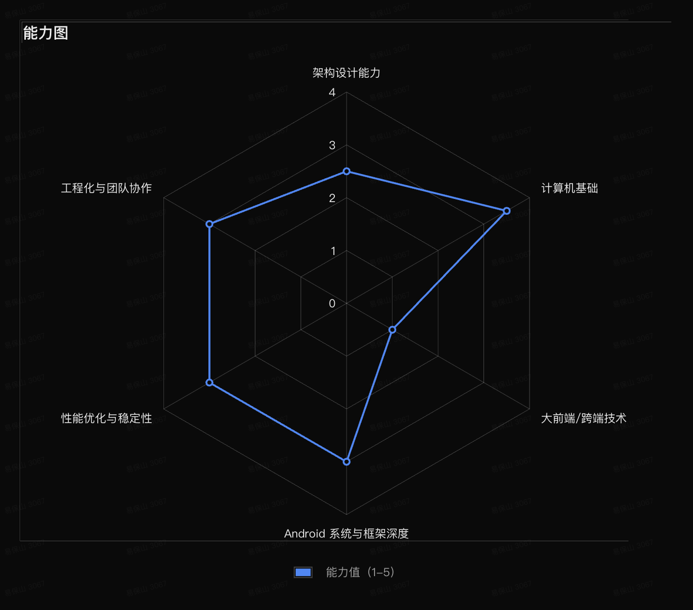

Android 开发工程师，热爱技术，喜欢分享。欢迎关注我的公众号：**[The Android Developer](wechat-official-account.png)** 。

1. 架构设计（MVX/Clean/动态化/DI/IoC/AOP/Hook/APT） 
2. 计算机基础（数据结构/算法/OS/Net/编译/并发/Java/C/Python） 
3. 大前端/跨端技术（Flutter/KMP/RN/Hybrid/HarmonyOS） 
4. Android 系统与框架深度（Framework/Jetpack/Third Lib） 
5. 性能优化与稳定性（Mem/Boot/Battery/Leak/Crash/FPS/ANR/Monitor/APM） 
6. 工程化与团队协作（CI/CD/R8/Gradle/Lint/CR/Test/Docs/Log/Trace/Security） 

