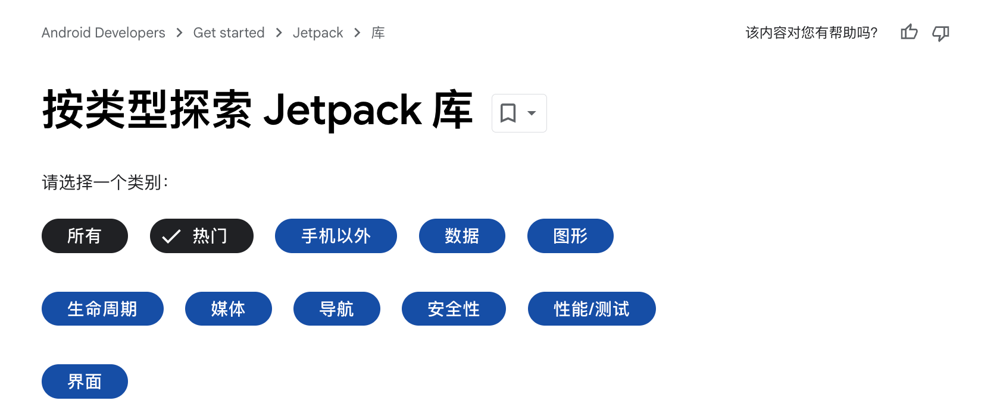

> 前排提示，本文档系个人整理，难免会有疏漏，如有错误，欢迎在 [issues](https://github.com/yibaoshan/yibaoshan/issues) 留言联系我改正。

# 一、Android 系统与主流框架技术

截止到 2025 年，[Android 官网](https://source.android.com/docs/core/architecture) 为 Android 系统架构分了 11  个级别，从上到下分别是：

1. 普通应用（Android Apps），在应用商店下载的非官方应用基本都在这一层，微信、支付宝、抖音、快手、淘宝、京东、美团、饿了么啥的。
2. 特权应用（Privileged Apps），权限更敏感的系统应用吧，比如 系统更新、安全中心之类的。
3. 设备制造商应用（Device Manufacturer Apps），系统应用，比如系统自带的天气、日历、便签、计算器啥的。Google 对它的描述是：
   - 结合使用 Android API、系统 API 并直接访问 Android 框架实现而创建的应用。由于设备制造商可能会直接访问 Android 框架中的不稳定的 API，因此这些应用必须预安装在设备上，并且只能在设备的系统软件更新时进行更新。
4. 系统 API（System API），需要的系统权限才能调用，只能被上面的系统应用和特权系统应用使用，比如，静默安装/卸载、控制数据流量限制、流量统计、读电池状态、屏幕使用时间啥的，官方描述是：
   - 系统 API 表示仅供合作伙伴和 OEM 纳入捆绑应用的 Android API。这些 API 在源代码中被标记为 @SystemApi。
5. Android API，平时开发时用到的 API，比如 View、Activity、Context、Intent、Service 等等。
6. Android 框架（Framework），Framework 层，AMS、PMS、WMS 之类的，官方解释是：
   - 构建应用所依据的一组 Java 类、接口和其他预编译代码。框架的某些部分可通过使用 Android API 公开访问。框架的其他部分只能由 OEM 通过系统 API 来访问。Android 框架代码在应用进程内运行。
7. 系统服务（System Services），为上面的 AMS、PMS 服务的更底层的服务，比如 system_server、SurfaceFlinger。
8. Android 运行时 (ART)，Java 的运行时，上面的服务都需要虚拟机来跑，ART 就是这个虚拟机。
9. 硬件抽象层 (HAL)，各个驱动的抽象层，比如相机，hal 提供 camera.h 头文件，实现交给各个厂商。
10. 原生守护程序和库（System Services and Daemons），官方解释：
    - 该层中的原生守护程序包括 init、healthd、logd 和 storaged。这些守护程序直接与内核或其他接口进行交互，并且不依赖于基于用户空间的 HAL 实现。
    - 该层中的原生库包括 libc、liblog、libutils、libbinder 和 libselinux。这些原生库直接与内核或其他接口进行交互，并且不依赖于基于用户空间的 HAL 实现。
11. 内核（Linux Kernel），进程、内存、文件系统、网络服务和管理和各种基础驱动等，还有基于 Linux 主线增加的 Android 特性，比如著名的 Binder 驱动，Ashmem 匿名共享内存等

官方新的 11 个层级我个人觉得有点啰嗦，分的太细，我还是更习惯原来的 5 层结构

 

如上图，还是按照从上到下的顺序来介绍：

1. Applications，普通应用，除了厂商应用外，需要上架到应用商店的 APP。
2. Application Framework，框架层，管理应用和为应用提供服务，四大组件的 AMS，窗口的 WMS，包管理的 PMS 等，View 系统、Handler 啥的也在这儿。
3. Libraries & Android Runtime，主要是一些 Native 系统库，例如图中的 surface、webkit、sql 等，还有最重要的 Android 运行时 ART，从这一层开始继续向下的，基本都是 C/C++ 实现。
4. HAL，定义硬件协议的抽象层，普通应用开发不太需要了解这方面内容。
5. Linux Kernel，OS 内核，相较于 Linux 主线，另外需要关注的就是 binder、lowmemorykiller 和 Ashmem 匿名共享内存了。

## 主流框架技术

应用层将会介绍一些常见的 Jetpack 库和三方的框架技术，首先是 [Android Jetpack](docs/Android-Jetpack-Overview.md)（只展示部分用过的库）

按官网顺序

1. 手机以外的（beyond）
   - ~~TV、手表、车载相关，和应用有关系的好像只有 [window](https://developer.android.com/jetpack/androidx/releases/window?hl=zh-cn)。~~
2. 数据（data）
    - [Room](android-jetpack/jetpack-data-room.md)，数据库框架，几个注解的使用、版本升级、常用 sql 等
3. 图形（graphics）
   - [Animation](android-jetpack/jetpack-graphics-animation.md)，属性动画、视图动画、插值器、触摸处理、可见性处理（先启动动画再gone）等
4. 生命周期（lifecycle）
   - [Lifecycle](android-jetpack/jetpack-lifecycle-lifecycle.md)，生命周期状态、所有者（LifecycleOwner/Act/Frag）、观察者模式
   - [ViewModel](android-jetpack/jetpack-lifecycle-viewmodel.md)，数据持久化、生命周期感知、SavedStateHandle
   - [LiveData](android-jetpack/jetpack-lifecycle-livedata.md)，生命周期管理、观察机制、粘性事件
5. 媒体（media）
   - ~~[Media3](android-jetpack/jetpack-media-media3.md)，媒体播放器的使用，ExoPlayer~~
6. 导航（navigation）
   - ~~[Navigation](android-jetpack/jetpack-navigation-navigation.md)，NavController、NavHost、Frag/Act/对话框 导航、参数传递、Deep、隐式显式、转场动画~~
7. 安全性（security）
   - ~~[Credentials](android-jetpack/jetpack-security-credentials.md)，基本使用、凭证管理、存储机制~~
8. 性能/测试（performance）
   - ~~[Startup](android-jetpack/jetpack-performance-startup.md)]，依赖关系处理、懒加载支持、ContentProvider~~
9. 界面（UI）
   - [AppCompatActivity](android-jetpack/jetpack-ui-appcompatactivity.md)，最基本的组件，代表一个窗口用于显示用户界面
     - 生命周期、启动模式、数据传递、状态保存和恢复、和 Window 的交互等。
     - 和 FragmentActivity、ComponentActivity、Activity 之间的关系。
   - [Fragment](android-jetpack/jetpack-ui-fragment.md)：可重用的组件，可以简单理解为拥有声明周期的 View。
     - 自己和 Activity 的生命周期管理、FM 使用、事务处理、BackStack 管理、通信、视图管理等等。
   - [Recyclerview](android-jetpack/jetpack-ui-recyclerview.md)，缓存机制、布局管理、适配器、ItemDecoration、ItemTouchHelper 等。
10. App Architecture：https://developer.android.com/topic/architecture/intro?hl=zh-cn
    - [Hilt](docs/Android-Jetpack-Architecture-Hilt)，依赖注入框架，作用域管理、限定符、入口
    - [Flow](docs/Android-Jetpack-Architecture-Hilt)，依赖注入框架，作用域管理、限定符、入口
    - manifest: https://developer.android.com/guide/topics/manifest/manifest-intro?hl=zh-cn

然后是一些常见的三方库

- [Glide](docs/Android-OpenSource-Glide.md)，图片加载流程、缓存机制、生命周期、缩略图、图片转换（圆角、高斯模糊、裁剪）
- [OkHttp](docs/Android-OpenSource-Glide.md)，请求/响应模型，连接池、拦截器链、缓存、Cookie 处理、文件上传下载
- [Retrofit](docs/Android-OpenSource-Glide.md)，基本使用，注解处理、适配器模式、转换机制、请求构建、协程/RxJava/Flow 支持
- [LeakCanary](docs/Android-OpenSource-Glide.md)，引用类型、GC 机制、泄漏检测原理、支持检测的类型、堆内存分析、泄漏路径分析、对象引用链、常见泄漏场景
- [MMKV](docs/Android-OpenSource-Glide.md)，mmap 内存映射、多进程并发
- [RxJava](docs/Android-OpenSource-Glide.md)，响应式编程，Observable/Observer、线程切换，各种操作符（转换、过滤、错误处理）
- [ARouter](docs/Android-OpenSource-Glide.md)，注解处理器、依赖注入、拦截器、降级、动态路由
- [Tinker](docs/Android-OpenSource-Glide.md)，类加载机制、资源替换、Dex 替换、下发策略
- [ButterKnife](docs/Android-OpenSource-Glide.md)，注解处理器
- [EventBus](docs/Android-OpenSource-Glide.md)，发布订阅、线程切换、粘性事件、内存泄漏风险
- [AndroidHiddenApiBypass](docs/Android-OpenSource-Glide.md)，隐藏 API 访问，反射机制
- [Matrix](docs/Android-OpenSource-Glide.md)，
- [KOOM](docs/Android-OpenSource-Glide.md)，

## Framework

### 1、四大组件

- [Activity]()，启动流程、启动来源、hook 点、任务栈管理机制（最近任务/拉起其他应用/单例弊端及解决方案）、Window&DecorView、软键盘
- [Service]()，启动和绑定流程、生命周期、前台服务机制及保活、回收和ANR
- [BroadcastReceiver]()，还有在用吗？有序粘性本地、AMS 中的注册流程、队列管理、分发机制、优先级、拦截机制、ANR和内存泄漏
- [ContentProvider]()，数据共享、跨进程数据访问、权限控制、启动点和启动优化、Provider 进程创建及实例化
- [Application]()，启动流程、ActivityThread、多进程、全局单例、ActivityLifecycleCallbacks、低内存回调
  - 启动优化大头，全局配置管理、组件初始化、崩溃处理、性能监控、第三方 SDK 初始化等等

### 2、消息机制

- [Handler]()，几个角色责任，分发流程、卡顿监控、消息出入队机制、消息池享元模式、同步屏障和异步消息及应用、空闲处理器 IdleHandler、ThreadLocal、View.post()、内测泄漏防范、pollOnce()
- [Input]()，消息的传递流程，Window/Act/View 分发流程，确定谁来消费，input 的 ANR 
  - InputReader、InputDispatcher、WindowManagerService、ViewRootImpl
  - Linux 内核层的驱动、Native 的 EventHub、Framework InputManager、应用层的 Act、View 分发
  - dispatchTouchEvent、onInterceptTouchEvent、onTouchEvent
  - 手势检测 GestureDetector、ScaleGestureDetector
  - 自绘 UI 的事件处理流程，Compose 的组件树，Flutter 的 Widget 树，RN 走桥接，忽略

### 3、视图系统

- [View/ViewGroup]()，绑定流程、坐标系、测量布局绘制三部曲、绘制流程、树结构
  - Choreographer，VSync 处理、input、动画、帧率监控 api
- [Window]()，LayoutParams、PhoneWindow、DecorView、ViewRootImpl、WindowManager 增删改
  - 与 act 关系，与 view 的关系，与 SurfaceView 关系，谁包含谁？谁管理谁？
  - Dialog、、PopupWindow、Toast、悬浮窗
- [Bitmap]()，888/565，内存大小占用及位置、缩放/裁剪/矩阵变换、压缩、内存监控、OOM 、Bitmap 缓存、Bitmap 池、BitmapFactory
  - 大图加载（详情页）、列表、图片保存
- [Not View 自绘方案]()
  - compose 使用 Skia 图形库通过 Canvas 直接绘制，不依赖 Android View 系统
  - flutter 自带渲染引擎（Skia）直接操作 GPU，自定义渲染管线

### 4、系统服务

- [ActivityManagerService]()，主要关注和应用有关系的，比如，能拿到的最早 hook 点，ActivityThread ，四大组件的创建、优先级、生命周期调度、回收与销毁、多进程、Act 的任务栈怎么设计和管理、ANR 触发
  - 核心组件（简单了解），ActivityManagerService、ActivityStackSupervisor、ActivityStack、ProcessRecord
  - AMS 的启动和注册，同样简单了解即可，毕竟应用层改不了一点。
- [WindowManagerService]()，Activity 创建窗口流程、DecorView 添加过程、生命周期与窗口关系
  - 显示相关，ViewRootImpl.setView()、Surface.lockCanvas()、WindowManagerGlobal.addView()
  - 交互，InputEventReceiver.dispatchInputEvent()、ViewRootImpl.handleMessage()、Choreographer.doFrame()
- [PackageManagerService]()，主要了解 签名机制，apk 包内容、解压安装过程（apk文件都被丢到哪，安装位置，渠道包信息存储和读取）、AndroidManifest 解析
- [ServiceManager]()，简单了解 binder 部分以及怎么管理各个 ms

## Native Runtime

- [ART]()，常规类加载，内存分配，堆空间划分，GC 算法/Roots/触发时机和条件
  - bitmap 的 oom 优化，字节的 mSponge 方案，移出 LargeObjectSpace 内存占用，间接增加虚拟机可用内存，降低 Android 8.0 以下的 OOM 率
  - 启动优化，启动阶段减少类加载，减少反射
  - AOT 的 dex2oat 工具，编译优化和空间开销，JIT 的热点识别和编译缓存
  - 与 Java 的 HotSpot 的区别？比如，增加 AOT，内存管控严格 Heap 不能自定义，GC 方面，不能自定义算法，完全由厂家定

## Linux Kernel

Kernel 的上一层还有个 HAL，不过应用开发实在接触不到，略略略😛

- [Binder Driver]()，Android IPC 最闪亮的仔，在保证通信安全的前提下，尽可能提升通信效率/性能。
  - 几个 ipc 对比，性能、安全方面
  - 权限控制、UID/PID 检查、SELinux、mmap、引用计数、死亡通知
- [Ashmem 匿名共享内存]()，大数据传输，跨进程共享、自动回收，surface、图形缓冲区都用它
- [Low Memory Kill]()，优先级管理、内存水位线、回收策略、与 AMS 的配合
- [进程调度]()，相较于 Linux 主线，Android 特性增加，CFS、前台进程/UI线程优先级++、nice 值管理、cgroup 分组、schedtune 调节

# 二、⼯程化和团队协作

- [Continuous Integration]()，Jenkins 和 Gitlab、Lint 检查代码准入、渠道/分支管理、自动构建、编译报告（资源增删、包体积）、测试分发（上传 OSS 与更新通知）
- [Continuous Delivery]()，Jenkins 和 Gitlab、Firebase
- [DevOps]()，需求群、线上 Bug 群、发布群、飞书卡片通知/操作确认（同意/打回）、测试阶段、产品验收、线上回归、自动发布、代码/文档/tag/分支归档、监控面板、最终交付。
- [Gradle]()，各种自定义任务、马甲包管理、Debug Only、本地环境隔离
- [Log & Trace]()，线上/线下日志和埋点解决方案

# 三、稳定性治理和性能优化

- [ANR]()，ANR 产生原因（触发条件/时机）、怎么分析、解决/优化方案、线上/线下监控、主线程 I/O、Method 耗时监控
- [Crash]()，Crash 常见原因和解决方案、Java 崩溃体系，预防与治理，CI 阶段如何检测、处理、线上/线下收集/监控，如何收敛？
- [OOM]()，内存管理/回收/泄漏/LMK等基础知识，线下内存使用量监控，LeakCanary 泄漏监控，线上 KOOM/Matrix 数据收集/监控
- [FPS/卡顿掉帧]()，View 渲染过程，布局优化、RV优化、线上/线下监控、收集
- [App/Page Startup]()，应用冷启动优化、Systrace、页面的启动和可交互速度优化、生命周期和埋点时机

# 四、计算机基础

## 数据结构和算法

LeetCode Hot 100，每天 1~3 题。

https://leetcode.cn/studyplan/top-100-liked/

## 操作系统

基础版 OS 可以阅读 [MIT6.S081 XV6 操作系统专栏](https://www.zhihu.com/column/c_1883164478474000252)

## 编译

- 了解 [Java/Kotlin 编译过程](docs/计算机基础-编译-Java&Kotlin) ，每个阶段都有哪些工具，是否有扩展的可能性。
    - 比如 C 语言的预处理、编译、汇编、链接，预处理阶段可以通过宏定义进行修改，编译阶段可以用自定义的编译器插件，链接阶段可以替换库文件。
    - 再比如 Java 的字节码增强工具 ASM 修改代码，在 CI/CD 中可能用于性能监控或代码注入。
- 二是了解 [Android APK 的构建流程](docs/计算机基础-编译-Android.md)，资源处理、代码编译、打包签名等步骤
    - 资源处理阶段使用aapt/aapt2，可以修改资源或生成额外的R.java；
    - 代码编译阶段，Java 转 dex 时，可以用Transform API（AGP）插入自定义任务，修改字节码

## 并发编程

并发安全问题的本质，是 **共享资源的竞争** 和 **操作的原子性**

1. [在硬件层面上](docs/计算机基础-并发-硬件支持.md)
    - 共享资源就是主存，多个执行单元（CPU 核心）对共享资源（主存）的并发访问，这点由 MESI 缓存一致性协议保证数据一致性。
    - 操作原子性方面，CPU 提供了原子操作指令和内存屏障指令。
2. [操作系统层面的支持](docs/计算机基础-并发-操作系统.md)
3. 语言层面，[C 的 POSIX 线程库](docs/计算机基础-并发-语言-C.md) 和 [Java 对并发的支持](docs/计算机基础-并发-语言-Java.md)

## Java & JVM

- [Java 基础语法和特性](docs/计算机基础-编程语言-Java-基础语法和特性.md)
    - 面向对象基础，类和对象，继承、封装、多态，抽象类和接口，内部类和匿名类
    - Java 基本类型和包装类，基本数据类型，自动装箱和拆箱，String 和字符串池，常量池机制
    - 异常处理，异常体系，try-catch-finally，自定义异常
- [Java 集合框架](docs/计算机基础-编程语言-Java-集合框架.md)
    - Collection 体系，List（ArrayList、LinkedList），Set（HashSet、TreeSet），Queue（ArrayDeque、PriorityQueue）
    - Map 体系，HashMap 原理和实现，TreeMap 和红黑树，ConcurrentHashMap 实现
- [Java 反射和注解](docs/计算机基础-编程语言-Java-反射和注解.md)
    - 反射机制，Class 类，反射 API，动态代理
    - 注解，内置注解，自定义注解，注解处理器
- [Java IO/NIO](docs/计算机基础-编程语言-Java-IO&NIO.md)
    - 传统 I/O，字节流和字符流，缓冲流，序列化
    - NIO，Buffer 和 Channel，Selector，文件系统
- [JVM/Dalvik/ART](docs/计算机基础-编程语言-Java-JVM.md)
    - 内存模型，运行时数据区，对象创建过程，垃圾回收机制
    - 类加载机制，类加载过程，类加载器，双亲委派模型

# 五、架构设计

架构设计不是很好分类，我个人是按照 设计思想/原则（设计模式、SOLID）、基础开发模式（MVX、Clean），和高级框架技术（组件化、动态化、IoC）这三类来划分的

- [架构设计思想](docs/架构设计-架构设计思想.md)
    1. SOLID 原则
        - 单一职责原则、开闭原则、里氏替换原则、接口隔离原则、依赖倒置原则
        - 尤其是依赖倒置（DIP）与接口隔离（ISP）在模块化中的应用
    2. 设计模式，常用的几个
        - 创建型：工厂模式（组件化中模块初始化）、单例模式（需注意线程安全）。
        - 行为型：观察者模式（LiveData/RxJava）、策略模式（动态替换算法，如图片加载策略）。
        - 结构型：代理模式（AOP切面）、装饰器模式（扩展功能，如OkHttp Interceptor）。
- [基础开发模式](docs/架构设计-基础开发模式.md)
    1. MVC → MVP → MVVM → MVI
        - 各架构模式的优缺点及适用场景，如 MVP 的 View 接口解耦、MVVM 的 DataBinding/ViewModel 双向绑定
        - 对比 Jetpack 的 ViewModel 与纯 MVVM 实现，注意 LiveData 与 RxJava 在响应式中的差异。
    2. Clean Architecture
        - 分层设计（Entities → Use Cases → Interface Adapters → Frameworks），依赖规则（内层不依赖外层）
        - 中心思想，分层、依赖倒置原则、边界划分、数据流转
        - 结合 Dagger/Hilt 实现依赖注入，业务逻辑与框架解耦
- [高级架构实践](docs/架构设计-高级架构实践.md)
    1. 组件化
        - 解决模块间通信（ARouter原理）、资源冲突（资源命名规范）、独立调试（Gradle动态切换Application/Library）。
        - 架构图：分层设计（App壳工程 → 业务组件 → 功能层 → 基础库）。
    2. 动态化方案
        - 热修复（Tinker/Sophix）、插件化（RePlugin/Shadow），重点理解类加载机制与资源 Hook。
        - 动态换肤方案。
    3. 依赖注入（IoC）
        - Dagger2/Hilt的核心：@Component、@Module、@Inject，解决依赖图的构建与生命周期管理。
    4. AOP 切面编程
        - 使用 AspectJ 或 ASM 实现无侵入埋点、性能监控（如方法耗时统计）。
    5. RxJava/Coroutine Flow
        - 对比观察者模式与协程的挂起机制，掌握背压处理（Flow的buffer()/conflate()）。
        - 应用场景：多数据源合并、UI事件防抖（如搜索框输入）
