# 聊聊 Glide | 不看源码，只聊设计

Glide 是一个非常优秀、高性能的开源图片加载框架，从我入行开始一直到现在，工程里面的图片库几乎都是用它。

截止到发稿，Glide 版本已经升到了 5.0，Java + Kotlin 代码总行数也膨胀到近 **9w** 行

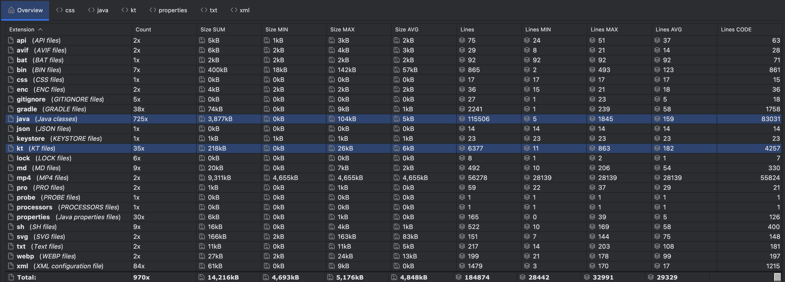

现在的 Glide 工程太庞大了，源码肯定是看不了一点

所以，我准备从 3 步链式调用的代码入手，来尝试剖析 Glide 的功能与设计

```kotlin
Glide.with(context).load(url).into(imageView)
```

本文将从链式调用的三个方法作为入口，分别介绍 Glide 的 **缓存复用机制**、**生命周期管理**、**预加载机制**、**图片的请求和转换** 等功能

1. **with(context)**
   - **绑定生命周期**，Glide 会在内部创建一个与该组件生命周期绑定的 RequestManager，这个 RequestManager 会监听传入的组件的生命周期事件
     - 在 `onStop()` 时暂停请求。 
     - 在 `onDestroy()` 时取消请求并释放相关资源（*如 Bitmap 内存*）。
   - **为 Glide 提供上下文**，如果你接下来传入的是资源文件，那 Glide 需要 Context 才可以访问 Res，另外，磁盘缓存 涉及到的文件系统 也需要 Context 才能正常工作
2. **load(x)**
   - 入参可以是 String、Uri、File、DrawableRes、Bitmap 等 
   - 这一步的工作主要是 定义请求 和一些准备工作，构建和配置 RequestBuilder 类，告诉 Glide 你想要加载什么图片，以及用什么方式加载
   - `load()` 后面的 `placeholder()`、`error()`、`centerCrop()`、`override()` 等都属于配置阶段，这些选项会被封装到一个 RequestOptions 对象中
3. **into(view)**
   - 这一步才是真正的请求触发和执行，常见的 **缓存处理**、**BitmapPool**、**图片的转换处理** 都在这个阶段 
   - 入参通常是 ImageView，也可以是自定义 Target，同时 Glide 内置了几个 Target 给开发者使用，比如 ViewTarget、SimpleTarget
   - 不同的 target 的核心加载流程（*缓存、数据获取、解码、转换*）是基本一致的，只是最终的 “**结果消费**” 和 “**显示方式”** 不一样，这一点我们在第三节会详细介绍。

> 全文基于 Glide v5.0.0：https://github.com/bumptech/glide/tree/v5.0.0-rc01

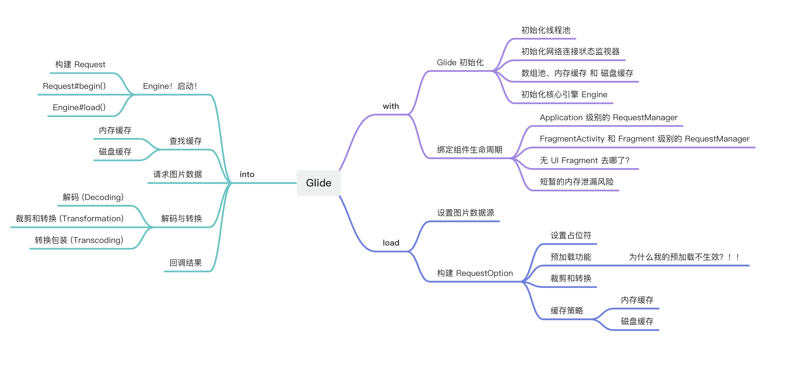

# 一、With context

`Glide#with(context)` 是我们使用 Glide 的第一步，传入 Context 的作用开头已经介绍过了

- 一是 **绑定生命周期**，Glide 会在内部创建一个与该组件生命周期绑定的 RequestManager，这个 RequestManager 会监听传入的组件的生命周期事件，用来管理请求。
- 二是为 Glide 提供上下文，如果你接下来传入的是资源文件，那 Glide 需要 Context 才可以访问 Res，另外，磁盘缓存涉及到的 文件系统 也需要 Context 才能工作。

本小节还会来探讨

1. 多次调用 ` Glide#with()` 传入同一个 Activity/Fragment 对象，Glide 会不会也创建多个 RequestManager，理论上应该共用一个 RequestManager ，不然就是资源浪费了
2. 传入 `Application#Context` 和 Activity/Fragment ，结果有什么不一样？

进入正文前，我们先来看 Glide 单例的初始化代码

## Glide 的初始化

首次加载图片会触发 Glide 单例对象的创建和初始化

Glide 的创建和初始化使用的是 **建造者模式**，由 GlideBuilder 负责构建配置，然后通过 `build()` 方法创建 Glide 对象。

```java
public final class GlideBuilder {
    Glide build(context, manifestModules, annotationGeneratedGlideModule) {
        
        // step 1, init ThreadExecutor for Glide
        sourceExecutor = GlideExecutor.newSourceExecutor();
        diskCacheExecutor = GlideExecutor.newDiskCacheExecutor();
        animationExecutor = GlideExecutor.newAnimationExecutor();

        // step 2, init network monitor
        connectivityMonitorFactory = new DefaultConnectivityMonitorFactory();

        // step 3, init bitmapPool
        memorySizeCalculator = new MemorySizeCalculator.Builder(context).build();

        if (bitmapPool == null) {
            int size = memorySizeCalculator.getBitmapPoolSize();
            
            if (size > 0) bitmapPool = new LruBitmapPool(size);
            else bitmapPool = new BitmapPoolAdapter();
        }
        
        // step 4, init all of cache
        arrayPool = new LruArrayPool(memorySizeCalculator.getArrayPoolSizeInBytes());
        memoryCache = new LruResourceCache(memorySizeCalculator.getMemoryCacheSize());
        diskCacheFactory = new InternalCacheDiskCacheFactory(context); // 250 MB of cache

        // step 5, init engine
        engine = new Engine(memoryCache, diskCacheFactory, diskCacheExecutor, sourceExecutor, animationExecutor);

        return new Glide(context, engine, memoryCache, bitmapPool, arrayPool, requestManagerRetriever, connectivityMonitorFactory, logLevel, defaultRequestOptionsFactory, defaultTransitionOptions, manifestModules, annotationGeneratedGlideModule);
    }
}
```

在 `build()` 函数中，我们会看到很多熟悉的老面孔

1. **初始化线程池**
   - Glide 有好几个线程池，涉及网络、文件 I/O 和 Bitmap 解码/转换的操作都发生在这里的后台线程中。
   - 具体到初始化流程，有三个线程池被创建
     - `sourceExecutor`，用于执行 I/O 密集型任务，如网络下载、大型文件读取。 
     - `diskCacheExecutor`，专用于执行磁盘缓存的读写操作。 
     - `animationExecutor`，用于处理 GIF 或其他动画的解码和帧更新。
   - 在实际开发中，你可以设置为自己管理的线程池，只需要在 AppGlideModule 中，拿到 GlideBuilder 对象以后，调用 `setXXXExecutor` 即可。
2. **初始化网络连接状态监视器**，DefaultConnectivityMonitorFactory，用来感知网络连接，网络不可用时自动暂停网络请求，在恢复时自动重启
3. **设备性能计算器**，MemorySizeCalculator 会根据设备内存大小和屏幕分辨率计算出，当前设备能够支持的 Bitmap 缓存池大小
   - 如果用户设备性能不是很高，那么 `getBitmapPoolSize()` 可能会返回 0
   - 一旦返回 0 ，bitmapPool 会使用 BitmapPoolAdapter，这是一个 “空操作” 的 BitmapPool，Glide 在这台设备上不会执行 任何 Bitmap 的缓存和复用
   - 如果 `getBitmapPoolSize()` 大于 0 ，启用 LruBitmapPool
   - LruBitmapPool 是个基于 LRU 策略的 Bitmap 复用池，如果你的应用有频繁创建/销毁 Bitmap 的场景，比如电商 APP，那复用 Bitmap 可以帮你减少 GC 次数，降低垃圾回收开销。
4. 第四步分别初始化了 **数组池**，**内存缓存** 和 **磁盘缓存**
   - ArrayPool，与 BitmapPool 类似，用来减少数组（*支持 int[] 和 byte[]*）的频繁创建和回收，降低 GC 压力，大小由 `memorySizeCalculator` 决定
   - MemoryCache，缓存已经解码并准备好显示的图片资源，避免重复解码和转换，Glide 性能优化点之一，大小同样由 `memorySizeCalculator` 决定，设备性能差的话就不缓存或者少缓存
   - DiskCacheFactory，磁盘缓存，避免重复下载，默认大小是 `DEFAULT_DISK_CACHE_SIZE` = 250MB，对你没看错，就是 250😂，当然你可以自定义 AppGlideModule 然后修改缓存大小
5. **初始化核心引擎 Engine**
   - 类如其名，能用 Engine 命名的类都不一般
   - 它负责 接收请求、管理缓存查找 (MemoryCache 和 DiskCache)、调度 DecodeJob 到不同的线程池、请求去重、解码回调 Request 等等工作
   - Engine 类跟 Glide 类的关系，比较像主力员工和老板的关系
   - 老板 Glide 负责对外开放接口，收集甲方各种各样的需求，回家关起门要 Engine 类去做具体的事情，Engine 负责 拆解任务 然后去执行，中间还得上报工作进度

## 绑定组件生命周期

然后我们来看 Glide 是怎么利用入参的 Context 绑定组件的生命周期的

`Glide#with()` 是一个 静态函数，并且有不同的 重载版本，返回值是一个 RequestManager 对象

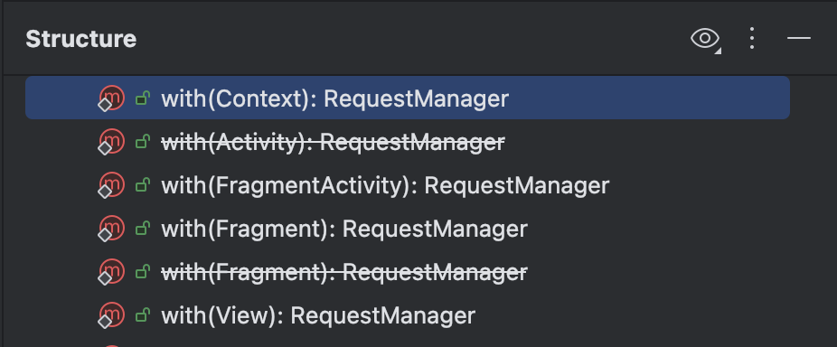

不管传入的 Context 是 Activity 还是 Fragment，最终都转交给 `RequestManagerRetriever#get()` 方法处理，得到两种类型的 RequestManager ：

1. **Application 级别的 RequestManager**
   - 传入的是抽象类 Context 或者是 View，Glide 会遍历查找当前 View/Context 所属的 Act，如果 Act 为空或者不是 FragmentAct，那么，使用 Application 的生命周期
   - 如果传入的是原生的 android.app.Activity 对象，也会使用  Application 的生命周期，原因未知，有知道的小伙伴可以在评论区留言
   - 另外，如果你是在非 UI 线程调用的 `Glide#with()`，即使你的 Context 是 Act 或 Frag，也会返回 Application 级别的 RequestManager
2. **FragmentActivity 和 Fragment**
   - 它俩都实现了 Lifecycle 接口，所以，Glide 的 LifecycleRequestManagerRetriever 类，负责管理和提供这些有 lifecycle 的 RequestManager 实例
   - 如果 Lifecycle 通知销毁，LifecycleRequestManagerRetriever 也会清楚对应的 RequestManager 和自己的映射
   - Map<Lifecycle, RequestManager> `lifecycleToRequestManager` 来保证，每个 Act/frag 对应一个 RequestManager
   - RequestManager 有了 Lifecycle ，也就拥有 **感知生命周期** 的能力，这是它和 Application 级别的 RequestManager 最大的区别

一旦被认为需要返回 Application 级别的 RequestManager，那么，**本次请求的生命周期将会和 Application 的生命周期一样长**，**而且，请求过程中不会自动暂停、恢复或取消，除非请求完成或者发生错误。**

而 FragmentActivity 和 Fragment 的 RequestManager 因为有来自 Lifecycle 的回调，所以能够在 `onStart()`、`onStop()`、`onDestroy()` 这几个时机自动执行 开始/恢复、暂停、取消 等操作。

```java
  /**
   * Lifecycle callback that cancels all in progress requests and clears and recycles resources for
   * all completed requests.
   */
  @Override
  public synchronized void onDestroy() {
    targetTracker.onDestroy();
    clearRequests();
    requestTracker.clearRequests();
    lifecycle.removeListener(this);
    lifecycle.removeListener(connectivityMonitor);
    Util.removeCallbacksOnUiThread(addSelfToLifecycle);
    glide.unregisterRequestManager(this);
  }
```

### 1. 无 UI Fragment 去哪了？

细心的朋友可能已经发现了，现在 RequestManager 感知生命周期的能力，是由 Jetpack 的 Lifecycle 组件提供

原来的利用无 UI 的 Fragment 感知生命周期变化的那一套已经被弃用了，成为了过去式

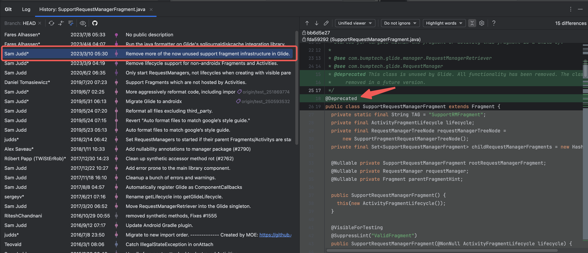

查看 Git 提交记录发现，在2023年的3月10号，无 UI 的 ~~SupportRequestManagerFragment~~ 类被标记为启用

并且，配合它执行生命周期调度的 ~~ActivityFragmentLifecycle~~ 类也被删除。

### 2. 短暂的内存泄漏风险

最后，还有个关于生命周期的点需要注意，虽然 FragmentActivity/Fragment 有 Lifecycle 可以自动释放资源，但如果使用不当，还是有内存泄漏的风险的

假设这么个场景，你在 Act/Frag 中调用 `Glide#with()` 不小心传错 Context 了，本来想传的是 `this`，结果传入了 Application 的上下文，`into()` 的 Target 又引用了 Act/Frag

**如果此时页面被关闭了，那么在 request 结束之前，Act/Frag 是无法被正常回收的，会发生一个短暂的 内存泄漏**

# 二、Load source

`load()` 的主要工作是构建 RequestBuilder 对象，组装 Request，告诉 Glide 我要从哪里加载图片、用什么方式加载

## 图片数据源

`load()` 函数接受 9 种不同类型的数据源：Bitmap、Drawable、String、Uri、File、Integer、URL、byte[]、Object

在组装阶段，不管你传入的是什么，Glide 都只会调用 `loadGeneric()` 函数，把它们保存到 Object 类型的成员变量 `model` 中，不校验参数合法性

```java
private Object model; // 数据源

private RequestBuilder<TranscodeType> loadGeneric(@Nullable Object model) {
    this.model = model;
    isModelSet = true;
    return this;
}
```

以 String 举例，你传入的可能个是本地的文件路径，也可能是一个网络地址，又或者穿了个空字符， Glide 都不会去检查参数是否合法，具体的校验工作放在了后续的 执行阶段 里面（通过 ModelLoader 和 ResourceDecoder）

```java
public RequestBuilder<TranscodeType> load(@Nullable String string) {
  return loadGeneric(string);
}
```

另外还有一点需要知道的是，如果你的数据源是 `byte[]` 数组、Bitmap 这种存在于内存中的资源，Glide 会将 DiskCacheStrategy 设置为 `NONE`，因为它们不需要磁盘缓存

```java
public RequestBuilder<TranscodeType> load(@Nullable Bitmap bitmap) {
    return loadGeneric(bitmap).apply(diskCacheStrategyOf(DiskCacheStrategy.NONE));
}
```

## 构建 RequestOption

除了设定图片的数据源，在组装阶段，Glide 还为我们提供 占位符、预加载 等功能

### 1. 占位符

Glide 目前支持三种 占位符

- `placeholder(int drawableRes)`，开始加载、加载过程中显示的占位图片，一般是一个静态的资源
- `error(int drawableRes)`，加载失败/错误的时候显示的图片，比如图片数据源错误啊、网络错误、图片格式不对无法解析啊等等，一般也是静态资源
- `fallback(int drawableRes)`，**优先级最高** 的占位符，如果图片的数据源是空的，比如用户头像的 URL 为空就会显示 `fallback` 的资源
    - 如果 `fallback` 被触发，那么，前面两个 `placeholder` 和 `error` 都不会显示，因为无法发起加载请求

### 2. 预加载

预加载 是指先把图片加载到内存中，轮到这张图片显示的时候可以直接从内存中读取，避免了加载图片的等待时间。是项目中常用的 **优化用户体验** 的手段之一，我们在多个项目中都有实际使用

`preload()` 函数有两个重载版本，一个是 **需要指定宽高**，另一个是 **无参函数**，默认加载 `SIZE_ORIGINAL` 原图尺寸

```java
  public Target<TranscodeType> preload(int width, int height) {
    final PreloadTarget<TranscodeType> target = PreloadTarget.obtain(requestManager, width, height);
    return into(target);
  }

  public Target<TranscodeType> preload() {
    return preload(Target.SIZE_ORIGINAL, Target.SIZE_ORIGINAL);
  }
```

Glide 预加载的使用条件还是比较 **苛刻** 的，使用的时候一定注意：

**想要成功命中缓存，除了要求预加载时的 链接 和最终使用的链接是一样的以外，还必须保证 宽高、转换信息 等参数也都是相同的**

**否则，Glide 会认为这是 两个不同的请求，不会命中内存缓存**（*我们在线上吃过亏*）

接下来，我们通过一个小栗子来看看，应该如何正确使用 Glide 的 预加载 功能，Demo 代码如下：

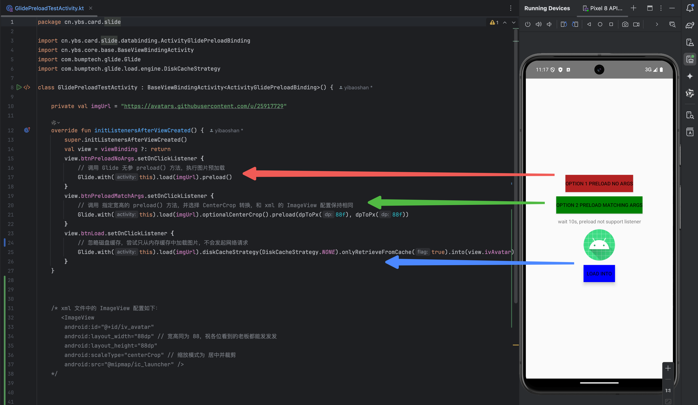


- 第一个 红色按钮，负责调用 Glide 无参的 `preload()` 方法，执行图片的 预加载
- 第二个 绿色按钮，调用了 指定宽高的 `preload()` 方法，并且选择了 `CenterCrop()` 转换，这是为了和 xml 中的 ImageView 配置保持相同
- 最下面的 蓝色按钮，调用 `load.into(url)` 方法，尝试以 **忽略磁盘缓存并只从内存缓存读取** 的方式来加载图片，**不会真的发起网络请求**

理论上，如果 红/绿 的 `preload()` 预加载 方法执行成功，那点击 蓝色按钮 后，应该可以正确的 从缓存中读取图片 并显示，对吧

我们一起来看下运行结果：

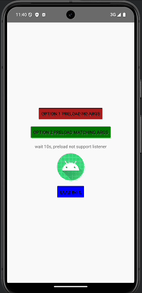

如图所示，先点击 红色按钮 执行 **无参预加载**，再点 蓝色按钮 尝试 **从内存获取图片**，ImageView 显示空白，说明此次 **未命中内存缓存**，缓存获取失败

然后再点击第二个 绿色按钮 执行 **参数匹配的预加载**，此时再点击 蓝色按钮 发现 ImageView 正常显示出头像照片，这说明此次 **成功命中内存缓存**

为什么会出现这样的情况？答案就藏在 Glide 的 EngineKey 类里

### 3. 为什么我的预加载不生效？！！

```java
class Engine {
    public <R> LoadStatus load(Object model, Key signature, int width, int height, Map<Class<?>, Transformation<?>> transformations,Class<?> resourceClass,Class<R> transcodeClass,Options options){
        // 1、根据数据源、宽高、转换信息、构建信息等等生成一个 key
        EngineKey key = keyFactory.buildKey(model, signature, width, height, transformations, resourceClass, transcodeClass, options);
        // 2、再根据 EngineKey 查询内存缓存
        memoryResource = loadFromMemory(key, isMemoryCacheable, startTime);
    }
}

class EngineKey implements Key {

    @Override
    public boolean equals(Object o) {
        if (o instanceof EngineKey) {
            EngineKey other = (EngineKey) o;
            return model.equals(other.model) && signature.equals(other.signature) && height == other.height && width == other.width && transformations.equals(other.transformations) && resourceClass.equals(other.resourceClass) && transcodeClass.equals(other.transcodeClass) && options.equals(other.options);
        }
        return false;
    }
}
```

在 `Engine#load()` 加载图片阶段，会先调用 `loadFromMemory()` 函数，尝试从 内存缓存 中获取图片，获取成功则直接返回，否则才执行网络请求，重点来了：

- Glide 会根据 **数据源**（*我们这里是图片的 URL 链接*）、**宽高**、**转换信息** 等参数生成一个 EngineKey
- 这个 EngineKey 会作为查询缓存的 **唯一标识**
  - 在 Glide 的 内存缓存 中，`ActiveResources` 和 `LruResourceCache` 内部都是使用 Map 存储的
  - Map 对比键值，调用的是对象的 `equals()` 方法，如果相同则返回 true
  - 再看 EngineKey 类，它重写了 `equals()` 方法，对比的就是 `model`、`signature`、`width`、`height`、`transformations`、`resourceClass`、`transcodeClass`、`options` 这些东西

所以，**如果你在 调用 `preload()` 设置的`model`、`width`、`height`、`transformations` 等参数，和最终 `load().into()` 的时候不一样，那在 Glide 看来你这属于 两个不同的请求，也就不会 命中缓存 了**

我们来 debug 验证一下

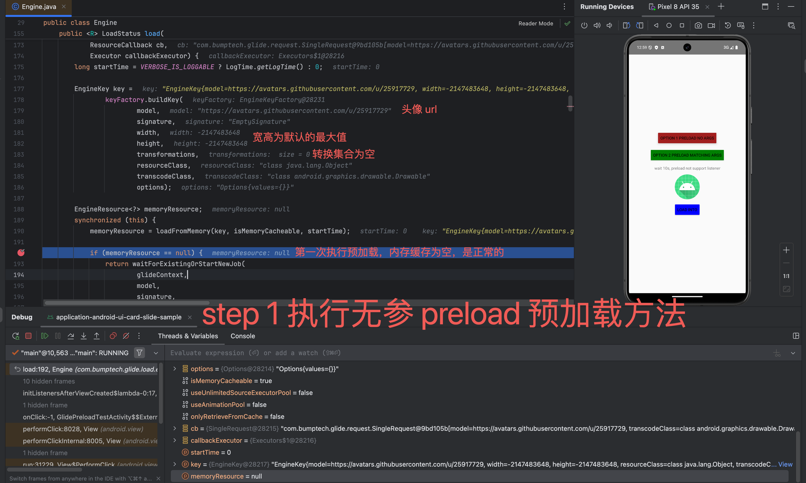

第一次调用 无参 `preload()`，宽高是 `Integer.MIN_VALUE` 表示不限制，按照 原图尺寸 加载，然后 转换列表 是空的

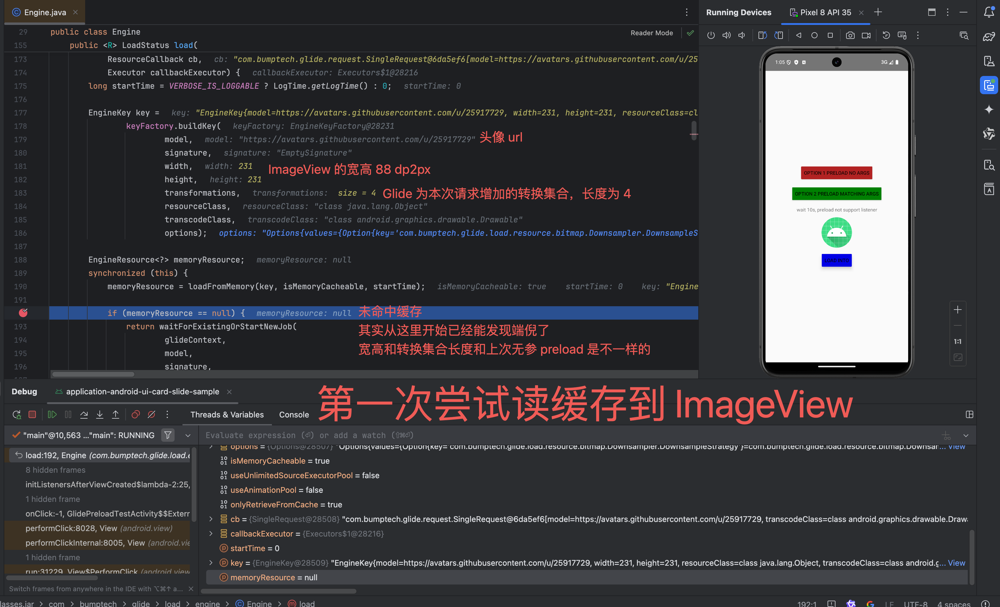

预加载 完成，第一次 尝试 读取缓存 到 ImageView，获取缓存失败

这一步就能看出问题来了，正式 `into` 请求的宽高是 ImageView 宽高的 px 值，正式的 转换列表 中也有 4 个元素，显然和 预加载 的配置是不一样的

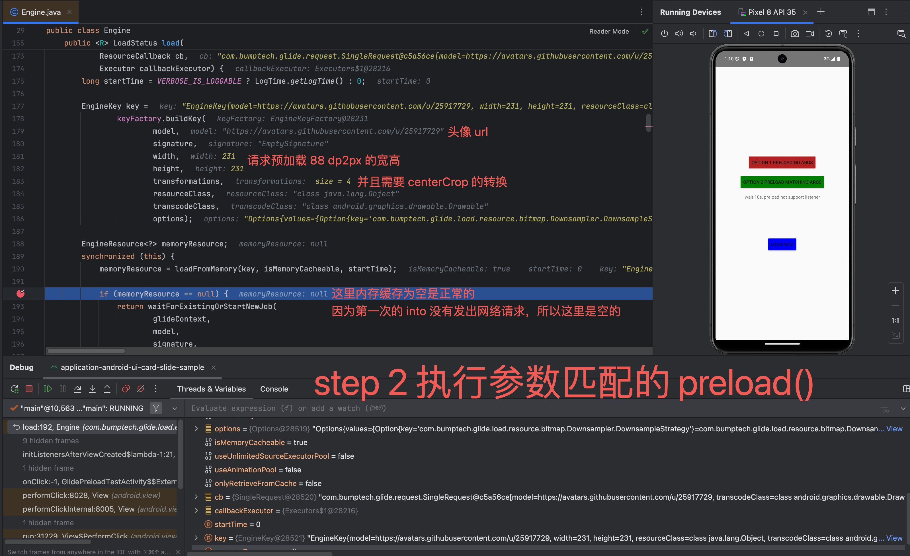

接着我们使用和 xml 中 ImageView 配置相同 的参数，再来一次 预加载 请求

这次调用的是 `preload(width, height)` 方法

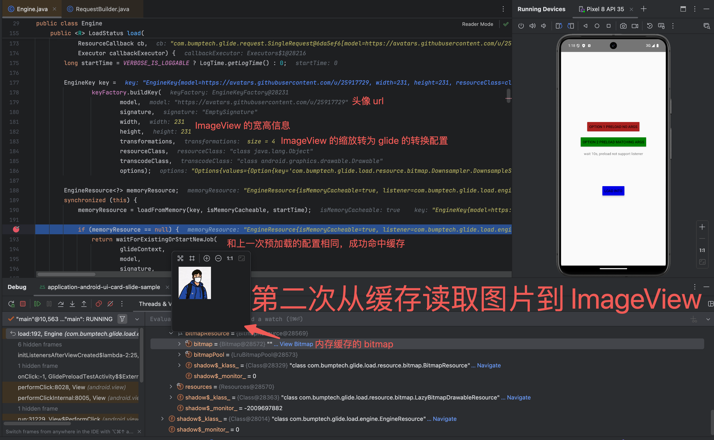

第二次 尝试从 内存缓存 中读取图片，成功命中缓存，ImageView 显示正常

做个小结

如果我们想要在项目中使用 预加载 功能，**一定要注意 `preload()` 的 参数设置，尤其是 `width`、`height`、`transformations` 这三项，要和目标 ImageView 的配置 保持一致**

参数不一致是无法命中缓存的，只会白白浪费了 CPU、内存和流量资源。

>  *本次 Demo 代码我放在 Github 仓库了，感兴趣的朋友可以点击链接查看：https://github.com/yibaoshan/yibaoshan/blob/master/application-android-ui-card-slide-sample/src/main/java/cn/ybs/card/slide/GlidePreloadTestActivity.kt*

### 4. 裁剪和转换

继续来看 RequestBuilder 的其他功能

Glide 支持图片 **裁剪和转换** 功能，它提供了像 圆形裁剪 `CircleCrop()`、高斯模糊 `BlurTransformation`、灰度处理 `GrayscaleTransformation` 等内置的转换，另外还提供了自定义转换 `transform()` 和 指定尺寸 `override()` 的功能

像一般的 `centerCrop`、`fitCenter` 啥的不需要单独设置，Glide 会自动读取 ImageView 的 `ScaleType` 信息，然后解析成对应的 缩放效果 保存到 `requestOptions` 对象

```java
class RequestBuilder {
    public ViewTarget into(ImageView view) {
        ...
        switch (view.getScaleType()) { // into 阶段，会根据 scaleTpye 设置不同的缩放
            case CENTER_CROP:
                requestOptions = requestOptions.clone().optionalCenterCrop();
                break;
            case CENTER_INSIDE:
                requestOptions = requestOptions.clone().optionalCenterInside();
                break;
            case FIT_CENTER:
            case FIT_START:
            case FIT_END:
                requestOptions = requestOptions.clone().optionalFitCenter();
                break;
            case FIT_XY:
                requestOptions = requestOptions.clone().optionalCenterInside();
                break;
            case CENTER:
            case MATRIX:
            default: // Do nothing.
        }
        ...
    }
}
```

### 5. 缓存策略

Glide 提供了两种 缓存策略，一是 **内存缓存**，二是 **磁盘缓存**，如果你不想使用缓存，或者只想使用缓存，Glide 也提供了 API 允许你自定义

- `skipMemoryCache`，默认 false，设为 true 的话，Glide 不会从 内存缓存 中加载图片，同时也不会将图片存入 内存缓存
- `diskCacheStrategy`，指定磁盘的 缓存策略，现在默认是 `AUTOMATIC` 智能模式，另外四个选项是：
  - `ALL`，缓存原图和转换后的图片、`NONE`，禁用磁盘缓存、`DATA`，只缓存原图、`SOURCE`，只缓存转换后的图片
- `onlyRetrieveFromCache`，只从缓存中加载图片，不发起 网络请求，缓存范围包括 内存缓存 和 磁盘缓存，默认 false

另外，RequestBuilder 还支持设置监听、过渡动画、制定解码为 Bitmap、Gif、File 等功能，我这里就不一一展开了

> *更多关于 RequestBuilder 的信息可点击链接查看：https://github.com/bumptech/glide/blob/v5.0.0-rc01/library/src/main/java/com/bumptech/glide/RequestBuilder.java*

# 三、Into target

链式调用的最后一步是 `into()` 函数，它接收 Target 类型的参数，作用是告诉 Glide，开发者想把图片加载到哪？是直接显示到 ImageView ，还是以 File、Bitmap 的形式回调给开发者。

设置完 Target 后，接下来会真正进入图片的加载和显示流程，整个过程大概可以分为以下几个阶段：

1. **Engine！启动！，**前面两个章节构建的 Request 最终会转交给 Glide 的核心组件 Engine 去执行，`Engine#load()` 是整个执行阶段的启动点
2. **查找缓存**，Engine 接到请求后，会首先检查 内存缓存，如果没有则继续查找 磁盘缓存，都没有才去 请求数据
3. **请求图片数据**，Glide 先会校验数据源是否合法，然后根据不同的数据源使用不同的 ModelLoader，是文件就去读取文件，是链接就发起网络请求去下载
   - 另外，`Glide#load()` 是支持传入 Object 类型的任意值的，所以，如果你有自定义图片源的需求，可以在这一步继承 ModelLoader 去处理
4. **解码与转换**，原始图片数据获取成功后，会被传递给合适的 ResourceDecoder 执行解码和转换
   - 以网络图片举例，图片下载完成以后，会交给 StreamBitmapDecoder 解码成 Bitmap 并执行 `transform()` 操作
5. **回调结果**，Glide 利用 Handler 机制 切换回主线程，把已经准备好的资源交付给最开始的 Target，本次的 Request 的工作全部结束，最后会执行一些收尾的清理工作
   - 还是以 网络图片 + ImageView 举例，`ImageViewTarget#onResourceReady()` 方法被回调，接着调用 `setImageDrawable()` 把图片显示到 ImageView 上

从上面的流程可以看出来，执行阶段 基本就是 Engine 按照前两步的配置在干活，开发者在这一步能做的事情不多

所以，本小节我准备换种风格，简单介绍一下，`into()` 各个阶段做的事情以及对应的源码路径

## Engine！启动！

`into()` 既是 Glide 链式调用 的 终点，又是整个 加载阶段 的 起点 

### 1. 构建 Request

```java
// class RequestBuilder
private <Y extends Target<TranscodeType>> Y into() {
    // 构建 Request 对象，包含 Model、Options、Target 等所有信息
    Request request = buildRequest(target, targetListener, options, callbackExecutor);
    // 将 Request 对象，提交给 RequestManager 执行调度
    requestManager.track(request, target);
}
```

`into()` 函数中，会根据我们当前的配置和  Target 创建一个 Request 对象，然后提交给 RequestManager 去调度

还记得 RequestManager 吗？它是第一步 `Glide#with(context)` 创建的，用来管理当前绑定组件的生命周期下，所有的 Request

如果页面关闭，RequestManager 会自动取消所有 正在执行 的任务

```
requestManager#track() -> requestTracker#runRequest(request) -> request#begin() -> SingleRequest#begin()
```

然后经过 层层转发，最终会进入到 `SingleRequest#begin()` 函数

### 2. Request#begin()

```java
// class SingleRequest
public void begin() {
   if (model == null) return;
   // 检查开发者是否已经通过 override() 设置了期望宽高
   if (Util.isValidDimensions(overrideWidth, overrideHeight)) {
      onSizeReady(overrideWidth, overrideHeight); // 如果设置了，直接调用 onSizeReady，这是 engine 的启动点
   } else {
      target.getSize(this); // 没设置的画，向 target 注册 SizeReadyCallback 回调，一般来说，这里的 target 是 ViewTarget
   }
   // 通知 target 我们已经开始了，你可以显示占位符 Drawable 了
   target.onLoadStarted(getPlaceholderDrawable());
}
```

`begin()` 函数中，一个主要的工作是，**确定 ImageView 的尺寸**

一般来说我们不太会调用 `override()` 指定尺寸，所以，在大多数的情况下，`begin()` 的逻辑分支都会走 else ，即 `ViewTarget#getSize()` 

篇幅原因，我们这里不展开 `ViewTarget#getSize()` 函数了

我们只需要知道，**ViewTarget 是利用 View 所持有的 ViewTreeObserver，注册了 OnPreDrawListener 回调实现的 ImageView 尺寸感知 功能**

**`ViewTreeObserver#OnPreDrawListener` 会在 布局完成后、绘制开始前 调用 `onPreDraw()` 通知观察者，Glide 收到通知后，查询到 ImageView 宽高信息并回调给 `SingleRequest#onSizeReady()`**

### 3. Engine#load()

`onSizeReady()` 中把所有在 `load()` 阶段配置好的参数，连同刚刚传进来 ImageView 的尺寸，一股脑全部塞给 `Engine#load()` 方法

```java
// class SingleRequest
public void onSizeReady(int width, int height) {
   engine.load(
           glideContext,
           model,
           this.width,
           this.height,
           requestOptions,
           this); // SingleRequest 自身作为回调，用来接收 Engine 任务结果
}
```

同时，SingleRequest 因为实现了 ResourceCallback 的接口，所以，自身也被作为 Engine 回调传了进去

**这意味着 Engine 在任务完成后，可以通过这个回调对象通知 SingleRequest，然后 SingleRequest 再把结果传递给前面的 Target**

至此，所有的准备工作全部完成，接下来正式进入 加载流程

## 查找缓存

加载的第一步，是 查找缓存，如果缓存有的话就不用发起网络请求了

缓存的查找顺序是：**内存缓存 -> 磁盘缓存**

### 1. 内存缓存

查找 内存缓存 的部分，我们在《**为什么我的预加载不生效？！！**》小节里已经介绍过了，简单回顾一下

```java 
// class Engine
public <R> LoadStatus load(){
   EngineKey key = keyFactory.buildKey(...);
   EngineResource<?> memoryResource = loadFromMemory(key);
}

private EngineResource<?> loadFromMemory(key) {
   EngineResource<?> active = loadFromActiveResources(key); // 优先从活跃缓存中读取
   EngineResource<?> cached = getEngineResourceFromCache(key); // 否则从 LRU 缓存中读取
   return active | cached;
}
```

以加载参数作为 `key`，先后尝试从 ActiveResources 和 LruResourceCache 中读取缓存数据

ActiveResources 和 LruResourceCache 都是内存缓存，并且，内部都是由 Map 进行存储，它俩的区别是：

- **ActiveResources** 保存的是，当前 **正在被使用的图片**，表示它最少被一个 ImageView 显示
  - 正在被显示的图片，是不能加入到 LRU 缓存中去的，因为 LRU 可能会删除最少使用的图片
  - 假设有个顶部显示头像，下面是商品列表的页面，你也不想看到用户划着划着，头像突然变空白了是吧夫人
- **LruResourceCache** 缓存的是，当前没有被 ImageView 引用的图片，容量有限，按 最远最少使用 规则删除，具体大小是动态计算出来的，要看用户设备的配置

### 2. 磁盘缓存

磁盘缓存 的读取比较复杂，因为涉及到 磁盘 I/O，这部分的工作是在 子线程 中执行的

磁盘缓存 也分为两种，一个是 ResourceCache，另一个是 DataCache，它俩的区别是，前者缓存 **经过转换后的图片数据**，后者是 **原始图片数据**

我们这里简单看一下两个 磁盘缓存 的查找逻辑，不展开具体的调用链路

```java
class ResourceCacheGenerator {
    @Override
    public boolean startNext() {
        ResourceCacheKey currentKey = new ResourceCacheKey(sourceId, getSignature(), getWidth(), getHeight(), transformation, resourceClass, getOptions());
        cacheFile = helper.getDiskCache().get(currentKey); // 具体查找的事儿交个 DiskLruCache 类去做
        return true;
    }
    
}
```

首先是 ResourceCache，和 内存缓存 类似，也是根据 `宽高`、`转换信息` 生成唯一 `key`

然后交给 DiskLruCache 去 磁盘缓存 中查找是否命中，如果命中，直接解码使用

```java
class DataCacheGenerator {
    
    @Override
    public boolean startNext() {
        Key originalKey = new DataCacheKey(sourceId, getSignature());
        cacheFile = helper.getDiskCache().get(originalKey);
        return true;
    }
}
```

然后来看，保存原始图片的 DataCache

从代码可以看到， DataCacheKey 只需要 签名信息（图片的 url），不包含 `尺寸`、`转换` 等信息，如果命中，也是直接解码使用

也就是说，原始图片的磁盘缓存，**只校验链接是否相同，对于同一个链接，如果命中 磁盘缓存，会直接返回给上一层使用**

## 请求图片数据

如果内存缓存和磁盘缓存都没有命中，Glide 就会发起网络请求去下载图片，下载工作还是发生在 DecodeJob 中

DecodeJob 中维护了一个 状态机，负责调用子线程中的所有工作

因为磁盘缓存没命中，所以接下来 DecodeJob 会重新调度，把任务从 DiskCacheExecutor 切换到 SourceExecutor

```java
class SourceGenerator {

    private void startNextLoad(final LoadData<?> toStart) {
        loadData.fetcher.loadData(helper.getPriority(),
                new DataCallback<Object>() {
                    @Override
                    public void onDataReady(@Nullable Object data) {
                        onDataReadyInternal(toStart, data);
                    }

                    @Override
                    public void onLoadFailed(@NonNull Exception e) {
                        onLoadFailedInternal(toStart, e);
                    }
                });
    }
}
```

`loadData#fetcher#loadData()` 是真正发起网络请求获取数据的地方

其中用到的 DataFetcher 接口有多个实现，单是网络就有 OkHttpStreamFetcher 和 HttpUrlFetcher 两种

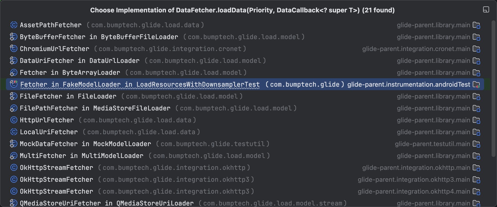

目前 Glide v5.0 版本，是使用 OkHttpStreamFetcher 作为默认的网络数据获取器

```java
class OkHttpStreamFetcher {

    public void loadData(DataCallback<? super InputStream> callback) {
        Request.Builder requestBuilder = new Request.Builder().url(url.toStringUrl());
        Request request = requestBuilder.build();
        call = client.newCall(request);
        call.enqueue(this); // 发起异步网络请求，自身作为回调
    }

    public void onResponse(Call call, Response response) {
        responseBody = response.body();
        if (response.isSuccessful()) {
            callback.onDataReady(responseBody.byteStream()); // 回调给 SourceGenerator
        } else {
            callback.onLoadFailed(new HttpException(response.message(), response.code()));
        }
    }
}
```

`OkHttpStreamFetcher#loadData()` 负责构建 call 对象，然后会 起一个后台线程去执行 网络请求

等到 OkHttp 结果返回后，回调给 `SourceGenerator#onDataReadyInternal()` 执行下一步的 解码 工作

```java
class SourceGenerator {

    private void startNextLoad(final LoadData<?> toStart) {
        loadData.fetcher.loadData(helper.getPriority(), new DataCallback<Object>() {
                    @Override
                    public void onDataReady(@Nullable Object data) {
                        onDataReadyInternal(data); // 成功拿到图片原始文件
                    }
                });
    }

    void onDataReadyInternal(LoadData<?> loadData, Object data) {
        // 缓存原始数据到磁盘（逻辑删减版）
        DataCacheKey newOriginalKey = new DataCacheKey(loadData.sourceKey, helper.getSignature());
        diskCache.put(newOriginalKey, data);
        // 回调通知上一层
        cb.onDataFetcherReady(loadData.sourceKey, data, loadData.fetcher, loadData.fetcher.getDataSource(), originalKey);
    }
}
```

`onDataReadyInternal()` 的工作比较简单，就是把数据缓存到磁盘（如果需要的话），然后回调给上一层，也就是 EngineJob

不过，EngineJob 自身并不直接负责解析工作，它负责调度每个阶段的任务协调者，接下来的解码和转换工作还是会被丢回原来的 DecodeJob 实例

图片的 原始文件 已经准备就绪，接下来进入 解码、转换 流程

## 解码与转换

图片的解码和转换是 Engine 的核心工作之一

在这一小节，我们还会见到除了 内存缓存 和 磁盘缓存 的另一种缓存：**BitmapPool 缓存池**

开始之前，先来认识几个新角色

- 上一小节结束后，图片的原始数据（*下载的网络图片数据类型通常是 InputStream*）回调到 DecodeJob，等待进一步处理
- DecodeJob 从名字看，它就是负责解码工作的类，实际上，图片的解码转换工作是由 LoadPath、DecodePath、ResourceDecoder 和 ResourceTranscoder 这几个类去完成
- LoadPath、DecodePath、ResourceDecoder、ResourceTranscoder 就是本小节的新角色，它们共同完成图片 解码到转换 的工作，具体来说：
  - `ResourceDecoder<DataType, ResourceType>` 资源解码器，负责把入参的 DataType 解码成 ResourceType
    - `DataType`, `ResourceType`, `Transcode`，这三个泛型参数，分别表示原图的数据类型、解码后的数据类型和转换后的数据类型
    - 以加载网图到 IV 举例，`DataType` 对应 InputStream, `ResourceType` 对应 Bitmap，转换后类型是 Drawable
    - ResourceDecoder 是个接口，加载网图的解码器实现类是 StreamBitmapDecoder，它负责把 InputStream 解码为 Bitmap
  - `ResourceTranscoder<Z, R>`，转换器，负责把解码出来的 Bitmap 转为 ImageView 需要的 Drawable 
    - 同样是 接口类，Bitmap 转 Drawable 对应的转换器是 BitmapDrawableTranscoder
  - `DecodePath<DataType, ResourceType, Transcode>`，持有多个 ResourceDecoder 和 一个 ResourceTranscoder
    - 职责是遍历所有的 Decoder ，找出一个能把源数据解码成 ResourceTranscoder 需要的 ResourceType 的 Decoder，然后调用它
  - LoadPath 负责协调整个解码流程，内部的成员变量 `decodePaths`，包含了若干个 DecodePath
    - 和楼上类似，遍历所有的 DecodePath，直到找到能把图片源数据转为目标类型的 DecodePath，可以理解成 **选择器** 的角色

以下基于 StreamBitmapDecoder 解码器，BitmapDrawableTranscoder 转换器，来介绍解码转换的流程

### 1. 解码 (Decoding)

解码的调用链路比较长，中间要横跨好几个类，我们忽略 LoadPath、DecodePath 里的代码逻辑，直接来看 StreamBitmapDecoder 解码器的工作

```java
class StreamBitmapDecoder {
    private final Downsampler downsampler;
    private final LruArrayPool byteArrayPool;

    public Resource<Bitmap> decode(InputStream source, int width, int height, Options options){
        RecyclableBufferedInputStream bufferedStream = new RecyclableBufferedInputStream(source, byteArrayPool);
        return downsampler.decode(bufferedStream, width, height, options);
    }
}
```

StreamBitmapDecoder 类有个成员变量 `byteArrayPool`

我们在初始化 Glide 有提到过，它负责复用 byte 数组，同样是 LRU 的设计，是典型的 空间换时间 策略

`decode()` 把解码工作委托给了 Downsampler，继续向下跟

```java
class Downsampler {
    
    // 简化版
    Resource<Bitmap> decode(imageReader, int requestedWidth, int requestedHeight, Options options, callbacks){
        // 计算采样率和目标密度
        calculateScaling(imageType, imageReader, sourceWidth, sourceHeight, targetWidth, targetHeight, options);
        // Bitmap.Config
        calculateConfig(imageReader, decodeFormat, options, targetWidth, targetHeight);
        // Android 4.4 及以上，Bitmap 才支持复用，即增加 inBitmap 属性
        if (Build.VERSION.SDK_INT >= Build.VERSION_CODES.KITKAT) {
            options.inBitmap = bitmapPool.getDirty(targetWidth, targetHeight);
        }
        // 解码成 bitmap 并返回
        return decodeStream(imageReader, bitmapFactoryOptions, callbacks, bitmapPool);
    }

}
```

`Downsample#decode()` 把整个解码过程分为下面几步执行：

1. 设置 `BitmapFactory#Options` 的 `inJustDecodeBounds` 属性为 true，表示 **只读取图片文件的头信息，图片的宽度、高度和 MIME 类型**
   - 这一步的目的是，拿到图片的 原始尺寸 和已知的 ImageView 尺寸作对比，计算出一个合适的 `inSampleSize` 采样率
   - 让最终 Bitmap 的尺寸，尽可能接近 ImageView 大小，避免大图配小 View 的情况，节约内存空间
2. 计算合理的 Bitmap 的 Config
   - Glide 会根据 DecodeFormat 和图片是否包含 `Alpha` 通道，来决定最终解码出来的 Bitmap 的颜色配置使用 888 还是 565
   - 在 Android 8.0 及以上设备上，Glide 还会根据 `ALLOW_HARDWARE_CONFIG` 选项尝试使用 `Bitmap.Config.HARDWARE` 的功能
   - Android 官网对 `HARDWARE` 的介绍是 “**启用此功能可避免重复位图，否则位图会同时位于显存和匿名内存中**”，简单来说，`HARDWARE` 配置会尝试把 Bitmap 放到 GPU 的显存中，减少主存消耗
3. 尝试从 BitmapPool 中获取一个尺寸和配置合适的可复用 Bitmap
4. 所有配置完成，最后调用到 Android 原生的 `BitmapFactory.decodeStream()` 方法
   - BitmapFactory 根据入参的 `inSampleSize`、`inBitmap`、`inPreferredConfig` 等选项，从 InputStream 中读取数据并解码成一个 Bitmap 对象并返回

### 2. 裁剪和转换 (Transformation)

Bitmap 解码完成以后，Bitmap 对象会经过一系列的回调，最终到达 `DecodeJob#onResourceDecoded()` 方法

这里是 Transformation 实际执行的地方

我们平时指定的 **居中裁剪、圆角、高斯模糊** 等一系列的 转换 都会在这里完成

```java
class DecodeJob {

    <Z> Resource<Z> onResourceDecoded(DataSource dataSource, Resource<Z> decoded) {
        // 获取解码后的原始资源类型，我们这里是 Bitmap.class）
        Class<Z> resourceSubClass = (Class<Z>) decoded.get().getClass();

        Transformation<Z> appliedTransformation = null;

        // 如果是从 RESOURCE_DISK_CACHE 读取，说明之前已经 Transform 过才保存到磁盘的
        if (dataSource != DataSource.RESOURCE_DISK_CACHE) {
            // 读取开发者配置的 Transformation 集合实例 (例如 CenterCrop 实例)
            appliedTransformation = decodeHelper.getTransformation(resourceSubClass);
            // 这一行就是实际执行裁剪、圆角、高斯模糊等像素操作的地方。
            appliedTransformation.transform(glideContext, decoded, width, height);
        }
        return result;
    }
}
```

 `DecodeJob#onResourceDecoded()` 方法中，**如果这个 Bitmap 不是从 `RESOURCE_DISK_CACHE` 加载的，那可以应用 Transformation 效果，否则，说明这个 Bitmap 在缓存之前，已经应用过 Transformation 效果了，再次取出时就不需要二次处理了**

### 3. 转换包装 (Transcoding)

Bitmap 经过 Transformation 处理后，如果最终的目标类型不是 Bitmap 类型，那么就需要进行类型转换

加载网络图片 `into` 到 ImageView 一般需要转为 `Drawable`

```java
class BitmapDrawableTranscoder implements ResourceTranscoder<Bitmap, BitmapDrawable> {
  private final Resources resources;

  public Resource<BitmapDrawable> transcode(Resource<Bitmap> toTranscode, Options options) {
    return new BitmapDrawable(resources);
  }
}
```

`BitmapDrawableTranscoder#transcode()` 的内部工作非常简单，创建一个 BitmapDrawable 对象返回回去就行了

## 回调结果

BitmapDrawable 对象已经准备就绪，接下来又是层层的回调和转发，大概路径是这样：

```
DecodeJob#run() 
    -> EngineJob#onResourceReady() -> notifyCallbacksOfResult() 
        -> SingleRequest#onResourceReady()
            -> ImageViewTarget#onResourceReady()
```

BitmapDrawable 对象被回调到最初 `into()` 函数设置的 Target 中

```java
class ImageViewTarget {
    public void onResourceReady(@NonNull Z resource, @Nullable Transition<? super Z> transition) {
        view.setImageDrawable(resource);
    }
}
```

ImageViewTarget 拿到 Drawable 对象，又持有 ImageView 对象，接调用 `ImageView#setImageDrawable()` 函数，把图片塞给 IV 就行了

等待下一次 vsync 信号到达绘制完图片，用户就可以在手机上看到图片了

至此，图片加载的流程就全部结束了

简单总结一下 `into()` 阶段做的事情

- 首先是 `into()` 启动加载流程，构建 Request 并交给 RequestManager 调度，Request 先确定 ImageView 尺寸后，将任务提交给 Engine。
- 然后，Engine 查找内存缓存（*ActiveResources → LruResourceCache*），都为空则查询磁盘缓存（*ResourceCache → DataCache*），磁盘缓存也未命中，启动 OkHttpStreamFetcher 在子线程下载图片文件
- 数据成功获取后，Downsampler 解码为合适大小和 Config 的 Bitmap 对象，接着，在 `DecodeJob#onResourceDecoded()` 中，应用 Transformation（*裁剪、圆角等*）处理 Bitmap，裁剪转换 完成交给 BitmapDrawableTranscoder 将处理后的 Bitmap 包装成BitmapDrawable 类型
- 最后，处理好的 BitmapDrawable 资源通过 EngineJob 逐级回调给 Request，直到 `ImageViewTarget#onResourceReady()` ，调用 `setImageDrawable()`，将图片显示在 ImageView 上

# 四、结语

本篇文章从 Glide 的 3 步链式调用作为入口，分别介绍了 Glide 如何完成生命周期绑定、构建图片请求策略以及后续的缓存查找、请求、解码的流程

一路跟下来，发现 Glide 真的是一套非常优秀的图片加载框架，非常的稳定、可靠，这么多年我好像都没有处理过因为 Glide 自身 bug 导致的线上问题

使用层面上，Glide 开箱即用，3 步链式调用即可自动完成下载、缓存、转换和显示的工作，还自带 Bitmap 优化，内存磁盘缓存和生命周期管理

代码设计上，Glide 的代码结构也非常清晰，把 Java 面向对象编程 三大特点 表现的淋漓尽致

- 良好的封装，不管是加载网图、本地文件还是资源 ID，都只需一行链式调用，你不需要去关心具体怎么去下载、转换、缓存等细节
- 继承性，抛开 Glide 内部大量的 继承体系（*比如 Request、ViewTarget、ResourceDecoder等*）不谈，它还对外提供了比较多的 抽象类和接口 给开发者使用，比如 ModelLoader、ResourceDecoder、Target 等这些都可以自定义，其中最常用的，可能就是继承 AppGlideModule，自定义 内存、磁盘缓存、日志的使用规则了
- 多态，比如 `with()`、`load()` 这些方法的重载啊，DiskCacheStrategy 和 DownsampleStrategy 这些策略的应用啊，都是多态的体现

除了这些，Glide 还有随处可见的设计模式，比如 GlideBuilder、RequestBuilder、RequestOptions 的 建造者模式，BitmapPool、ArrayPool 的 享元，ModelLoaderFactory、StreamModelLoaderFactory 的工厂，以及 EngineJob 里面的 观察者模式 等等。

好了，以上就是本文的全部内容，希望能给大家带来帮助

如果你在项目中也有使用 Glide，欢迎在评论区分享你的 使用心得 或者 优化小技巧，我们一起交流

全文完