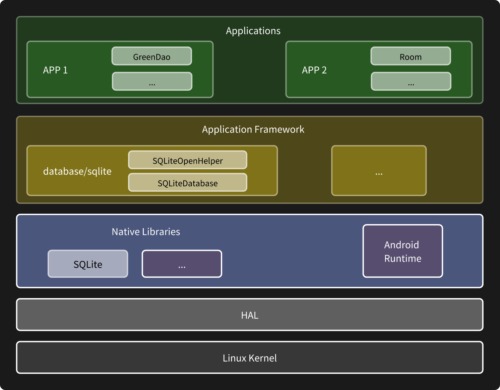
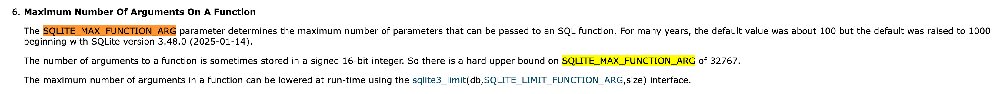

> 前排提示，速通 [Jetpack](https://github.com/yibaoshan/yibaoshan/blob/master/%E7%9F%A5%E8%AF%86%E5%BA%93/README.MD) 中，文章内容可能会有疏漏，如有错误，请在 [issues](https://github.com/yibaoshan/yibaoshan/issues) 留言联系我改正。

# 一、数据库的基本使用

SQLite 是 Android 系统为开发者提供的数据库引擎,它在 Android 架构中的位置如下图



今天的主角是 Jetpack 的 Room，它是 Google 基于 SQLite 实现的 ORM 框架。 ORM 全称是对象关系映射（Object Relational Mapping），使用 ORM 框架就不需要我们手写 SQL 语句了，直接操作 Java/Kotlin 对象就可以了。

在开始介绍 Room 之前，我们需要先来了解 Android 平台上，近些年使用数据库方式的变化历程

1. 早期时代，使用 SQLiteOpenHelper 来管理数据库的创建和版本更新，SQLiteDatabase 执行读写，手写 SQL 语句并使用 Cursor 获取数据转为实体类。
2. ORM 时代，GreenDAO、ORMLite 等对象关系映射框架出现，大部分情况下，开发者可以直接操作 Java 对象完成增删改查，修复了 SQLite 使用繁琐，还容易出错的 bug。
3. Room 时代，Google 官方推出的数据库 ORM 框架，相较于已存在的 ORM 框架，提供编译时检查，支持 LiveData 和 Flow，支持协程

## 蛮荒时代：SQLite

早期时代，开发者都是需要手写 SQL ，通过 SQLiteDatabase + Cursor 的方式来操作数据库。

其中，使用 SQLiteOpenHelper 来管理数据库的创建和版本更新，SQLiteDatabase 执行读写，手写查询语句并使用 Cursor 获取数据转为实体类。

第一步，继承 SQLiteOpenHelper 定义自己的数据库帮助类，必选入参除了上下文，还有数据库名称和版本号

- 一个 SQLiteOpenHelper 操作一个数据库，如果有多个库，需要创建多个 SQLiteOpenHelper，数据库的文件放在 data/data/<package_name>/databases/ 目录下
- 版本号用来记录本地数据库是什么版本，应用覆盖安装以后，如果发现新包代码中的版本和本地对不上，会调用 onUpgrade 方法通知，old 是本地，new 是新包，你需要自己做升级处理

```kotlin
class DatabaseHelper(context: Context) : SQLiteOpenHelper(context, "app.db", null, 1) {
    
    override fun onCreate(db: SQLiteDatabase) {
        db.execSQL("""
            CREATE TABLE user (
                id INTEGER PRIMARY KEY AUTOINCREMENT,
                name TEXT NOT NULL,
                age INTEGER,
                email TEXT
            )
        """)
    }
    
    override fun onUpgrade(db: SQLiteDatabase, oldVersion: Int, newVersion: Int) {
        // 处理数据库升级
    }
}
```

第二步，数据表的增删改查操作，通过 SQLiteOpenHelper 拿到要操作的数据库 SQLiteDatabase

SQLiteDatabase 类提供了一系列操作方法，比如 insert、update、delete、query 等，返回值是受影响的行数

对于查询操作，SQLite 和其他数据库一样，提供了 Cursor 对象封装了查询结果，通过 Cursor 的方法获取数据，比如 getLong、getString 等，然后自己封装成 Java 对象返回给上层业务。

需要注意的是，Cursor 提供的功能比较基础，一不小心就会触发下标越界，和类型转换异常，这就需要你对自己业务的表结构有个比较清楚的了解。

最后，使用完 Cursor 记得调用 close 方法关闭，否则会造成内存泄漏

```kotlin
class UserDao(private val dbHelper: DatabaseHelper) {
    
    fun insert(user: User) {
        val db = dbHelper.writableDatabase
        val values = ContentValues().apply {
            put("name", user.name)
            put("age", user.age)
            put("email", user.email)
        }
        db.insert("user", null, values)
    }
    
    fun queryById(id: Long): User? {
        val db = dbHelper.readableDatabase
        val cursor = db.query(
            "user",
            arrayOf("id", "name", "age", "email"),
            "id = ?",
            arrayOf(id.toString()),
            null, null, null
        )
        
        return cursor.use {
            if (it.moveToFirst()) {
                User(
                    id = it.getLong(0),
                    name = it.getString(1),
                    age = it.getInt(2),
                    email = it.getString(3)
                )
            } else null
        }
    }
}
```

## ORM 时代：GreenDao

14、15 年左右，Android 数据库操作进入了 ORM 时代，国内用的比较多的应该是 GreenDao ，几个常见的 GreenDao 注解

- @Entity，一般写在一个实体类上，一个 Entity 对应一张表，当然，它还支持一些列属性，比如 schema、nameInDb 啥的，这里忽略。
- @Id，一般写一个字段上，表示这个字段是主键，可以指定 autoincrement 为 true，表示自增
- @NotNull，一般写一个字段上，表示这个字段不能为 null
- ...

```java
@Entity
public class User {
    @Id(autoincrement = true)
    private Long id;
    
    @NotNull
    private String name;
    
    private int age;
    private String email;
    
    // getters and setters
}
```

“Make Project” 编译工程，GreenDao 的注解处理器会在配置的包目录下自动生成 DaoMaster、DaoSession 和 UserDao 几个类。

- DaoMaster 就是个 SQLiteOpenHelper，忽略
- DaoSession，主要用来获取 DAO 对象，，，
- UserDao，提供数据库操作方法，比如 insert、update、delete、query 啥的。

```java
class UserRepository {
    private final DaoSession daoSession;
    
    public void insert(User user) {
        daoSession.getUserDao().insert(user);
    }
    
    public User queryById(Long id) {
        return daoSession.getUserDao().load(id);
    }
    
    public List<User> queryByAge(int age) {
        return daoSession.getUserDao().queryBuilder()
                .where(UserDao.Properties.Age.eq(age))
                .list();
    }
}
```

## Room 时代

随着 Google 开发生态的进一步完善和统一，Room 框架也正式发布，相较于上面的 GreenDao，Room 的优势是提供编译时检查，支持 LiveData 和 Flow，支持协程。

另外，Room 的使用方式也和 GreenDao 不太一样，它把数据库操作分为三块：

1. 数据库定义
   - 对应的注解是 @Database，表示把一个抽象类为数据库类，要求该类继承自 RoomDatabase
   - 注解属性里面需要指定实体类数组和数据库版本号，比如 @Database(entities = {User.class}, version = 1)。
   - 后续注解处理器会关联制定的所有的实体类和 DAO
   - 可以简单理解为 SQLiteOpenHelper 的增强版本，基础功能都有管理数据库的创建和版本更新
2. 实体定义
   - 对应的注解是 @Entity，表示该类是一张表，可以自定义表名、主键、列名等，并且，这个类需要添加到某个 @Database 注解的 entities 数组中
   - 和 GreenDao 不同的是，Room 的实体类的功能只是表示一张表，和数据库的字段进行映射，不会生成 DAO 层的代码，DAO 层需要自己手动实现
   - 其他常用注解，@PrimaryKey(autoGenerate = true) 表示主键自增，@ColumnInfo(name = "name") 表示列名是 name，@Ignore 表示忽略某个字段不存入数据库
3. DAO 接口
   - 使用 @Dao 注解标注某个接口类是数据访问（增删改查）操作对象
   - 使用 @Query 注解标注 SQL 语句，返回值可以是任意类型，比如 List、Flow、Unit 等，其他还有 @Transaction 事务注解、@Insert、@Delete、@Update 等

```kotlin
@Entity(tableName = "users")
data class User(
    @PrimaryKey(autoGenerate = true)
    val id: Long = 0,
    
    @ColumnInfo(name = "name")
    val name: String,
    
    @ColumnInfo(name = "age")
    val age: Int,
    
    @ColumnInfo(name = "email")
    val email: String?
)

@Dao
interface UserDao {
    
    @Insert
    suspend fun insert(user: User)
    
    @Query("SELECT * FROM users WHERE id = :id")
    suspend fun getById(id: Long): User?
    
    @Query("SELECT * FROM users WHERE age = :age")
    fun getUsersByAge(age: Int): Flow<List<User>>
}

@Database(entities = [User::class], version = 1)
abstract class AppDatabase : RoomDatabase() {
    abstract fun userDao(): UserDao
    
    companion object {
        fun create(context: Context): AppDatabase {
            return Room.databaseBuilder(context, AppDatabase::class.java, "app.db").build()
        }
    }
}
```

## 常见错误

最后，我们来聊聊 SQLite、Room 一些常见错误。

### 1、too many SQL variables

我们是社交应用，部分女生账号每天会接收到大量的消息，为了方便她们使用，我们在消息列表页为她们提供了一个筛选 + 搜索的功能。

这个功能刚上线没多久就收到崩溃异常告警，报错信息：android.database.sqlite.SQLiteException: too many SQL variables

百度后发现，问题出现在下面这条语句

```roomsql
SELECT  * from xxx WHERE uuid IN (:uuids) ORDER BY xxx
```

这条查询语句中最终会被展开为 IN (1,2,3,...) 的形式执行，而 SQLite 默认限制了单条语句的参数数量，如果 List 的长度超过限制数量，就会抛出 too many SQL variables 异常



发现问题以后，我们把这块业务修改为 分批 执行，每次最多传入 100 个参数

```
suspend List<User> queryVipByUuidList(uuids: List<String>) {
    uuids.chunked(100) { chunk ->  // 每批最多 100 个
        ...
    }
}
```

后面我们又改为了 临时表 + JOIN 封装成事务来替代 分批 执行，因为我们为了防止类似问题发生，增加了 Lint 规则，禁止使用 IN/NOT IN 操作符

### 2、数据读写失败

我们之前线上有个数据库升级事故，有张表的 ID 是 int 类型，因为某个业务变动，无意中把 ID 改成了 String 类型，这块业务访问量比较少，测试用例没覆盖到，就这样上线了。

后面收到客服反馈，用户说页面数据是空的，我们拉取该用户的数据后发现表里是有数据的。代码对比后才发现问题，原先写入的时候是 int 类型，查数据按 String 查的，而 SQLite 又是弱类型，它不会报错，只是一味地返回空数据，，

# 二、Room 实现原理

### 编译时注解处理：APT/KSP 代码生成

Room 通过注解处理器（APT/KSP）在编译阶段生成模板代码，大概得步骤如下：

1. 注解解析：
   - 扫描 @Entity、@Dao、@Database 等注解，提取表结构、查询语句和数据库配置。
2. 代码生成：
   - Entity：生成 _Impl 类实现字段映射与类型转换逻辑（如 Cursor ↔ 对象）。
   - DAO：将 @Query 方法转换为 SQLiteStatement 预编译语句，并封装事务管理。
   - Database：生成 _Impl 类继承 RoomDatabase，管理 DAO 实例与数据库连接池。

# 三、小结

相较于使用 SQLiteDatabase 手写 SQL 和创建 Java 映射，ORM 框架和 Room 优势很明显，解决了又繁琐又容易出错的问题。

而 Room 相较于市面上其他 ORM 框架的优势我个人认为有两点

1. Room 有编译时检查避免运行时错误，SQL 写错了编译不通过
2. Room 是 Google 官方支持，与自己的 jetpack 兄弟们，比如 Flow、协程配合度较高
