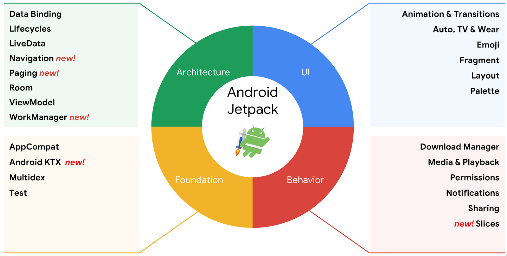
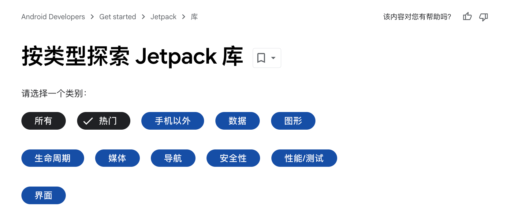
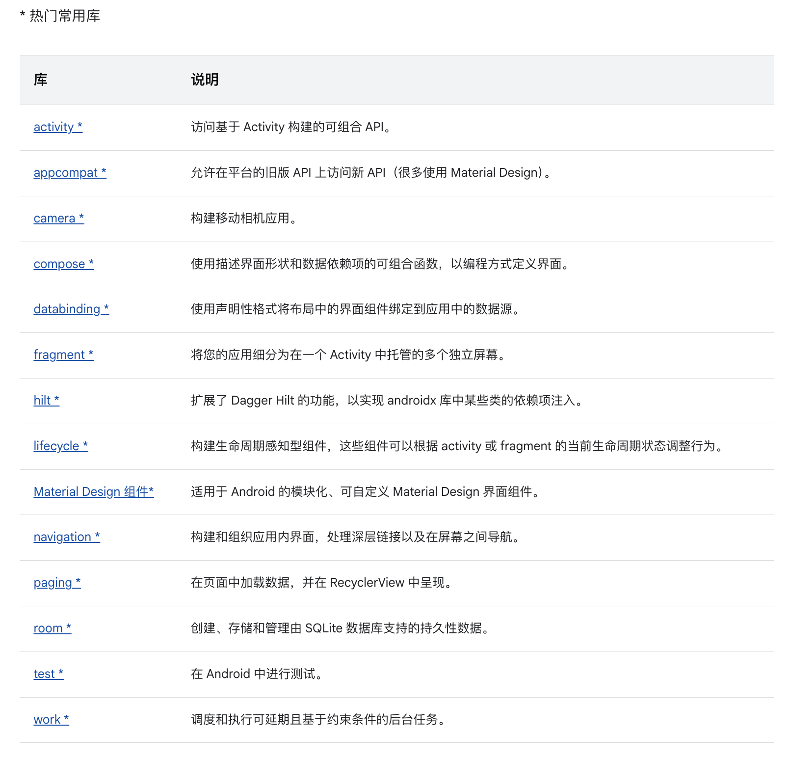

 

老的官网把 Jetpack 组件分为四个大类：

1. Foundation （基础组件），比较重要的是 AppCompat
2. Architecture（架构组件），DataBinding、Lifecycle 啥的
3. Behavior（行为组件），Notifications、Download 之类的
4. UI（界面组件），Fragment、Emoji

现在的官网把 Jetpack 分为九大类：

1. 手机以外的（beyond），TV、Wear、Android Auto，以及折叠屏适配的 window 库
2. 数据（data），Room、Paging、datastore
3. 图形（graphics），core.animation、dynamicanimation、插值器 interpolator
4. 声明周期（lifecycle），loader、lifecycle
5. 媒体（media），相机、蓝牙、音视频 media3
6. 导航（navigation），drawerlayout、navigation
7. 安全性（security），我接触过的只有 credentials、security 这俩库
8. 性能/测试（performance），startup、tracing、test
9. 界面（UI），appcompat、compose、cardview、constraintlayout、databinding、recyclerview、viewpager2 等
   - appcompat 中又包含 activity、annotation、fragment 等

下图是截止到 2025 年，Jetpack 最受欢迎和最多使用的库

