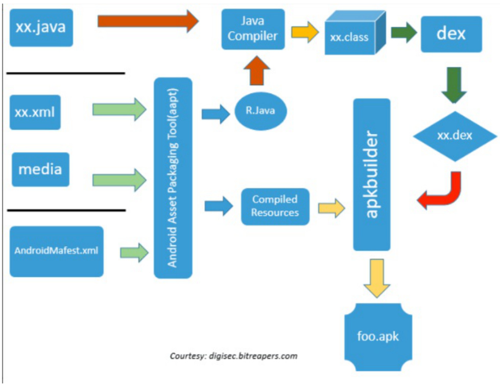

1. 资源编译阶段（AAPT2） 
   - 流程：XML/图片资源 → 编译为二进制格式 → 生成R.java和resources.arsc
   - 干预技术：
     - 资源混淆：AndResGuard修改资源ID映射表，降低反编译可读性
     - 资源注入：在 mergeResources 任务后插入自定义资源文件（如多语言适配）
     - 动态换肤：Hook 资源加载逻辑实现运行时资源替换
2. 代码编译阶段（D8/R8）
   - 流程：.java → .class → .dex（DEX字节码）→ 优化（R8）
   - 干预技术：
     - 字节码插桩：Transform API在.class转.dex前插入ASM逻辑（埋点/监控）
     - 代码混淆：ProGuard规则控制保留类/方法，R8优化缩减代码体积
     - 热修复：动态替换.dex文件（如Tinker方案）
3. 原生代码编译（NDK）
   - 流程：C/C++ → LLVM编译 → .so动态库
   - 干预技术：
     - 交叉编译：定制Android.mk控制编译参数（如NEON指令集优化）
     - 符号隐藏：-fvisibility=hidden限制导出符号，提升安全性
     - PLT/GOT Hook：LD_PRELOAD劫持动态库函数（如C内存监控）
4. 打包签名阶段
   - 流程：APK组装 → ZIP对齐 → V1/V2/V3签名
   - 干预技术：
     - 多渠道打包：在assets插入标识文件，结合Gradle变体生成多版本
     - 签名校验绕过：修改MANIFEST.MF实现重打包（仅用于安全测试）
     - APK加固：整体DEX加密或VMP保护（如梆梆安全方案）

CI/CD 链路工具链组合

```c
+-------------------+     +-------------------+     +-------------------+
|  代码仓库         |     | 构建系统          |     | 部署平台          |
|  (Git/SVN)        | →   | (Gradle+Jenkins)  | →   | (Google Play)      |
+-------------------+     +-------------------+     +-------------------+
       ↓                        ↓                          ↓
 静态分析（Sonar）        动态插桩（Jacoco）          灰度发布（ staged rollout）
 依赖管理（Nexus）       产物签名（Signing）          A/B测试（Firebase）
```